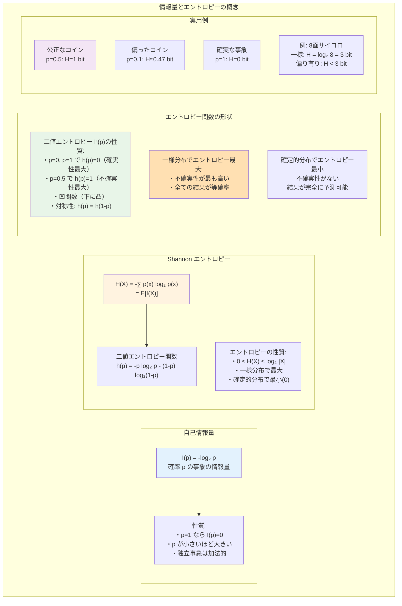
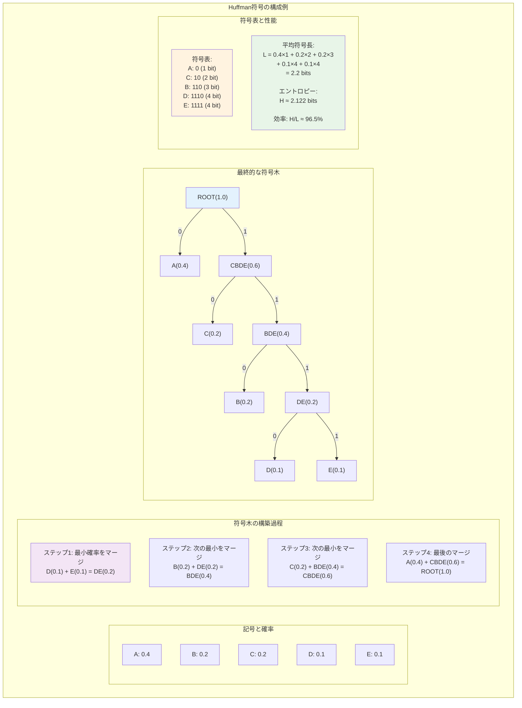
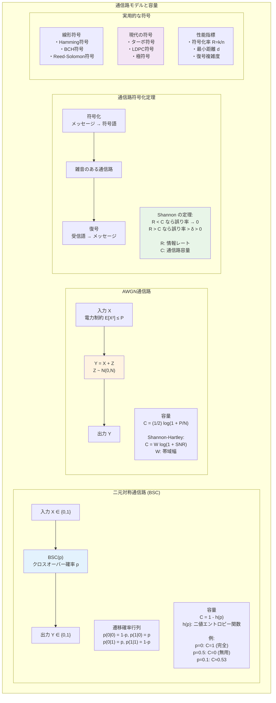
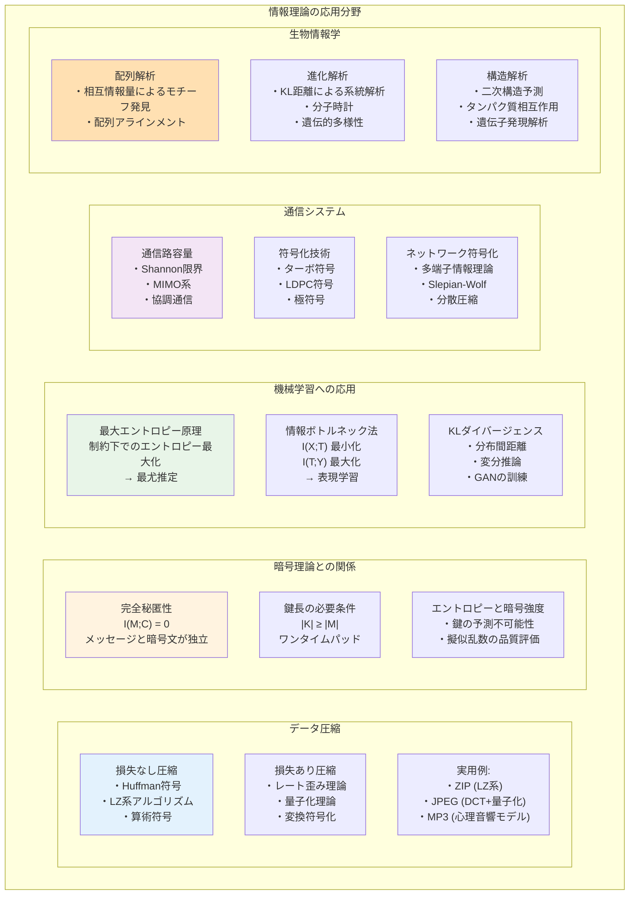

# 第10章 情報理論

## はじめに

情報理論は、情報の定量化、保存、伝達に関する数学的理論です。1948年のクロード・シャノンの画期的な論文により創始されたこの分野は、通信工学から始まり、今日ではデータ圧縮、暗号理論、機械学習、生物情報学など、幅広い分野で応用されています。

本章では、情報量の数学的定義から始まり、データ圧縮の理論的限界、雑音のある通信路での信頼性のある通信の可能性、そして誤り訂正符号の構成まで、情報理論の核心的な概念を体系的に学びます。これらの理論は、現代のデジタル通信システムの設計における基礎となっています。

## 10.1 情報量とエントロピー

### 10.1.1 情報量の定義

**定義 10.1** 確率 p で生起する事象の**自己情報量**（self-information）は：
I(p) = -log₂ p = log₂(1/p) [bits]

**性質**：
1. 0 < p ≤ 1 に対して I(p) ≥ 0
2. p = 1（確実な事象）のとき I(p) = 0
3. p₁ < p₂ ならば I(p₁) > I(p₂)
4. 独立事象の情報量は加法的：I(p₁p₂) = I(p₁) + I(p₂)

### 10.1.2 Shannon エントロピー

**定義 10.2** 離散確率変数 X の**エントロピー**：
H(X) = -∑ₓ p(x) log₂ p(x) = E[I(X)]

ここで、0 log 0 = 0 と定義する（連続性による）。

**例 10.1** 二値確率変数 X ∈ {0, 1}, P(X=1) = p のエントロピー：
H(X) = -p log₂ p - (1-p) log₂(1-p) = h(p)

これを**二値エントロピー関数**という。h(p) は p = 1/2 で最大値 1 をとる。

**定理 10.1** 離散確率変数 X について：
0 ≤ H(X) ≤ log₂ |X|

等号は左が X が定数のとき、右が X が一様分布のとき。

*証明*：Jensen の不等式を用いる。log は凹関数なので：
H(X) = E[-log p(X)] ≤ -log E[p(X)] = -log(1/|X|) = log |X| □

### 10.1.3 結合エントロピーと条件付きエントロピー

**定義 10.3** 
- **結合エントロピー**：H(X,Y) = -∑ₓ,ᵧ p(x,y) log p(x,y)
- **条件付きエントロピー**：H(Y|X) = ∑ₓ p(x)H(Y|X=x)

**定理 10.2**（連鎖律）H(X,Y) = H(X) + H(Y|X)

*証明*：
H(X,Y) = -∑ₓ,ᵧ p(x,y) log p(x,y)
       = -∑ₓ,ᵧ p(x,y) log[p(x)p(y|x)]
       = -∑ₓ,ᵧ p(x,y) log p(x) - ∑ₓ,ᵧ p(x,y) log p(y|x)
       = H(X) + H(Y|X) □

### 10.1.4 相互情報量

**定義 10.4** X と Y の**相互情報量**：
I(X;Y) = ∑ₓ,ᵧ p(x,y) log [p(x,y)/(p(x)p(y))]

**定理 10.3** 以下の等式が成立：
1. I(X;Y) = H(X) - H(X|Y) = H(Y) - H(Y|X)
2. I(X;Y) = H(X) + H(Y) - H(X,Y)
3. I(X;Y) = I(Y;X)（対称性）
4. I(X;Y) ≥ 0（等号は X と Y が独立）

### 10.1.5 相対エントロピー

**定義 10.5** 分布 P と Q の**相対エントロピー**（Kullback-Leibler divergence）：
D(P||Q) = ∑ₓ p(x) log [p(x)/q(x)]

**定理 10.4**（情報不等式）D(P||Q) ≥ 0、等号は P = Q のとき。

*証明*：log の凹性より：
-D(P||Q) = ∑ₓ p(x) log [q(x)/p(x)] ≤ log ∑ₓ p(x) · [q(x)/p(x)] = log 1 = 0 □

### 10.1.6 エントロピーの性質

**定理 10.5**（条件付けによる減少）H(X|Y) ≤ H(X)、等号は X⊥Y。

**定理 10.6**（データ処理不等式）X → Y → Z がマルコフ連鎖なら：
I(X;Y) ≥ I(X;Z)

## 10.2 情報源符号化

### 10.2.1 符号の定義と性質

**定義 10.6** アルファベット X から符号アルファベット D への**符号**は、
写像 C: X → D* （D* は D の有限文字列の集合）。

**定義 10.7** 
- **非特異符号**：C は単射
- **一意復号可能**：C の拡張 C*: X* → D* が単射
- **瞬時符号**（prefix-free）：どの符号語も他の符号語の接頭辞でない

**定理 10.7** 瞬時符号 ⊆ 一意復号可能符号 ⊆ 非特異符号

### 10.2.2 Kraft の不等式

**定理 10.8**（Kraft-McMillan）D 元符号において、
一意復号可能符号の符号長 l₁, ..., lₙ は以下を満たす：
∑ᵢ D^(-lᵢ) ≤ 1

逆に、この不等式を満たす長さの組に対して瞬時符号が構成可能。

*証明*（必要性）：符号木を考える。深さ lᵢ の葉は D^lᵢ 個の葉を「使用」する。
全体で D^max(lᵢ) 個の葉があるので、不等式が成立。□

### 10.2.3 Shannon の符号化定理

**定理 10.9**（情報源符号化定理）
確率変数 X に対する一意復号可能な D 元符号の平均符号長 L について：
L ≥ H(X) / log D

また、L < H(X) / log D + 1 を満たす瞬時符号が存在する。

*証明*：相対エントロピーの非負性を用いる。
確率分布 p(x) と q(x) = D^(-l(x)) / ∑ D^(-l(x)) に対して：
D(p||q) ≥ 0 より導かれる。□

### 10.2.4 最適符号

#### Shannon 符号
符号長を l(x) = ⌈-log_D p(x)⌉ とする。

**性質**：H(X) / log D ≤ L < H(X) / log D + 1

#### Huffman 符号

**アルゴリズム**（二元の場合）：
1. 各記号を確率付きノードとする
2. 最小確率の2ノードを選び、親ノードを作成
3. 1ノードになるまで繰り返し

**定理 10.10** Huffman 符号は平均符号長を最小化する瞬時符号である。

*証明*：最適符号の性質を用いた帰納法による。□

### 10.2.5 算術符号

**原理**：メッセージ全体を [0,1) の部分区間として符号化。

**利点**：
- 記号ごとに整数ビットを割り当てる制約がない
- ブロック符号化の効果を記号ごとの処理で実現

**実装上の考慮**：
- 精度の管理
- アンダーフロー対策

### 10.2.6 ユニバーサル符号

**Lempel-Ziv 符号**（LZ77, LZ78）：
- 情報源の統計を知らなくても漸近的に最適
- 辞書ベースの適応的符号化

**定理 10.11** 定常エルゴード情報源に対して、LZ符号の圧縮率は
確率 1 でエントロピーレートに収束する。

## 10.3 通信路符号化

### 10.3.1 通信路モデル

**定義 10.8** **離散無記憶通信路**（DMC）は、
入力アルファベット X、出力アルファベット Y、
遷移確率 p(y|x) で特徴付けられる。

**例 10.2** 二元対称通信路（BSC）：
- X = Y = {0, 1}
- p(0|1) = p(1|0) = p（クロスオーバー確率）
- p(0|0) = p(1|1) = 1 - p

### 10.3.2 通信路容量

**定義 10.9** 通信路の**容量**：
C = max_{p(x)} I(X;Y)

**定理 10.12** BSC(p) の容量：C = 1 - h(p)
ここで h(p) は二値エントロピー関数。

*証明*：対称性より、最大化する入力分布は一様分布。
このとき I(X;Y) = H(Y) - H(Y|X) = H(Y) - h(p) ≤ 1 - h(p) □

### 10.3.3 Shannon の通信路符号化定理

**定義 10.10** レート R の (M, n) 符号：
- M 個のメッセージ
- ブロック長 n
- レート R = (log M) / n

**定理 10.13**（通信路符号化定理）
任意の R < C と ε > 0 に対して、十分大きな n で
誤り率 < ε となるレート R の符号が存在する。

逆に、R > C なら誤り率は 0 から離れた下界を持つ。

*証明の概要*（達成可能性）：
ランダム符号化により、平均誤り率が小さいことを示す。
典型系列の理論と大数の法則を使用。□

### 10.3.4 誤り指数

**定義 10.11** レート R での**誤り指数**：
E(R) = lim_{n→∞} [-1/n · log P_e^(n)]

**定理 10.14** 0 < R < C に対して E(R) > 0。

これは誤り率が指数的に減少することを意味する。

## 10.4 誤り訂正符号

### 10.4.1 線形符号

**定義 10.12** **線形符号** C は F_q^n の線形部分空間。
- n：符号長
- k = log_q |C|：情報記号数（次元）
- d：最小距離

[n, k, d] 符号と表記する。

**生成行列と検査行列**：
- 生成行列 G（k × n）：C = {uG | u ∈ F_q^k}
- 検査行列 H（(n-k) × n）：C = {c ∈ F_q^n | Hc^T = 0}
- GH^T = 0

### 10.4.2 符号の限界

**定理 10.15**（Hamming 限界）
最小距離 d の q 元 [n, k] 符号に対して：
q^k ≤ q^n / ∑_{i=0}^{⌊(d-1)/2⌋} C(n,i)(q-1)^i

**定理 10.16**（Singleton 限界）
[n, k, d] 符号に対して：d ≤ n - k + 1

**定義 10.13** d = n - k + 1 を満たす符号を**最大距離分離**（MDS）符号という。

### 10.4.3 具体的な符号

#### Hamming 符号
- パラメータ：[2^r - 1, 2^r - r - 1, 3]
- 1誤り訂正
- 完全符号（Hamming 限界を達成）

**構成**：検査行列の列として、0 以外の r ビットベクトルをすべて使用。

#### Reed-Solomon 符号
- パラメータ：[n, k, n-k+1] over F_q（n ≤ q）
- MDS 符号
- バースト誤り訂正に優れる

**構成**：評価写像を用いる
C = {(f(α₁), ..., f(αₙ)) | f ∈ F_q[x], deg(f) < k}

#### BCH 符号
- 設計距離を保証する巡回符号
- 効率的な復号アルゴリズム

### 10.4.4 復号アルゴリズム

#### 症候復号
受信語 r に対して、症候 s = Hr^T を計算。
症候表を用いて誤りパターンを特定。

#### Reed-Solomon 符号の復号
1. 症候計算
2. 誤り位置多項式の決定（Berlekamp-Massey）
3. 誤り位置の探索（Chien search）
4. 誤り値の計算（Forney のアルゴリズム）

### 10.4.5 連接符号とターボ符号

**連接符号**：
- 内符号と外符号の組み合わせ
- 優れた性能と実装の容易さ

**ターボ符号**：
- 並列連接畳み込み符号
- 反復復号により Shannon 限界に接近

**LDPC 符号**：
- 疎な検査行列
- 信念伝播による効率的復号

## 10.5 連続情報理論

### 10.5.1 微分エントロピー

**定義 10.14** 連続確率変数 X の**微分エントロピー**：
h(X) = -∫ f(x) log f(x) dx

**注意**：離散エントロピーと異なり、h(X) は負になりうる。

### 10.5.2 ガウス分布の特性

**定理 10.17** 分散 σ² に制約された分布の中で、
ガウス分布 N(μ, σ²) が微分エントロピーを最大化：
h(X) ≤ (1/2) log(2πeσ²)

### 10.5.3 ガウス通信路

**定義 10.15** **加法的白色ガウス雑音**（AWGN）通信路：
Y = X + Z、Z ~ N(0, N)

**定理 10.18** 電力制約 E[X²] ≤ P の下での AWGN 通信路容量：
C = (1/2) log(1 + P/N) [bits/channel use]

### 10.5.4 帯域制限通信路

**Shannon-Hartley の定理**：
帯域幅 W、信号電力 P、雑音電力 N の通信路容量：
C = W log(1 + P/N) [bits/second]

## 10.6 情報理論の応用

### 10.6.1 データ圧縮への応用

**損失のある圧縮**：
- レート歪み理論
- 量子化の最適化

**例**：JPEG, MP3 などの規格

### 10.6.2 暗号理論との関係

**完全秘匿性**（Shannon）：
I(M;C) = 0（メッセージと暗号文が独立）

**定理 10.19** 完全秘匿性には |K| ≥ |M|（鍵空間 ≥ メッセージ空間）が必要。

### 10.6.3 機械学習における情報理論

**最大エントロピー原理**：
制約を満たす分布の中でエントロピーを最大化。

**情報ボトルネック法**：
I(X;T) を最小化しつつ I(T;Y) を最大化。

### 10.6.4 生物情報学での応用

**配列アラインメント**：
相互情報量によるモチーフ発見。

**進化的距離**：
KL divergence による種間距離の定量化。

## 章末問題

### 基礎問題

1. 以下の確率分布のエントロピーを計算せよ：
   (a) P(X) = {1/2, 1/4, 1/8, 1/8}
   (b) 幾何分布：P(X = k) = (1-p)^(k-1)p, k = 1, 2, ...

2. X, Y, Z が Markov 連鎖 X → Y → Z をなすとき、
   I(X;Y|Z) + I(X;Z) = I(X;Y) を証明せよ。

3. 二元対称通信路（クロスオーバー確率 0.1）において、
   入力が一様分布のときの相互情報量を計算せよ。

4. {a:0.5, b:0.25, c:0.125, d:0.125} に対する Huffman 符号を構成し、
   平均符号長を求めよ。

### 発展問題

5. Fano の不等式を証明し、通信路符号化定理の逆定理への応用を説明せよ。

6. 型（typical sequences）の理論について：
   (a) 弱型と強型の定義を与えよ
   (b) 漸近等分割性（AEP）を証明せよ

7. Slepian-Wolf の定理（分散情報源符号化）を説明し、
   達成可能領域を特徴付けよ。

8. ネットワーク符号化について：
   (a) 最大流最小カット定理との関係を説明せよ
   (b) 線形ネットワーク符号の十分性を論ぜよ

### 探究課題

9. 量子情報理論について調査し、
   von Neumann エントロピーと古典的エントロピーの違いを論ぜよ。

10. Kolmogorov 複雑性について調査し、
    Shannon エントロピーとの関係を説明せよ。

11. 極符号（Polar codes）について調査し、
    通信路分極現象と容量達成性を説明せよ。

12. 深層学習における情報理論的解析について調査し、
    情報ボトルネック理論の応用例を示せ。