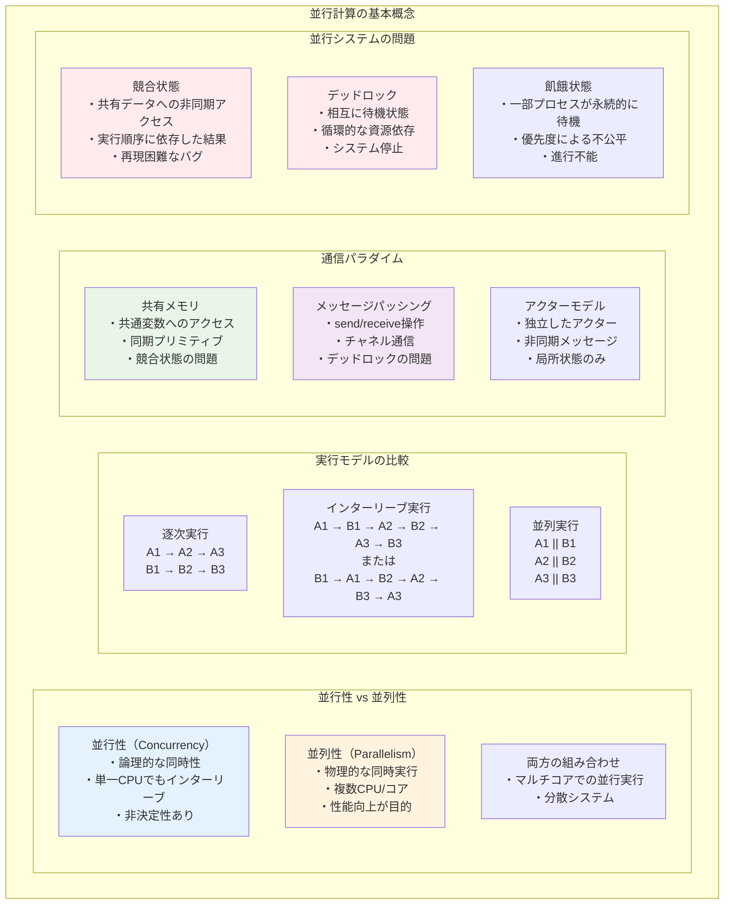
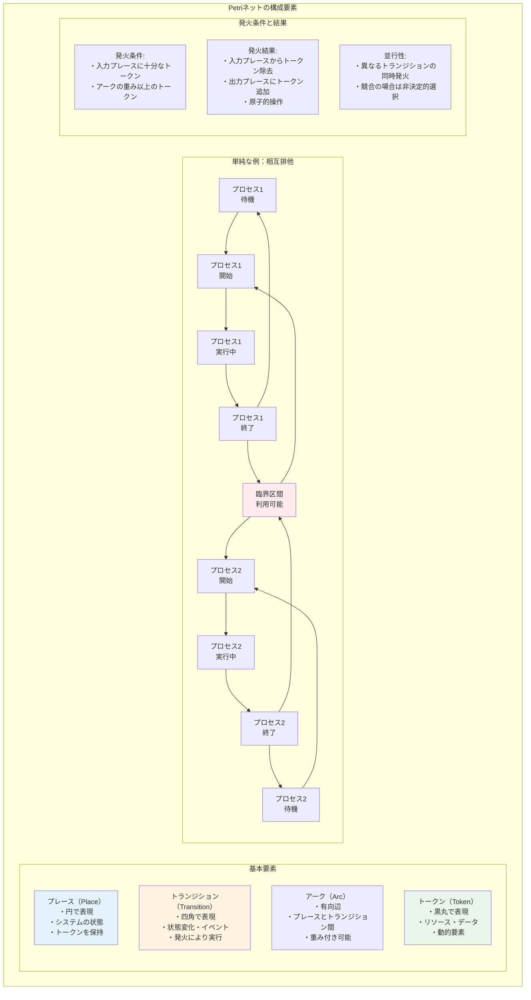
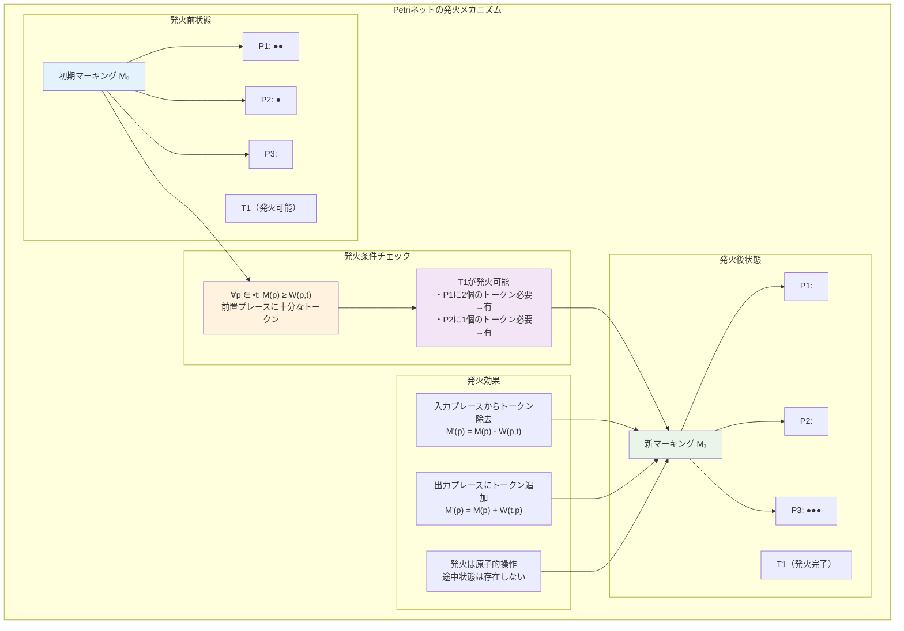
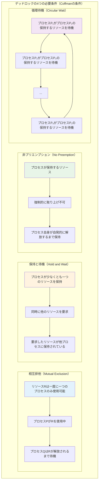
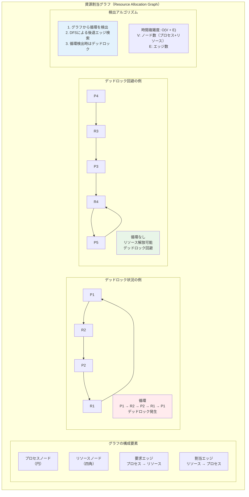
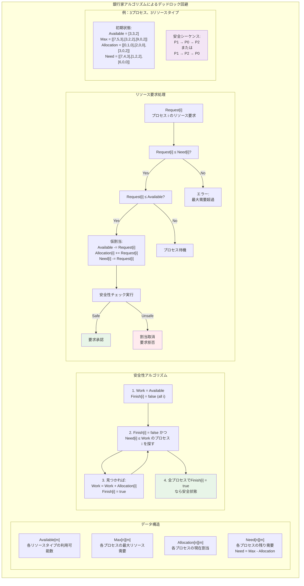

# 第12章 並行計算の理論

## はじめに

並行計算の理論は、複数の計算プロセスが同時に実行される状況を数学的に扱う分野です。マルチコアプロセッサ、分散システム、クラウドコンピューティングの普及により、並行性の理解と制御は現代のコンピュータサイエンスにおいて不可欠となっています。本章では、並行システムのモデル化、解析、検証のための理論的基礎を体系的に学びます。

並行性がもたらす非決定性、デッドロック、競合状態などの問題は、逐次プログラムでは現れない固有の複雑さを持ちます。これらの問題を理解し、解決するための形式的手法は、信頼性の高い並行システムの設計に欠かせません。本章で学ぶ理論は、オペレーティングシステム、データベース、分散アルゴリズムなど、幅広い分野の基礎となります。

## 12.1 並行計算モデル

### 12.1.1 並行性の基本概念



**定義 12.1** **並行システム**は、複数のプロセスが同時に実行される可能性があるシステム。

**並行性 vs 並列性**：
- 並行性（Concurrency）：論理的な同時性、インターリーブ実行を含む
- 並列性（Parallelism）：物理的な同時実行

**インターリーブ意味論**：
並行実行を、可能なすべての実行順序（インターリーブ）の集合として捉える。

### 12.1.2 共有メモリモデル

**定義 12.2** **共有メモリシステム**では、プロセスが共通の変数を通じて通信する。

**原子的操作**：
- Read：x の値を読む
- Write：x に値を書く
- Read-Modify-Write：Test-and-Set、Compare-and-Swap

**メモリ一貫性モデル**：
- 逐次一貫性（Sequential Consistency）
- 弱い一貫性モデル（TSO、PSO、Relaxed）

### 12.1.3 メッセージパッシングモデル

**定義 12.3** **メッセージパッシングシステム**では、プロセスがメッセージ送受信により通信する。

**通信プリミティブ**：
- send(p, m)：プロセス p にメッセージ m を送信
- receive(q)：プロセス q からメッセージを受信

**同期性**：
- 同期通信：送信と受信が同時に起こる
- 非同期通信：送信後、受信まで遅延がある

## 12.2 プロセス代数

### 12.2.1 CCS（Calculus of Communicating Systems）

**定義 12.4** **CCS の構文**：
```
P ::= 0                    (停止)
    | α.P                  (プレフィックス)
    | P + Q                (選択)
    | P | Q                (並行合成)
    | P\L                  (制限)
    | P[f]                 (リラベリング)
    | A                    (プロセス定数)
```

**アクション**：
- a, b, c, ...：入力アクション
- ā, b̄, c̄, ...：出力アクション
- τ：内部アクション

### 12.2.2 操作的意味論

**遷移規則**（構造的操作意味論）：

```
(Act)   α.P --α--> P

(Sum1)  前提: P --α--> P'
        結論: P + Q --α--> P'

(Par1)  前提: P --α--> P'
        結論: P | Q --α--> P' | Q

(Com)   前提: P --a--> P', Q --ā--> Q'
        結論: P | Q --τ--> P' | Q'
```

### 12.2.3 双模倣等価性

**定義 12.5** 関係 R が**双模倣**（bisimulation）であるとは：
P R Q ならば、
1. P --α--> P' ⇒ ∃Q', Q --α--> Q' かつ P' R Q'
2. Q --α--> Q' ⇒ ∃P', P --α--> P' かつ P' R Q'

**定義 12.6** P と Q が**双模倣等価**（P ∼ Q）⟺ ある双模倣 R で P R Q

**定理 12.1** 双模倣等価性は合同関係である（すべての文脈で保存される）。

### 12.2.4 その他のプロセス代数

**CSP（Communicating Sequential Processes）**：
- 失敗意味論
- トレース、失敗、発散

**π計算**：
- 名前の移動性
- チャネルを値として送受信可能

## 12.3 Petri ネット

### 12.3.1 Petri ネットの定義



**定義 12.7** **Petri ネット**は 4つ組 N = (P, T, F, W) で定義される：
- P：プレースの有限集合
- T：トランジションの有限集合（P ∩ T = ∅）
- F ⊆ (P × T) ∪ (T × P)：フロー関係（アーク）
- W: F → ℕ：重み関数

**マーキング** M: P → ℕ は各プレースのトークン数を示す。

### 12.3.2 動的挙動と発火規則



**発火規則**：
トランジション t が発火可能 ⟺ ∀p ∈ •t, M(p) ≥ W(p,t)

発火後のマーキング：M'(p) = M(p) - W(p,t) + W(t,p)

### 12.3.3 Petri ネットの解析性質

**到達可能性**：初期マーキング M₀ から到達可能なマーキングの集合 R(N, M₀)

**有界性**：すべての到達可能なマーキング M とプレース p に対して M(p) ≤ k

**活性**：任意の到達可能なマーキングから、さらにそのトランジションを発火可能

## 12.4 デッドロック

### 12.4.1 デッドロックの特徴



### 12.4.2 資源割当グラフによるデッドロック検出



### 12.4.3 銀行家アルゴリズム（Banker's Algorithm）



**時間複雑度**：安全性アルゴリズムは O(mn²)
- m：リソースタイプ数
- n：プロセス数

### 12.4.4 デッドロック対策の比較

1. **予防**：Coffmanの条件の一つを破る
2. **回避**：銀行家アルゴリズムによる動的チェック
3. **検出と回復**：定期的な検出と強制終了
4. **無視**：鳥駝政策（現実的なアプローチ）

本章では、並行計算の理論的基礎を学びました。これらの概念は、マルチコアシステム、分散システム、クラウドコンピューティングなど、現代の計算環境において不可欠な知識です。
