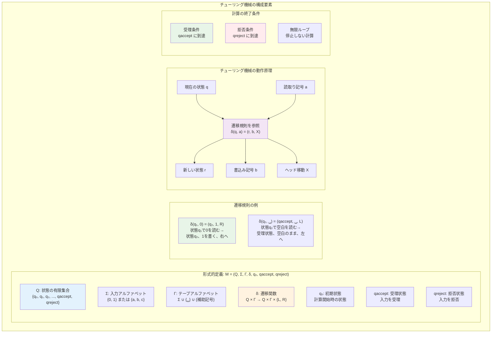
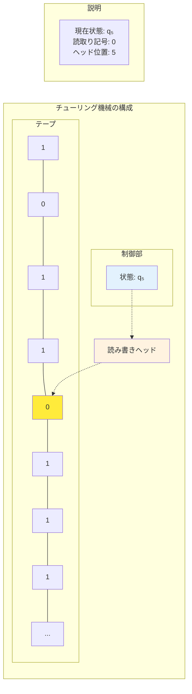
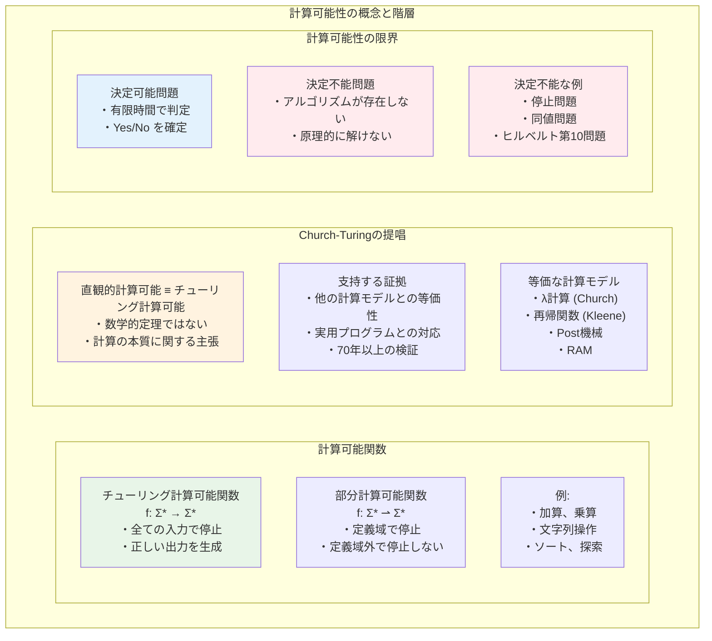
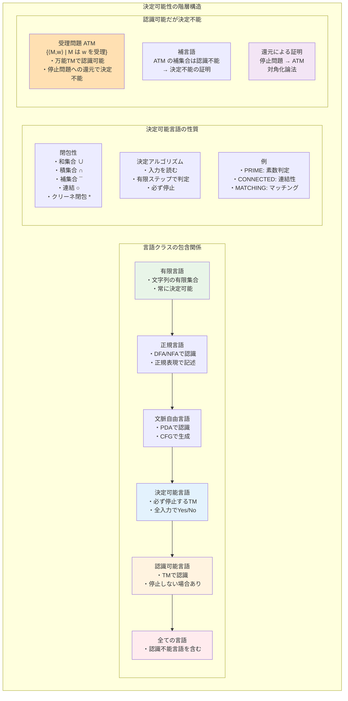
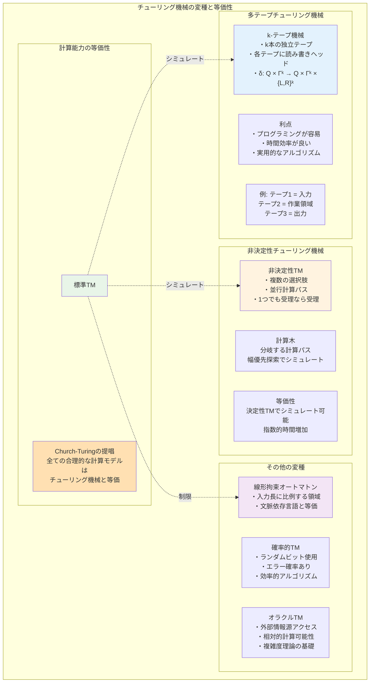
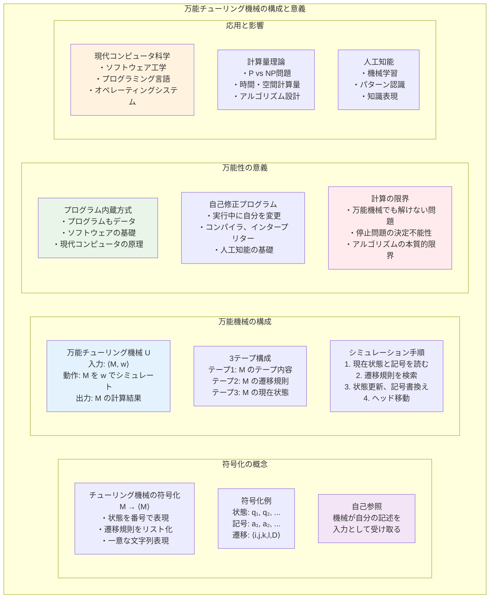
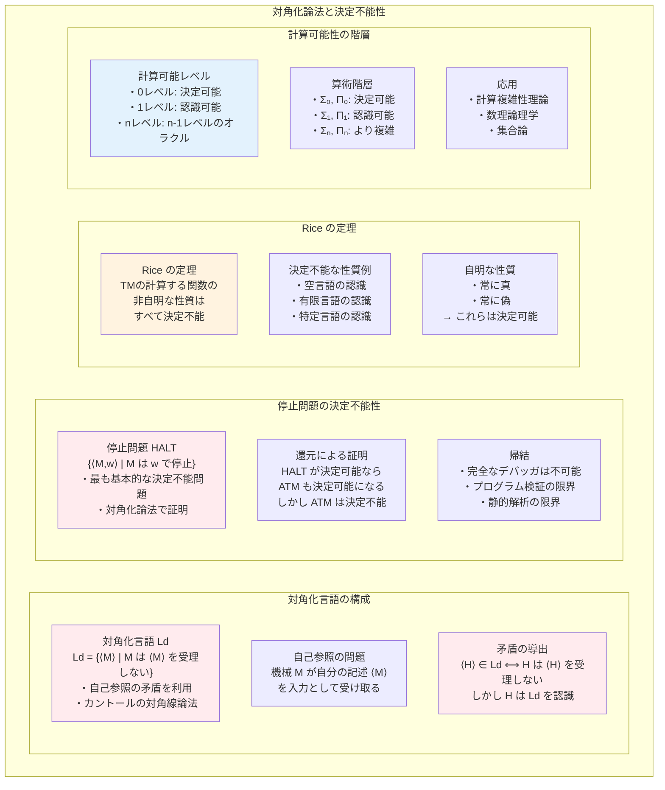

# 第2章 計算理論の基礎

## はじめに

「計算とは何か」という根本的な問いは、コンピュータサイエンスの中核をなす問題です。本章では、計算の数学的モデルとしてのチューリング機械を導入し、計算可能性と決定可能性の概念を学びます。これらの概念は、アルゴリズムの限界を理解し、解ける問題と解けない問題を区別する理論的基盤を提供します。

20世紀前半、数学者たちは「効果的に計算可能」とは何かを厳密に定義しようと試みました。その結果、チューリング、チャーチ、クリーネなどによって提案された様々な計算モデルが、すべて同じ計算能力を持つことが明らかになりました。この驚くべき一致は、計算可能性の本質的な特徴を捉えていることを示唆しています。

## 2.1 計算モデル

### 2.1.1 チューリング機械の直観的理解

**チューリング機械**（Turing machine）は、1936年にアラン・チューリングによって提案された抽象的な計算モデルです。人間が紙と鉛筆で行う計算過程を抽象化したもので、以下の要素から構成されます：

1. **無限に長いテープ**：記号を書き込める升目に分かれている
2. **読み書きヘッド**：テープ上の1つの升目を読み書きできる
3. **有限個の内部状態**：機械の「記憶」に相当
4. **遷移規則**：現在の状態とテープの記号に基づいて次の動作を決定

チューリング機械は、現在の状態とヘッドが読んでいる記号に基づいて：
- 新しい記号をテープに書き込む
- ヘッドを左または右に移動する
- 新しい状態に遷移する

### 2.1.2 チューリング機械の形式的定義



**定義 2.1** **チューリング機械**は7つ組 M = (Q, Σ, Γ, δ, q₀, qaccept, qreject) である。ここで：

- Q：状態の有限集合
- Σ：入力アルファベット（空白記号 ␣ を含まない）
- Γ：テープアルファベット（␣ ∈ Γ かつ Σ ⊆ Γ）
- δ：Q × Γ → Q × Γ × {L, R}：遷移関数
- q₀ ∈ Q：初期状態
- qaccept ∈ Q：受理状態
- qreject ∈ Q：拒否状態（qaccept ≠ qreject）

遷移関数 δ(q, a) = (r, b, X) は以下を意味します：
- 状態 q で記号 a を読んだとき
- 状態 r に遷移し
- 記号 b を書き込み
- ヘッドを X 方向（L：左、R：右）に移動する

### 2.1.3 チューリング機械の構成と計算

**定義 2.2** チューリング機械 M の**構成**（configuration）は、現在の状態、テープの内容、ヘッドの位置を表す。形式的には、文字列 uqv で表現される。ここで：
- q は現在の状態
- uv はテープの内容（空白でない部分）
- ヘッドは v の最初の記号を指している（v が空なら空白を指している）

**例 2.1** 構成 1011q₅0111 は：
- 現在の状態：q₅
- テープの内容：10110111...
- ヘッドの位置：5番目の記号（0）を指している



**定義 2.3** 構成 C₁ が構成 C₂ に**1ステップで遷移する**ことを C₁ ⊢ C₂ と表記する。

遷移規則：δ(q, a) = (r, b, X) のとき、状態 q でヘッドが記号 a を読むと：
1. 記号 a を b に書き換える
2. 状態を r に変更する  
3. ヘッドを X 方向（L：左、R：右）に移動する

構成の遷移は状況に応じて以下のようになる：
- 左移動：ucqav ⊢ uqcbv （c は u の最後の記号、a を b に書き換えて左へ移動）
- 右移動：uqav ⊢ ubrv または uqa ⊢ ubr␣

**定義 2.4** チューリング機械 M が入力 w を**受理する**とは：
- 初期構成 q₀w から始めて
- 受理状態を含む構成に到達すること

M が w を**拒否する**とは：
- 拒否状態を含む構成に到達すること

M が w で**停止する**とは：
- 受理または拒否すること

### 2.1.4 チューリング機械の例

**例 2.2** 言語 L = {0ⁿ1ⁿ | n ≥ 0} を認識するチューリング機械

この言語は、同数の0と1が順番に並んだ文字列の集合です。

**アルゴリズムの概要**：
1. 最左端の0を見つけてxに置き換える
2. 右に移動して対応する1を見つけてyに置き換える
3. 左に戻って次の0を探す
4. すべての0と1が対応したら受理、そうでなければ拒否

**形式的な記述**：
M = (Q, Σ, Γ, δ, q₁, qaccept, qreject) where:
- Q = {q₁, q₂, q₃, q₄, q₅, qaccept, qreject}
- Σ = {0, 1}
- Γ = {0, 1, x, y, ␣}

遷移関数δ：
```
δ(q₁, 0) = (q₂, x, R)  // 0をxに変えて右へ
δ(q₁, y) = (q₁, y, R)  // yをスキップ
δ(q₁, ␣) = (qaccept, ␣, R)  // すべて処理済みなら受理

δ(q₂, 0) = (q₂, 0, R)  // 0をスキップ
δ(q₂, y) = (q₂, y, R)  // yをスキップ
δ(q₂, 1) = (q₃, y, L)  // 1をyに変えて左へ

δ(q₃, 0) = (q₃, 0, L)  // 0をスキップして左へ
δ(q₃, y) = (q₃, y, L)  // yをスキップして左へ
δ(q₃, x) = (q₁, x, R)  // xに到達したら右へ

// エラー処理
δ(q₁, 1) = (qreject, 1, R)
δ(q₂, ␣) = (qreject, ␣, R)
```

**計算例**：入力 "0011" に対する計算過程
```
q₁0011 ⊢ xq₂011 ⊢ x0q₂11 ⊢ x0yq₃1 ⊢ xq₃0y1 ⊢ q₃x0y1 ⊢ xq₁0y1 
⊢ xxq₂y1 ⊢ xxyq₂1 ⊢ xxyyq₃ ⊢ xxyq₃y ⊢ xxq₃yy ⊢ xq₃xyy 
⊢ xxq₁yy ⊢ xxyq₁y ⊢ xxyyq₁ ⊢ xxyy␣qaccept
```

## 2.2 計算可能性



### 2.2.1 チューリング計算可能関数

**定義 2.5** 関数 f: Σ* → Σ* が**チューリング計算可能**（Turing computable）であるとは、以下を満たすチューリング機械 M が存在することである：
- すべての w ∈ Σ* に対して
- M を入力 w で開始すると
- M は停止し、テープ上に f(w) のみが残る

**例 2.3** 文字列を逆順にする関数 rev: {0,1}* → {0,1}* はチューリング計算可能である。

*証明の概要*：以下のアルゴリズムを実装するチューリング機械を構成できる：
1. 入力の最後の文字を記憶
2. その文字を消去
3. テープの右端に移動してその文字を書く
4. 元の位置に戻って繰り返す

### 2.2.2 部分関数と計算可能性

実際の計算では、すべての入力に対して定義されない関数（部分関数）も重要です。

**定義 2.6** 部分関数 f: Σ* ⇀ Σ* が**チューリング計算可能**であるとは、以下を満たすチューリング機械 M が存在することである：
- f(w) が定義されている場合、M は停止して f(w) を出力する
- f(w) が定義されていない場合、M は停止しない（無限ループまたは拒否状態に入る）

### 2.2.3 Church-Turingの提唱

**Church-Turingの提唱**（Church-Turing thesis）：
「直観的に計算可能な関数は、チューリング機械で計算可能な関数と一致する」

これは数学的定理ではなく、「計算」の本質に関する主張です。以下の事実がこの提唱を支持します：

1. **他の計算モデルとの等価性**：
   - ラムダ計算（Church）
   - 再帰関数（Kleene）
   - Post機械
   - ランダムアクセス機械
   これらはすべてチューリング機械と同じ計算能力を持つ

2. **プログラミング言語との対応**：
   現代のプログラミング言語で書けるアルゴリズムは、すべてチューリング機械でシミュレート可能

## 2.3 決定可能性



### 2.3.1 言語と決定問題

**定義 2.7** アルファベット Σ 上の**言語**（language）は、Σ* の部分集合である。

計算理論では、問題を言語として形式化します：
- 問題のインスタンス → 文字列
- "Yes"のインスタンス → 言語の要素
- "No"のインスタンス → 言語に含まれない文字列

**例 2.4** 
- PRIME = {n | n は2進表記された素数}
- CONNECTED = {⟨G⟩ | G は連結グラフ}

### 2.3.2 決定可能言語

**定義 2.8** 言語 L が**決定可能**（decidable）または**再帰的**（recursive）であるとは、L を決定するチューリング機械が存在することである。すなわち、ある機械 M が存在して：
- w ∈ L ならば M は w を受理する
- w ∉ L ならば M は w を拒否する
- M はすべての入力で停止する

決定可能言語の例：
1. **有限言語**：すべての有限言語は決定可能
2. **正規言語**：DFAで認識される言語
3. **文脈自由言語**：CFGで生成される言語

**定理 2.1** 決定可能言語は以下の演算に関して閉じている：
1. 和集合：L₁, L₂ が決定可能 → L₁ ∪ L₂ も決定可能
2. 積集合：L₁, L₂ が決定可能 → L₁ ∩ L₂ も決定可能
3. 補集合：L が決定可能 → L̄ も決定可能
4. 連結：L₁, L₂ が決定可能 → L₁L₂ も決定可能
5. クリーネ閉包：L が決定可能 → L* も決定可能

*証明*（和集合の場合）：
L₁ を決定する機械を M₁、L₂ を決定する機械を M₂ とする。
L₁ ∪ L₂ を決定する機械 M を以下のように構成する：

M = "入力 w に対して：
1. M₁ を w でシミュレートする
2. M₁ が受理したら、受理する
3. M₁ が拒否したら、M₂ を w でシミュレートする
4. M₂ が受理したら受理、拒否したら拒否する"

M₁, M₂ は必ず停止するので、M も必ず停止する。□

### 2.3.3 認識可能言語

**定義 2.9** 言語 L が**認識可能**（recognizable）または**再帰的可算**（recursively enumerable）であるとは、L を認識するチューリング機械が存在することである。すなわち、ある機械 M が存在して：
- w ∈ L ならば M は w を受理する
- w ∉ L ならば M は w を拒否するか、永遠に動作し続ける

**定理 2.2** L が決定可能 ⟺ L と L̄ の両方が認識可能

*証明*（⇒）：L が決定可能なら、定義より L は認識可能。
L を決定する機械の受理と拒否を入れ替えれば L̄ を決定する機械が得られるので、L̄ も認識可能。

（⇐）：L を認識する機械を M₁、L̄ を認識する機械を M₂ とする。
以下の機械 M は L を決定する：

M = "入力 w に対して：
1. M₁ と M₂ を並行してシミュレートする
2. M₁ が受理したら、受理する
3. M₂ が受理したら、拒否する"

w ∈ L または w ∈ L̄ のいずれかが成り立つので、M は必ず停止する。□

## 2.4 チューリング機械の変種



### 2.4.1 多テープチューリング機械

**定義 2.10** k-テープチューリング機械は、k 本の独立したテープを持ち、各テープに独立した読み書きヘッドを持つ。

遷移関数：δ: Q × Γᵏ → Q × Γᵏ × {L, R}ᵏ

**定理 2.3** 多テープチューリング機械は、単一テープチューリング機械と同じ計算能力を持つ。

*証明の概要*：k-テープ機械 M を単一テープ機械 S でシミュレートする。
S のテープを k 個の領域に分け、各領域が M の各テープを表現する。
ヘッドの位置は特殊な記号でマークする。

例：3テープ機械の構成
```
テープ1: a b c
         ↑
テープ2: x y z
           ↑
テープ3: 1 2 3
         ↑
```

を単一テープで表現：
```
#â b c#x ŷ z#1̂ 2 3#
```
（ˆ はヘッドの位置を示す）

S の1ステップで M の1ステップをシミュレートできる。□

### 2.4.2 非決定性チューリング機械

**定義 2.11** **非決定性チューリング機械**（NTM）では、遷移関数が遷移の集合を返す：
δ: Q × Γ → P(Q × Γ × {L, R})

各ステップで、機械は可能な遷移の中から非決定的に1つを選択する。

**定義 2.12** NTM M が入力 w を受理するとは、少なくとも1つの計算パスが受理状態に到達することである。

**定理 2.4** 非決定性チューリング機械は、決定性チューリング機械と同じ計算能力を持つ。

*証明の概要*：NTM N を決定性TM D でシミュレートする。
D は N のすべての可能な計算パスを幅優先探索で系統的に探索する。

計算木の各ノードは N の構成を表し、子ノードは可能な遷移先を表す。
D は以下のように動作：
1. 深さ1のすべてのパスを探索
2. 深さ2のすべてのパスを探索
3. 以下同様

受理構成が見つかれば受理、すべての有限パスが拒否なら拒否。□

### 2.4.3 線形拘束オートマトン

**定義 2.13** **線形拘束オートマトン**（Linear Bounded Automaton, LBA）は、テープの使用を入力長に比例する範囲に制限したチューリング機械である。

形式的には、入力の両端に特殊な端記号を置き、その間でのみ動作する。

**定理 2.5** LBAで認識される言語のクラスは、文脈依存言語のクラスと一致する。

### 2.4.4 確率的チューリング機械

**定義 2.14** **確率的チューリング機械**（Probabilistic TM）は、各ステップでコイン投げの結果を利用できるチューリング機械である。

形式的には、特別な状態でランダムビットを生成し、その結果に基づいて遷移する。

確率的計算の受理条件：
- **片側誤り**：w ∈ L → Pr[M accepts w] ≥ 2/3、w ∉ L → Pr[M accepts w] = 0
- **両側誤り**：w ∈ L → Pr[M accepts w] ≥ 2/3、w ∉ L → Pr[M accepts w] ≤ 1/3

## 2.5 万能チューリング機械



### 2.5.1 チューリング機械の符号化

チューリング機械自体を文字列として表現できます。

**定義 2.15** チューリング機械 M = (Q, Σ, Γ, δ, q₀, qaccept, qreject) の**符号化** ⟨M⟩ は、M の構造を一意に表現する文字列である。

符号化の例：
- 状態を q₁, q₂, ..., qₙ と番号付け
- 記号を a₁, a₂, ..., aₘ と番号付け
- 遷移 δ(qᵢ, aⱼ) = (qₖ, aₗ, D) を ⟨i, j, k, l, D⟩ として符号化

### 2.5.2 万能チューリング機械の構成

**定理 2.6** 万能チューリング機械 U が存在する。U は入力 ⟨M, w⟩ に対して、M が w に対して行う計算をシミュレートする。

**証明の概要**：U を3テープ機械として構成する：
1. テープ1：シミュレート対象の機械 M のテープ内容
2. テープ2：M の遷移規則（⟨M⟩の一部）
3. テープ3：M の現在の状態

U の動作：
1. 入力 ⟨M, w⟩ を適切なテープに配置
2. M の初期構成を設定
3. 以下を繰り返す：
   - 現在の状態と読んでいる記号から、適用する遷移規則を探す
   - 遷移規則に従って、状態を更新し、記号を書き換え、ヘッドを移動
   - 受理状態に達したら受理、拒否状態に達したら拒否

単一テープ機械でも同様の構成が可能。□

### 2.5.3 万能性の意義

万能チューリング機械の存在は、以下の重要な帰結をもたらします：

1. **プログラム内蔵方式**：プログラム（チューリング機械）をデータとして扱える
2. **計算の理論的限界**：万能機械でも解けない問題の存在を示唆
3. **現代のコンピュータ**：本質的に万能チューリング機械の実装

## 2.6 計算可能性の基本定理



### 2.6.1 対角化言語

**定義 2.16** 対角化言語 Ld を以下のように定義する：
Ld = {⟨M⟩ | M は ⟨M⟩ を受理しない}

**定理 2.7** Ld は認識可能でない。

*証明*（対角線論法）：
Ld が認識可能と仮定し、それを認識する機械を H とする。
⟨H⟩ ∈ Ld かどうかを考える：

- ⟨H⟩ ∈ Ld とすると、定義より H は ⟨H⟩ を受理しない
  しかし、H は Ld を認識するので、⟨H⟩ ∈ Ld なら H は ⟨H⟩ を受理する（矛盾）

- ⟨H⟩ ∉ Ld とすると、定義より H は ⟨H⟩ を受理する
  しかし、H は Ld を認識するので、⟨H⟩ ∉ Ld なら H は ⟨H⟩ を受理しない（矛盾）

したがって、Ld は認識可能でない。□

### 2.6.2 認識可能だが決定可能でない言語

**定理 2.8** 認識可能だが決定可能でない言語が存在する。

*証明*：受理言語 LATM を考える：
LATM = {⟨M, w⟩ | M は w を受理する}

**LATM は認識可能**：万能チューリング機械 U により、⟨M, w⟩ に対して M を w でシミュレートする。M が w を受理すれば U も受理し、M が拒否または無限ループすれば U も同様に動作する。

**LATM は決定可能でない**：背理法で示す。LATM を決定する機械 H が存在すると仮定する。以下の機械 D を構成する：

D = "入力 ⟨M⟩ に対して：
1. H を ⟨M, ⟨M⟩⟩ でシミュレートする
2. H が受理したら拒否、拒否したら受理する"

すると D は Ld = {⟨M⟩ | M は ⟨M⟩ を受理しない} を認識することになる。
しかし定理2.7により Ld は認識可能でない。矛盾。□

## 2.7 計算の階層

### 2.7.1 言語クラスの包含関係

これまでに学んだ言語クラスの関係：

**定理 2.9** 以下の真の包含関係が成り立つ：
有限言語 ⊊ 正規言語 ⊊ 文脈自由言語 ⊊ 決定可能言語 ⊊ 認識可能言語 ⊊ すべての言語

### 2.7.2 計算可能関数の性質

**定理 2.10**（s-m-n定理）プログラムの部分適用に相当する操作が計算可能である。

形式的には、2変数の計算可能関数 f(x, y) に対して、計算可能な関数 s が存在し、
すべての x, y に対して φ_s(x)(y) = f(x, y)

ここで φᵢ は符号 i を持つチューリング機械が計算する関数。s(x)はxを引数とする関数を表す。

**定理 2.11**（再帰定理）すべてのチューリング機械 T に対して、機械 R が存在し、R と T(⟨R⟩) は同じ言語を認識する。

これは、自己の記述を得ることができるプログラムの存在を保証します。つまり、プログラムが自身のソースコードを読み込んだり、変更したりできる能力を意味し、プログラミングにおける再帰的構造や自己言及的なプログラムの理論的基盤を提供します。

## 章末問題

### 基礎問題

1. 以下の言語を認識するチューリング機械を構成せよ：
   (a) {0ⁿ1ⁿ2ⁿ | n ≥ 0}
   (b) {ww | w ∈ {0,1}*}
   (c) {w ∈ {0,1}* | w は回文}

2. 2つの2進数の和を計算するチューリング機械を設計せよ。入力形式は ⟨x⟩#⟨y⟩ とする。

3. 以下の言語が決定可能であることを証明せよ：
   (a) ADFA = {⟨B, w⟩ | B は DFA で、B は w を受理する}
   (b) ECFG = {⟨G⟩ | G は文脈自由文法で、L(G) = ∅}

4. L₁ = {w | w は偶数個の0を含む} と L₂ = {w | w は3の倍数個の1を含む} が決定可能であることを示し、L₁ ∩ L₂ を決定するアルゴリズムを示せ。

5. 非決定性チューリング機械が言語 {0ⁿ1ⁿ | n ≥ 0} ∪ {0ⁿ1²ⁿ | n ≥ 0} を線形時間で認識できることを示せ。

### 発展問題

6. 多テープチューリング機械から単一テープチューリング機械への変換において、時間計算量がどのように変化するか解析せよ。

7. 非決定性チューリング機械 N が時間 t(n) で動作するとき、それをシミュレートする決定性チューリング機械の時間計算量の上界を求めよ。

8. チューリング機械の停止性を判定する「近似アルゴリズム」を考える。入力の一定割合以上で正しく判定できるアルゴリズムは存在しないことを証明せよ。

### 探究課題

9. Church-Turingの提唱に対する批判や限界について調査し、量子計算やDNA計算などの新しい計算モデルとの関係を論ぜよ。

10. 計算可能性理論の歴史的発展について調査し、ヒルベルトの第10問題やゲーデルの不完全性定理との関連を説明せよ。

### 実装課題

#### 1. 簡単なチューリング機械シミュレータを実装せよ

```python
class TuringMachine:
    def __init__(self, states, alphabet, tape_alphabet, 
                 transitions, start_state, accept_state, reject_state):
        # 初期化
    
    def step(self):
        # 1ステップ実行
    
    def run(self, input_string, max_steps=1000):
        # 入力文字列に対して実行
        # 受理/拒否/タイムアウトを返す
```

例として、{0ⁿ1ⁿ | n ≥ 0} を認識する機械を実装し、テストせよ。

#### 2. Post対応問題のインスタンスを解く総当たりアルゴリズムを実装せよ

- 与えられたドミノのリストから、上下が一致する並べ方を探索
- 深さ制限付き探索で、解が存在する場合は発見できることを確認