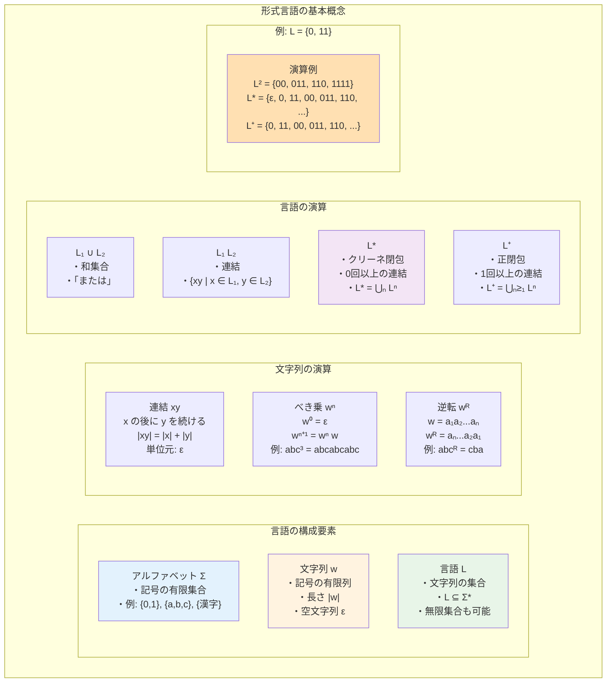
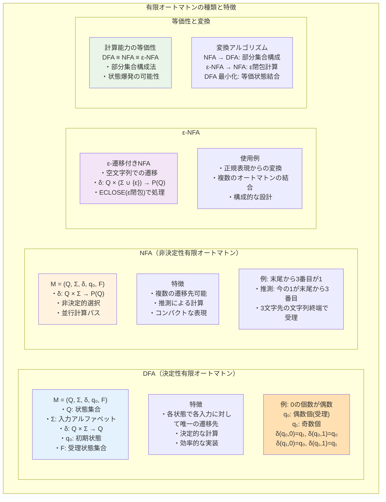
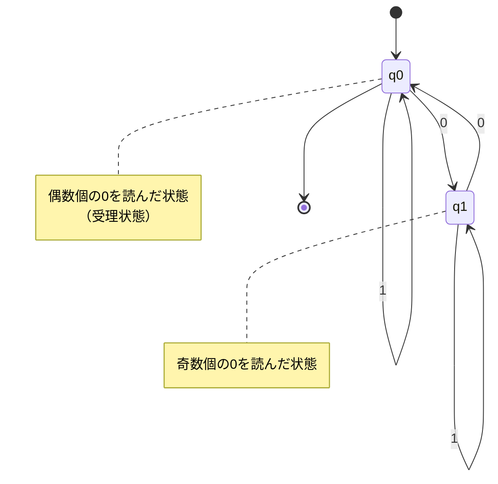
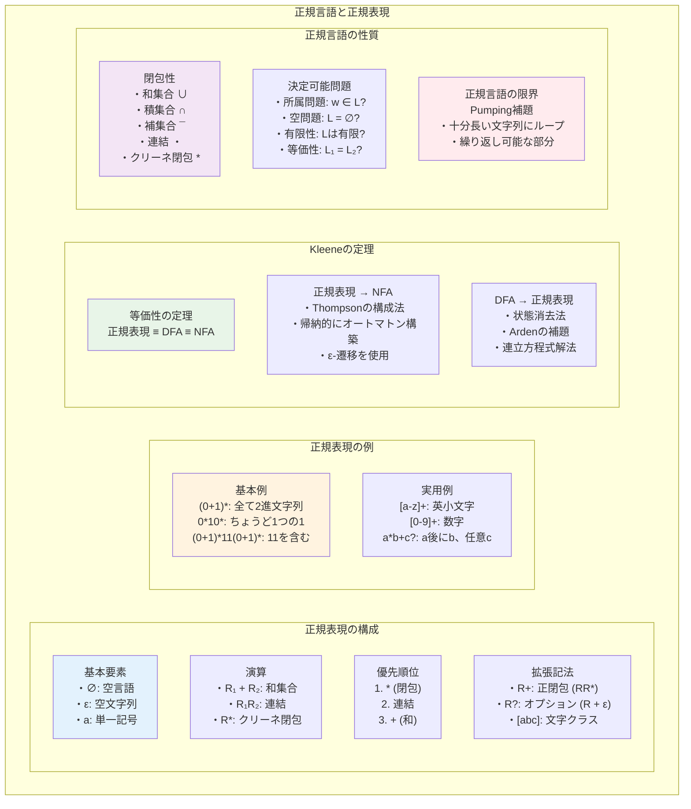
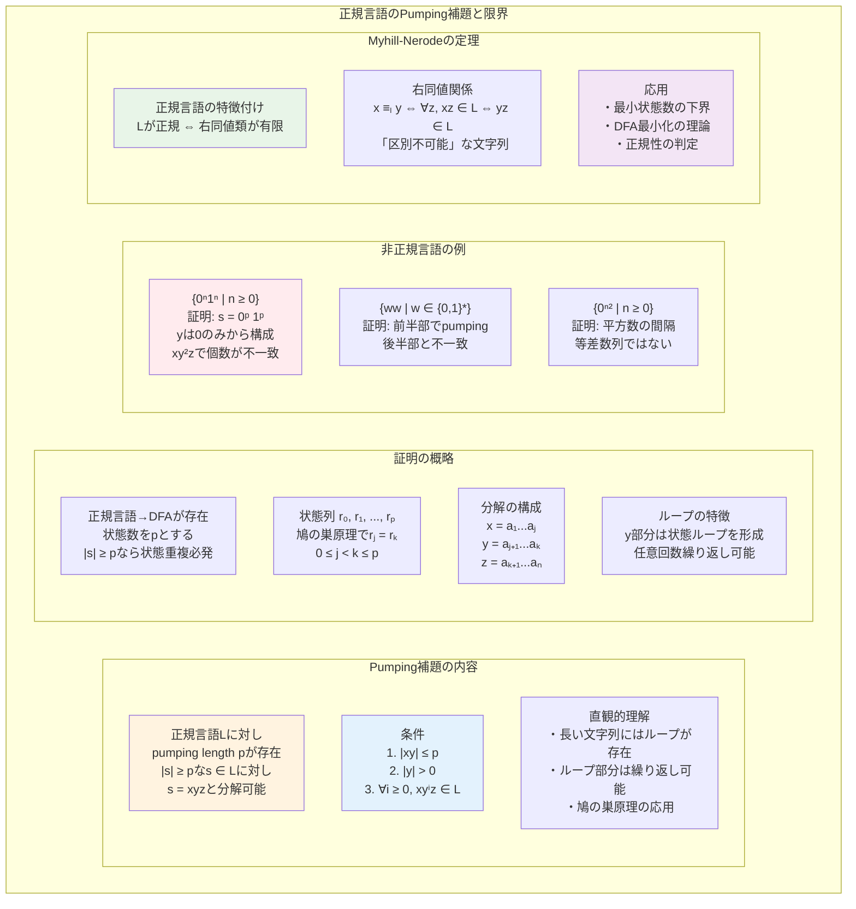
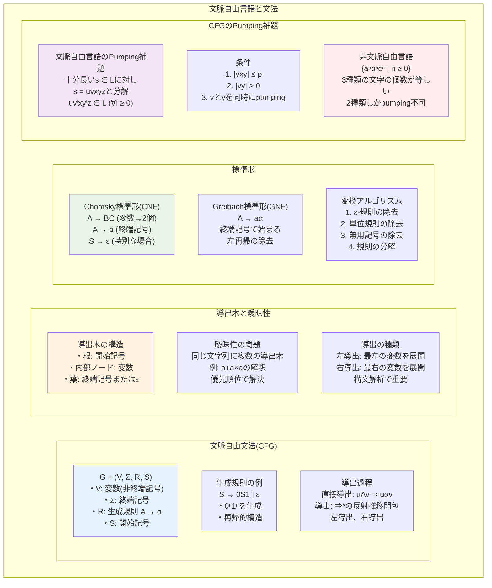
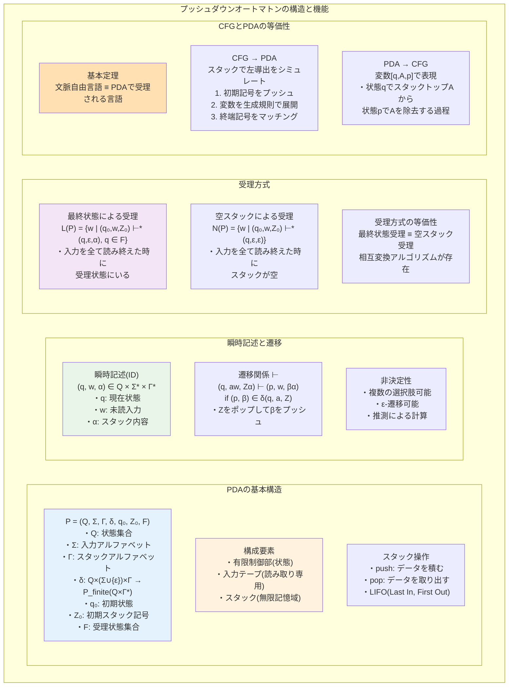
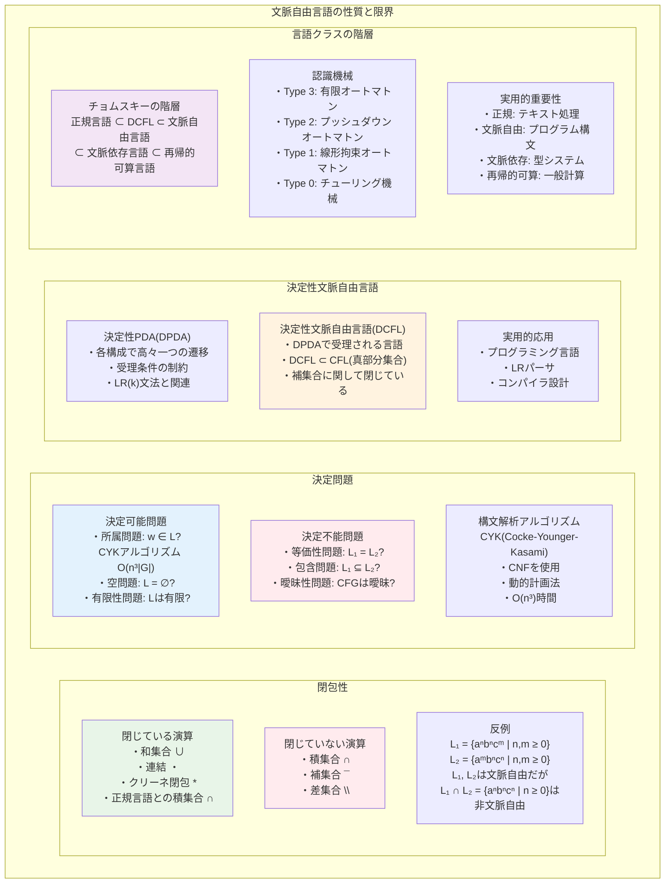

# 第3章 形式言語とオートマトン理論

## はじめに

形式言語理論は、プログラミング言語の構文解析、コンパイラ設計、文字列処理アルゴリズムなど、コンピュータサイエンスの多くの分野で基礎となる理論です。本章では、言語を認識する計算モデルであるオートマトンを、その計算能力に応じて階層的に学びます。

有限オートマトンから始まり、より強力なプッシュダウンオートマトンへと進むことで、計算モデルの能力と限界を体系的に理解します。各モデルが認識できる言語クラス（正規言語、文脈自由言語）の性質を詳しく調べ、実用的な応用への橋渡しをします。

## 3.1 形式言語



### 3.1.1 基本定義

**定義 3.1** **アルファベット**（alphabet）Σ は、記号の空でない有限集合である。

例：
- Σ₁ = {0, 1}（2進アルファベット）
- Σ₂ = {a, b, c, ..., z}（英小文字）
- Σ₃ = {0, 1, ..., 9, +, -, ×, ÷, (, )}（算術式の記号）

**定義 3.2** Σ 上の**文字列**（string）は、Σ の要素の有限列である。長さ 0 の文字列を**空文字列**（empty string）と呼び、ε で表す。

**記法**：
- |w|：文字列 w の長さ
- wᵢ：w の i 番目の文字（1 ≤ i ≤ |w|）
- Σ*：Σ 上のすべての文字列の集合
- Σ⁺：Σ 上の空でない文字列の集合（Σ⁺ = Σ* \ {ε}）
- Σⁿ：長さ n の文字列の集合

**定義 3.3** Σ 上の**言語**（language）は、Σ* の部分集合である。

### 3.1.2 文字列の演算

**定義 3.4** 文字列の基本演算：

1. **連結**（concatenation）：文字列 x, y の連結 xy は、x の後に y を続けた文字列
   - 性質：|xy| = |x| + |y|
   - 単位元：xε = εx = x

2. **冪乗**：wⁿ = ww...w（n 個の w の連結）
   - w⁰ = ε
   - wⁿ⁺¹ = wⁿw

3. **逆転**（reversal）：w = a₁a₂...aₙ の逆転 wᴿ = aₙ...a₂a₁
   - εᴿ = ε
   - (xy)ᴿ = yᴿxᴿ

4. **部分文字列**：v が w の部分文字列 ⟺ ∃x, y ∈ Σ*, w = xvy
   - **接頭辞**（prefix）：w = xv となる x
   - **接尾辞**（suffix）：w = vx となる x

### 3.1.3 言語の演算

**定義 3.5** 言語 L₁, L₂ ⊆ Σ* に対する演算：

1. **和集合**：L₁ ∪ L₂ = {w | w ∈ L₁ ∨ w ∈ L₂}
2. **積集合**：L₁ ∩ L₂ = {w | w ∈ L₁ ∧ w ∈ L₂}
3. **補集合**：L̄ = Σ* \ L
4. **連結**：L₁L₂ = {xy | x ∈ L₁ ∧ y ∈ L₂}
5. **冪乗**：
   - L⁰ = {ε}
   - Lⁿ⁺¹ = LⁿL
6. **クリーネ閉包**：L* = ⋃ₙ₌₀^∞ Lⁿ
7. **正閉包**：L⁺ = ⋃ₙ₌₁^∞ Lⁿ

**例 3.1** L = {0, 11} のとき：
- L² = {00, 011, 110, 1111}
- L* = {ε, 0, 11, 00, 011, 110, 1111, ...}

## 3.2 有限オートマトン



### 3.2.1 決定性有限オートマトン（DFA）

**定義 3.6** **決定性有限オートマトン**（Deterministic Finite Automaton, DFA）は5つ組 M = (Q, Σ, δ, q₀, F) である。ここで：
- Q：状態の有限集合
- Σ：入力アルファベット
- δ: Q × Σ → Q：遷移関数
- q₀ ∈ Q：初期状態
- F ⊆ Q：受理状態の集合

**定義 3.7** DFA M の**拡張遷移関数** δ̂: Q × Σ* → Q を帰納的に定義：
- δ̂(q, ε) = q
- δ̂(q, wa) = δ(δ̂(q, w), a)（w ∈ Σ*, a ∈ Σ）

**定義 3.8** DFA M が文字列 w を**受理する**とは、δ̂(q₀, w) ∈ F であること。
M が認識する言語：L(M) = {w ∈ Σ* | δ̂(q₀, w) ∈ F}

**例 3.2** 0 の個数が偶数である2進文字列を認識する DFA

M = ({q₀, q₁}, {0, 1}, δ, q₀, {q₀}) where:
- δ(q₀, 0) = q₁, δ(q₀, 1) = q₀
- δ(q₁, 0) = q₀, δ(q₁, 1) = q₁



状態の意味：
- q₀：これまでに読んだ0の個数が偶数（受理状態）
- q₁：これまでに読んだ0の個数が奇数

### 3.2.2 非決定性有限オートマトン（NFA）

**定義 3.9** **非決定性有限オートマトン**（Nondeterministic Finite Automaton, NFA）は5つ組 M = (Q, Σ, δ, q₀, F) である。ここで：
- Q, Σ, q₀, F は DFA と同じ
- δ: Q × Σ → P(Q)：遷移関数（P(Q) は Q の冪集合）

**定義 3.10** NFA M の拡張遷移関数 δ̂: Q × Σ* → P(Q)：
- δ̂(q, ε) = {q}
- δ̂(q, wa) = ⋃ᵣ∈δ̂(q,w) δ(r, a)

状態集合への拡張：δ̂(R, w) = ⋃q∈R δ̂(q, w)（R ⊆ Q）

**定義 3.11** NFA M が w を受理 ⟺ δ̂(q₀, w) ∩ F ≠ ∅

**例 3.3** 末尾から3番目の文字が1である2進文字列を認識する NFA

直観的に、「今読んでいる文字が末尾から3番目の1である」と「推測」する。

M = ({q₀, q₁, q₂, q₃}, {0, 1}, δ, q₀, {q₃}) where:
- δ(q₀, 0) = {q₀}, δ(q₀, 1) = {q₀, q₁}
- δ(q₁, 0) = {q₂}, δ(q₁, 1) = {q₂}
- δ(q₂, 0) = {q₃}, δ(q₂, 1) = {q₃}
- δ(q₃, 0) = ∅, δ(q₃, 1) = ∅

### 3.2.3 ε-NFA

**定義 3.12** **ε-NFA** は、空文字列 ε での遷移を許す NFA である。
遷移関数：δ: Q × (Σ ∪ {ε}) → P(Q)

**定義 3.13** 状態 q の**ε-閉包** ECLOSE(q)：
ECLOSE(q) = {p | q から p へ ε 遷移のみで到達可能}

集合への拡張：ECLOSE(R) = ⋃q∈R ECLOSE(q)

**例 3.4** ε-NFA から通常の NFA への変換

ε-NFA の遷移関数 δ から、等価な NFA の遷移関数 δ' を構成：
δ'(q, a) = ECLOSE(⋃ᵣ∈ECLOSE(q) δ(r, a))

### 3.2.4 DFAとNFAの等価性

**定理 3.1** すべての NFA に対して、同じ言語を認識する DFA が存在する。

*証明*（部分集合構成法）：
NFA N = (Qₙ, Σ, δₙ, q₀, Fₙ) から DFA D = (Qᴅ, Σ, δᴅ, q₀ᴅ, Fᴅ) を構成：
- Qᴅ = P(Qₙ)（N の状態集合の冪集合）
- q₀ᴅ = {q₀}
- Fᴅ = {R ⊆ Qₙ | R ∩ Fₙ ≠ ∅}
- δᴅ(R, a) = ⋃q∈R δₙ(q, a)

帰納法により、δ̂ᴅ({q₀}, w) = δ̂ₙ(q₀, w) が示される。
したがって、L(D) = L(N)。□

**注意**：状態数は最悪の場合指数的に増加する（|Qᴅ| ≤ 2^|Qₙ|）。

## 3.3 正規言語



### 3.3.1 正規表現

**定義 3.14** アルファベット Σ 上の**正規表現**（regular expression）を帰納的に定義：
1. ∅ は正規表現（言語 ∅ を表す）
2. ε は正規表現（言語 {ε} を表す）
3. a ∈ Σ に対して、a は正規表現（言語 {a} を表す）
4. R₁, R₂ が正規表現なら、以下も正規表現：
   - (R₁ + R₂)：和集合 L(R₁) ∪ L(R₂) を表す
   - (R₁R₂)：連結 L(R₁)L(R₂) を表す
   - (R₁)*：クリーネ閉包 L(R₁)* を表す

**記法の簡略化**：
- 括弧の省略：優先順位は * > 連結 > +
- R⁺ = RR*
- R? = R + ε（0回または1回）

**例 3.5** 正規表現と言語：
- (0+1)*：すべての2進文字列
- 0*10*：ちょうど1つの1を含む2進文字列
- (0+1)*11(0+1)*：部分文字列として11を含む
- ((0+1)(0+1))*：偶数長の2進文字列

### 3.3.2 正規言語の特徴付け

**定理 3.2**（Kleeneの定理）言語 L について、以下は同値：
1. L は正規表現で表される
2. L は DFA で認識される
3. L は NFA で認識される

*証明の概要*：
(1)→(3)：正規表現から NFA を帰納的に構成
- 基底：∅, ε, a に対する NFA は自明
- 帰納：和集合、連結、クリーネ閉包に対する構成法

(3)→(2)：定理3.1（部分集合構成法）

(2)→(1)：状態消去法またはArdenの補題を使用□

### 3.3.3 正規言語の閉包性

**定理 3.3** 正規言語は以下の演算に関して閉じている：
1. 和集合
2. 積集合
3. 補集合
4. 連結
5. クリーネ閉包
6. 差集合
7. 対称差

*証明*（積集合の場合）：
L₁ を認識する DFA M₁ = (Q₁, Σ, δ₁, q₁, F₁)
L₂ を認識する DFA M₂ = (Q₂, Σ, δ₂, q₂, F₂)

積オートマトン M = (Q₁ × Q₂, Σ, δ, (q₁, q₂), F₁ × F₂) を構成：
δ((p, q), a) = (δ₁(p, a), δ₂(q, a))

帰納法により、δ̂((q₁, q₂), w) = (δ̂₁(q₁, w), δ̂₂(q₂, w)) が示される。
したがって、L(M) = L₁ ∩ L₂。□

### 3.3.4 正規言語の判定問題

**定理 3.4** 正規言語に対する以下の問題は決定可能：
1. **所属問題**：w ∈ L?
2. **空問題**：L = ∅?
3. **有限性問題**：L は有限？
4. **等価性問題**：L₁ = L₂?

*証明*（等価性問題）：
L₁ = L₂ ⟺ (L₁ \ L₂) ∪ (L₂ \ L₁) = ∅
正規言語の閉包性より (L₁ \ L₂) ∪ (L₂ \ L₁) も正規言語。
空問題が決定可能なので、等価性も決定可能。□

## 3.4 正規言語の限界



### 3.4.1 Pumping補題

**定理 3.5**（正規言語のPumping補題）
L が正規言語ならば、ある正整数 p（pumping length）が存在して、
|s| ≥ p なる任意の s ∈ L は以下を満たす分解 s = xyz を持つ：
1. |xy| ≤ p
2. |y| > 0
3. すべての i ≥ 0 に対して xyⁱz ∈ L

*証明*：L を認識する DFA を M = (Q, Σ, δ, q₀, F) とし、p = |Q| とする。
|s| ≥ p なる s ∈ L を考える。s = a₁a₂...aₙ（n ≥ p）とする。

状態列 r₀, r₁, ..., rₙ を以下のように定義：
- r₀ = q₀
- rᵢ₊₁ = δ(rᵢ, aᵢ₊₁)

鳩の巣原理より、r₀, r₁, ..., rₚ の中に同じ状態が存在。
rⱼ = rₖ（0 ≤ j < k ≤ p）とすると、s = xyz と分解できる：
- x = a₁...aⱼ
- y = aⱼ₊₁...aₖ  
- z = aₖ₊₁...aₙ

このとき：
1. |xy| = k ≤ p
2. |y| = k - j > 0  
3. δ̂(q₀, x) = rⱼ = rₖ = δ̂(q₀, xy) なので、y の部分はループを形成し、任意の i ≥ 0 に対して δ̂(q₀, xyⁱz) ∈ F となる。したがって xyⁱz ∈ L。□

### 3.4.2 非正規言語の例

**例 3.6** L = {0ⁿ1ⁿ | n ≥ 0} は正規言語でない。

*証明*（Pumping補題の対偶を使用）：
L が正規言語と仮定し、pumping length を p とする。
s = 0ᵖ1ᵖ を考える。|s| = 2p ≥ p なので、s = xyz と分解できる。

条件 |xy| ≤ p より、y は 0 のみからなる。y = 0ᵏ（k > 0）とする。
すると xy²z = 0ᵖ⁺ᵏ1ᵖ ∉ L となり、矛盾。□

**例 3.7** 以下の言語も非正規：
1. {ww | w ∈ {0,1}*}
2. {0ⁿ² | n ≥ 0}
3. {w ∈ {0,1}* | w は回文}

### 3.4.3 Myhill-Nerodの定理

**定義 3.15** 言語 L に対して、文字列 x, y の**識別可能性**：
x ≡ₗ y ⟺ ∀z ∈ Σ*, (xz ∈ L ⟺ yz ∈ L)

≡ₗ は同値関係であり、その同値類を L の**右同値類**という。

**定理 3.6**（Myhill-Nerodの定理）
言語 L が正規言語 ⟺ ≡ₗ の同値類の個数が有限

*証明*（⇒）：L を認識する DFA M = (Q, Σ, δ, q₀, F) が存在。
x ≡ₘ y ⟺ δ̂(q₀, x) = δ̂(q₀, y) と定義すると、≡ₘ は有限個の同値類を持つ。
x ≡ₘ y ならば x ≡ₗ y が示せるので、≡ₗ も有限個の同値類を持つ。

（⇐）：≡ₗ の同値類を状態とする DFA を構成できる。□

## 3.5 文脈自由言語



### 3.5.1 文脈自由文法

**定義 3.16** **文脈自由文法**（Context-Free Grammar, CFG）は4つ組 G = (V, Σ, R, S) である：
- V：変数（非終端記号）の有限集合
- Σ：終端記号の有限集合（V ∩ Σ = ∅）
- R：生成規則の有限集合。各規則は A → α の形（A ∈ V, α ∈ (V ∪ Σ)*）
- S ∈ V：開始記号

**定義 3.17** **導出**（derivation）：
- 直接導出：uAv ⇒ uαv if A → α ∈ R
- 導出：⇒* は ⇒ の反射推移閉包
- 左導出：常に最左の変数を展開
- 右導出：常に最右の変数を展開

**定義 3.18** CFG G が生成する言語：
L(G) = {w ∈ Σ* | S ⇒* w}

**例 3.8** 言語 {0ⁿ1ⁿ | n ≥ 0} を生成する CFG：
G = ({S}, {0, 1}, {S → 0S1, S → ε}, S)

導出例：S ⇒ 0S1 ⇒ 00S11 ⇒ 000S111 ⇒ 000111

### 3.5.2 導出木と曖昧性

**定義 3.19** CFG G の**導出木**（derivation tree）は以下を満たす順序木：
1. 各内部節点は変数でラベル付け
2. 各葉は終端記号または ε でラベル付け
3. 根は開始記号でラベル付け
4. 内部節点 A の子が B₁, ..., Bₖ なら A → B₁...Bₖ ∈ R

**定義 3.20** CFG G が**曖昧**（ambiguous）⟺ 
ある w ∈ L(G) に対して複数の導出木が存在

**例 3.9** 曖昧な文法：
G: E → E + E | E × E | (E) | a

文字列 "a + a × a" に対する2つの導出木：
1. E → E + E → a + E → a + E × E → a + a × a
2. E → E × E → E + E × E → a + E × E → a + a × E → a + a × a

### 3.5.3 文脈自由言語の標準形

**定義 3.21** **Chomsky標準形**（CNF）：すべての生成規則が以下の形：
- A → BC（A, B, C ∈ V）
- A → a（A ∈ V, a ∈ Σ）
- S → ε（S が右辺に現れない場合のみ）

**定理 3.7** すべての CFG は等価な CNF に変換できる。

*変換アルゴリズム*：
1. ε-規則の除去（S → ε 以外）
2. 単位規則（A → B）の除去
3. 無用な記号の除去
4. 長い規則の分解
5. 終端記号の分離

**定義 3.22** **Greibach標準形**（GNF）：すべての生成規則が以下の形：
A → aα（A ∈ V, a ∈ Σ, α ∈ V*）

### 3.5.4 CFGのPumping補題

**定理 3.8**（文脈自由言語のPumping補題）
L が文脈自由言語ならば、ある正整数 p が存在して、
|s| ≥ p なる任意の s ∈ L は以下を満たす分解 s = uvxyz を持つ：
1. |vxy| ≤ p
2. |vy| > 0
3. すべての i ≥ 0 に対して uvⁱxyⁱz ∈ L

*証明の概要*：CNF の文法を考え、十分長い文字列の導出木は深くなる。
鳩の巣原理により、ある変数が経路上に2回現れる。
その部分木の構造から、pumping が可能であることが示される。□

**例 3.10** L = {aⁿbⁿcⁿ | n ≥ 0} は文脈自由言語でない。

*証明*：pumping length を p とし、s = aᵖbᵖcᵖ を考える。
s = uvxyz と分解したとき、|vxy| ≤ p より、vxy は高々2種類の文字を含む。
したがって、uv²xy²z では3種類の文字の個数が等しくならない。□

## 3.6 プッシュダウンオートマトン



### 3.6.1 PDAの定義

**定義 3.23** **プッシュダウンオートマトン**（PDA）は7つ組 P = (Q, Σ, Γ, δ, q₀, Z₀, F)：
- Q：状態の有限集合
- Σ：入力アルファベット
- Γ：スタックアルファベット
- δ: Q × (Σ ∪ {ε}) × Γ → P(Q × Γ*)：遷移関数（Pは冪集合、有限部分集合のみを返す）
- q₀ ∈ Q：初期状態
- Z₀ ∈ Γ：初期スタック記号
- F ⊆ Q：受理状態の集合

**定義 3.24** PDA の**瞬時記述**（ID）：(q, w, α) ∈ Q × Σ* × Γ*
- q：現在の状態
- w：未読の入力
- α：スタックの内容（左端がトップ）

**定義 3.25** 1ステップ遷移 ⊢：
(q, aw, Zα) ⊢ (p, w, βα) if (p, β) ∈ δ(q, a, Z)

### 3.6.2 PDAの受理方式

**定義 3.26** PDAの2つの受理方式：
1. **最終状態による受理**：L(P) = {w | (q₀, w, Z₀) ⊢* (q, ε, α), q ∈ F}
2. **空スタックによる受理**：N(P) = {w | (q₀, w, Z₀) ⊢* (q, ε, ε)}

**定理 3.9** 最終状態受理と空スタック受理は等価である。

### 3.6.3 CFGとPDAの等価性

**定理 3.10** 言語 L について、以下は同値：
1. L は文脈自由言語
2. L は PDA で受理される

*証明の概要*：
(1)→(2)：CFG から PDA を構成。スタックを使って左導出をシミュレート。

(2)→(1)：PDA から CFG を構成。変数 [q, A, p] は「状態 q でスタックトップ A から始めて、スタックトップを取り除いて状態 p に至る」ことを表す。□

## 3.7 文脈自由言語の性質



### 3.7.1 閉包性

**定理 3.11** 文脈自由言語は以下に関して閉じている：
1. 和集合
2. 連結
3. クリーネ閉包
4. 正規言語との積集合

文脈自由言語は積集合、補集合に関して閉じていない。

**例 3.11** L₁ = {aⁿbⁿcᵐ | n, m ≥ 0} と L₂ = {aᵐbⁿcⁿ | n, m ≥ 0} は文脈自由言語だが、L₁ ∩ L₂ = {aⁿbⁿcⁿ | n ≥ 0} は文脈自由言語でない。

### 3.7.2 決定問題

**定理 3.12** 文脈自由言語に対する以下の問題は決定可能：
1. **所属問題**：w ∈ L?（CYKアルゴリズム：O(n³|G|)）
2. **空問題**：L = ∅?
3. **有限性問題**：L は有限？

以下は決定不能：
- **等価性問題**：L₁ = L₂?
- **包含問題**：L₁ ⊆ L₂?
- **曖昧性問題**：CFG は曖昧？

### 3.7.3 決定性文脈自由言語

**定義 3.27** **決定性PDA**（DPDA）：各構成で高々1つの遷移が可能

**定義 3.28** **決定性文脈自由言語**（DCFL）：DPDA で受理される言語

**性質**：
- すべての正規言語は DCFL
- DCFL ⊊ CFL（真部分集合）
- DCFL は補集合に関して閉じている

## 章末問題

### 基礎問題

1. 以下の言語を認識する DFA を構成せよ：
   (a) {w ∈ {0,1}* | w は 00 を部分文字列として含まない}
   (b) {w ∈ {a,b}* | w 中の a の個数は 3 の倍数}
   (c) {w ∈ {0,1}* | w を2進数と見たとき 3 で割り切れる}

2. 以下の言語を表す正規表現を示せ：
   (a) {w ∈ {a,b}* | w は aa も bb も含まない}
   (b) {w ∈ {0,1}* | w のすべての 0 のブロックの長さは偶数}

3. 以下の言語が正規言語でないことを証明せよ：
   (a) {0ⁿ1ᵐ | n ≠ m}
   (b) {w ∈ {0,1}* | w は同数の 0 と 1 を含む}

4. 以下の言語を生成する CFG を構成せよ：
   (a) {aⁱbʲcᵏ | i = j または j = k}
   (b) {w ∈ {a,b}* | w = wᴿ}（回文）

5. PDA を用いて、バランスの取れた括弧列を認識する方法を示せ。

### 発展問題

6. DFA の最小化アルゴリズムを説明し、その正当性を証明せよ。

7. 正規表現から ε-NFA への変換アルゴリズムを詳述せよ。

8. L₁ が正規言語、L₂ が文脈自由言語のとき、L₁ ∩ L₂ が文脈自由言語であることを証明せよ。

9. CYK アルゴリズムを説明し、その時間計算量を解析せよ。

10. 以下の言語が文脈自由言語か決定せよ：
    (a) {aⁿbⁿcⁿdⁿ | n ≥ 0}
    (b) {ww | w ∈ {0,1}*}
    (c) {aⁱbʲcᵏ | i < j < k}

### 探究課題

11. オートマトン理論の実用的応用（コンパイラ、正規表現エンジン、XMLパーサなど）について調査し、理論と実装のギャップについて論ぜよ。

12. 文脈自由言語を超える言語クラス（文脈依存言語、帰納的可算言語など）について調査し、Chomskyの階層との関係を説明せよ。

### 実装課題

#### 1. DFAとNFAのシミュレータを実装せよ

```python
class DFA:
    def __init__(self, states, alphabet, transitions, start, accept_states):
        # DFAの初期化
    
    def accepts(self, string):
        # 文字列を受理するか判定
        
class NFA:
    def __init__(self, states, alphabet, transitions, start, accept_states):
        # NFAの初期化（ε遷移も含む）
    
    def to_dfa(self):
        # 部分集合構成法によりDFAに変換
```

#### 2. 文脈自由文法のCYK構文解析アルゴリズムを実装せよ

- CNF（Chomsky標準形）の文法を入力として受け取る
- 動的計画法により、与えられた文字列が導出可能か判定
- 可能な場合は導出木も構成する