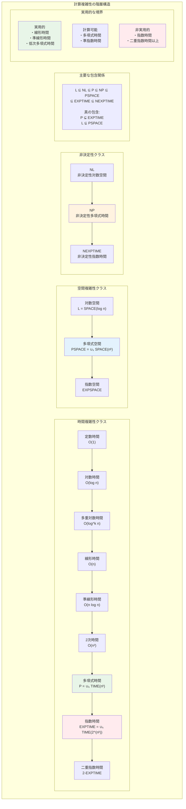
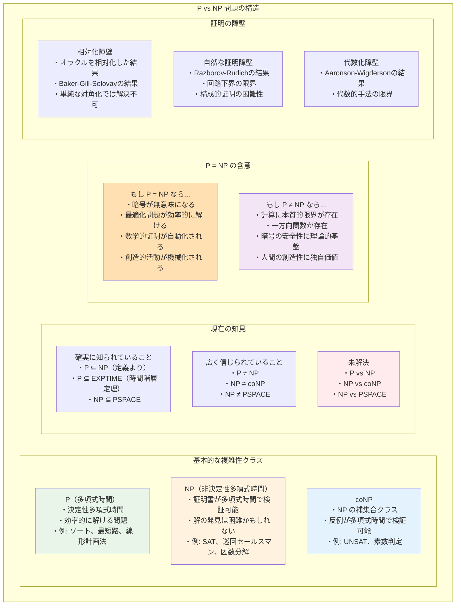
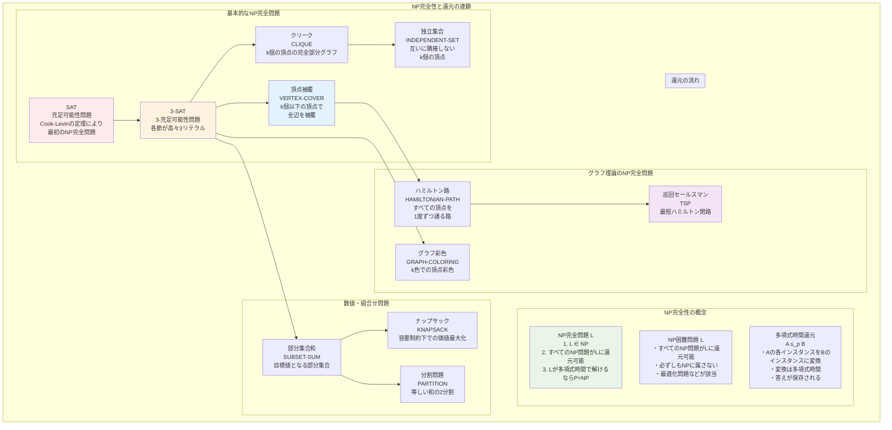
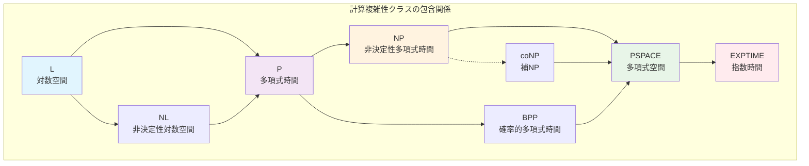

# 第5章 計算複雑性理論

## はじめに

計算複雑性理論は、計算可能な問題を解くのに必要な資源（時間や空間）を定量的に分析する分野です。すべての計算可能な問題が実用的に解けるわけではありません。本章では、問題の困難さを厳密に定義し、P、NP、PSPACE などの重要な複雑性クラスを学びます。

特に、コンピュータサイエンスにおける最も重要な未解決問題の一つである P vs NP 問題を中心に、計算複雑性の理論的枠組みを構築します。この理論は、暗号理論、最適化、人工知能など、多くの応用分野の基礎となっています。

## 5.1 時間複雑性

### 5.1.1 計算時間の定義

**定義 5.1** チューリング機械 M の入力 w に対する**実行時間**（running time）を、
M が w で停止するまでのステップ数とする。M が停止しない場合は ∞ とする。

**定義 5.2** チューリング機械 M の**時間複雑度**（time complexity）t_M: ℕ → ℕ を
t_M(n) = max{M が長さ n の入力 w で実行するステップ数}
と定義する。

### 5.1.2 漸近記法

計算量の解析では、定数倍や低次の項を無視した漸近的な振る舞いに注目します。

**定義 5.3** 関数 f, g: ℕ → ℝ⁺ に対して：

1. **Big-O記法**：f(n) = O(g(n)) ⟺ ∃c > 0, ∃n₀, ∀n ≥ n₀, f(n) ≤ c·g(n)

2. **Big-Ω記法**：f(n) = Ω(g(n)) ⟺ ∃c > 0, ∃n₀, ∀n ≥ n₀, f(n) ≥ c·g(n)

3. **Θ記法**：f(n) = Θ(g(n)) ⟺ f(n) = O(g(n)) かつ f(n) = Ω(g(n))

4. **little-o記法**：f(n) = o(g(n)) ⟺ lim_{n→∞} f(n)/g(n) = 0

5. **little-ω記法**：f(n) = ω(g(n)) ⟺ lim_{n→∞} f(n)/g(n) = ∞

**性質**：
- 推移性：f = O(g) かつ g = O(h) ⟹ f = O(h)
- 反射性：f = O(f)
- 対称性：f = Θ(g) ⟺ g = Θ(f)

### 5.1.3 時間複雑性クラス



**定義 5.4** 時間構成可能関数 t: ℕ → ℕ に対して、
**TIME**(t(n)) = {L | ある O(t(n)) 時間チューリング機械が L を決定}

**定義 5.5** 重要な時間複雑性クラス：
- **P** = ⋃_{k≥0} TIME(n^k)（多項式時間）
- **EXPTIME** = ⋃_{k≥0} TIME(2^{n^k})（指数時間）
- **2-EXPTIME** = ⋃_{k≥0} TIME(2^{2^{n^k}})（二重指数時間）

**定理 5.1**（時間階層定理）時間構成可能関数 f, g に対して、
g(n) = o(f(n)/log(f(n))) ならば TIME(g(n)) ⊊ TIME(f(n))

*証明の概要*：対角化論法を用いる。f(n) 時間で、g(n) 時間機械の動作をシミュレートし、
その結果を反転する機械を構成する。ログ因子はシミュレーションのオーバーヘッドから生じる。
ここで log は任意の底の対数（通常は底2または自然対数）を表す。□

**系 5.1** P ⊊ EXPTIME

### 5.1.4 多テープ機械と時間複雑性

**定理 5.2** k-テープチューリング機械が t(n) 時間で認識する言語は、
1-テープチューリング機械で O(t(n)²) 時間で認識できる。

*証明の概要*：1-テープ機械は k 本のテープを順番にシミュレートする。
各ステップで最大 O(t(n)) の距離を移動する必要があり、
t(n) ステップのシミュレーションに O(t(n)²) 時間かかる。□

## 5.2 非決定性と NP

### 5.2.1 非決定性時間複雑性

**定義 5.6** 非決定性チューリング機械 N の時間複雑度を
t_N(n) = max{N が長さ n の入力 w を受理する最短計算パスの長さ}

**定義 5.7** **NTIME**(t(n)) = {L | ある O(t(n)) 時間非決定性機械が L を認識}

**定義 5.8** **NP** = ⋃_{k≥0} NTIME(n^k)（非決定性多項式時間）

### 5.2.2 検証による NP の特徴付け

**定義 5.9** 言語 L が**検証可能**（verifiable）であるとは、
多項式 p と多項式時間チューリング機械 V（検証器）が存在して、
w ∈ L ⟺ ∃証明書 c (|c| ≤ p(|w|) かつ V(w, c) = accept)

**定理 5.3** L ∈ NP ⟺ L は多項式時間検証可能

*証明*：
（⟹）L を認識する非決定性多項式時間機械 N が存在。
証明書を N の受理計算パスとし、V は計算パスの正当性を検証。

（⟸）検証器 V と多項式 p が存在。
非決定性機械 N を以下のように構成：
1. 長さ ≤ p(|w|) の証明書 c を非決定的に推測
2. V(w, c) を実行
3. V が accept なら accept

両方向とも多項式時間で実行可能。□

### 5.2.3 NP の例

**例 5.1** 以下の問題はすべて NP に属する：

1. **SAT**（充足可能性問題）
   - 入力：論理式 φ
   - 問：φ を真にする変数割当は存在するか？
   - 証明書：変数割当

2. **HAMPATH**（ハミルトン路問題）
   - 入力：有向グラフ G と頂点 s, t
   - 問：s から t へのハミルトン路は存在するか？
   - 証明書：頂点の列

3. **CLIQUE**
   - 入力：グラフ G と整数 k
   - 問：サイズ k のクリークは存在するか？
   - 証明書：k 個の頂点

4. **SUBSET-SUM**
   - 入力：整数の集合 S と目標値 t
   - 問：和が t となる部分集合は存在するか？
   - 証明書：部分集合

### 5.2.4 coNP

**定義 5.10** **coNP** = {L | L̄ ∈ NP}

coNP は「すべての証明書に対して」という全称量化に対応する：
L ∈ coNP ⟺ ∃多項式 p, V, w ∈ L ⟺ ∀c (|c| ≤ p(|w|) → V(w, c) = accept)

**例 5.2** UNSAT = {φ | φ は充足不可能} ∈ coNP

**未解決問題**：NP = coNP ?

## 5.3 P vs NP 問題

### 5.3.1 問題の定式化



**P vs NP 問題**：P = NP か？

この問題は以下のように言い換えられます：
- 解の検証が簡単な問題は、解の発見も簡単か？
- 非決定性は多項式時間計算に対して真の計算力の増加をもたらすか？

**現在の知見**：
- P ⊆ NP（定義より明らか）
- P ≠ NP と広く信じられているが、証明されていない
- 相対化、自然な証明、代数化などの障壁が知られている

### 5.3.2 NP 完全性

**定義 5.11** 言語 L が**NP困難**（NP-hard）⟺ ∀A ∈ NP, A ≤_p L

**定義 5.12** 言語 L が**NP完全**（NP-complete）⟺ L ∈ NP かつ L は NP困難

ここで ≤_p は多項式時間多対一還元を表す。

**定理 5.4** L が NP完全で L ∈ P ならば P = NP

*証明*：任意の A ∈ NP に対して A ≤_p L。
L ∈ P なので、還元と L の決定を組み合わせて A を多項式時間で決定できる。
したがって NP ⊆ P となり、P = NP。□

### 5.3.3 Cook-Levin の定理

**定理 5.5**（Cook-Levin）SAT は NP完全である。

*証明の概要*：任意の L ∈ NP に対して L ≤_p SAT を示す。
L を認識する非決定性多項式時間機械 N が存在。

入力 w に対して、以下を満たす論理式 φ_w を構成：
φ_w が充足可能 ⟺ N は w を受理

φ_w は以下の変数を含む：
- x_{i,j,s}：時刻 i にテープの位置 j に記号 s がある
- q_{i,k}：時刻 i に状態 q_k にある
- h_{i,j}：時刻 i にヘッドが位置 j にある

φ_w は以下の条件を表現：
1. 初期構成が正しい
2. 各ステップで正しい遷移が行われる
3. 最終的に受理状態に達する
4. 各時刻で一貫性が保たれる

構成は多項式時間で可能。□

### 5.3.4 NP完全問題の連鎖



**定理 5.6** 3-SAT は NP完全である。

*証明*：SAT ≤_p 3-SAT を示す。
任意の CNF 式を、各節が高々3個のリテラルを持つ形に変換：

長い節 (l₁ ∨ l₂ ∨ ... ∨ l_k) (k > 3) を以下に変換：
- 新変数 y₁, ..., y_{k-3} を導入
- (l₁ ∨ l₂ ∨ y₁) ∧ (¬y₁ ∨ l₃ ∨ y₂) ∧ ... ∧ (¬y_{k-3} ∨ l_{k-1} ∨ l_k)

この変換は多項式時間で、充足可能性を保存する。□

**他の NP完全問題**：
- **頂点被覆**：3-SAT から還元
- **ハミルトン路**：頂点被覆から還元
- **巡回セールスマン問題**：ハミルトン路から還元
- **グラフ彩色**：3-SAT から還元

## 5.4 空間複雑性

### 5.4.1 空間複雑性の定義

**定義 5.13** チューリング機械 M の**空間複雑度** s_M(n) を、
長さ n の任意の入力に対して M が使用するテープマス数の最大値とする。

**定義 5.14** **SPACE**(s(n)) = {L | ある O(s(n)) 空間機械が L を決定}

**定義 5.15** 主要な空間複雑性クラス：
- **L** = SPACE(log n)（対数空間）
- **NL** = NSPACE(log n)（非決定性対数空間）
- **PSPACE** = ⋃_{k≥0} SPACE(n^k)（多項式空間）

### 5.4.2 空間の基本的性質

**定理 5.7**（Savitchの定理）空間構成可能関数 s(n) ≥ log n に対して、
NSPACE(s(n)) ⊆ SPACE(s(n)²)

*証明の概要*：到達可能性問題を再帰的に解く。
構成 C₁ から C₂ への高々 2^{s(n)} ステップの計算パスの存在を、
中間点を推測することで判定。再帰の深さは s(n)、各レベルで O(s(n)) 空間。□

**系 5.2** PSPACE = NPSPACE

### 5.4.3 空間と時間の関係

**定理 5.8** 
1. TIME(f(n)) ⊆ SPACE(f(n))
2. SPACE(f(n)) ⊆ TIME(2^{O(f(n))})

*証明*：
(1) 時間 f(n) では高々 f(n) マスしか使えない。
(2) s(n) 空間の機械の可能な構成数は高々 2^{O(s(n))}。
   ループを避けて計算すれば、この時間内に終了。□

**系 5.3** L ⊆ P ⊆ NP ⊆ PSPACE ⊆ EXPTIME



### 5.4.4 PSPACE完全性

**定義 5.16** 言語 L が**PSPACE完全** ⟺ L ∈ PSPACE かつ ∀A ∈ PSPACE, A ≤_p L

**定理 5.9** TQBF（真量化ブール式）は PSPACE完全である。

TQBF = {φ | φ は真な量化ブール式}

量化ブール式の例：∀x₁∃x₂∀x₃ [(x₁ ∨ x₂) ∧ (¬x₂ ∨ x₃)]

*証明の概要*：
（TQBF ∈ PSPACE）再帰的に真偽を判定。各量化子で変数に 0/1 を代入。

（PSPACE困難性）任意の PSPACE 言語 L に対して、
多項式空間機械 M の受理計算の存在を量化ブール式で表現。□

## 5.5 多項式階層

### 5.5.1 階層の定義

**定義 5.17** **多項式階層**（Polynomial Hierarchy）：
- Σ₀ᴾ = Π₀ᴾ = P
- Σₖ₊₁ᴾ = NPᴾᶦᵏ（Πₖᴾ オラクル付き NP）
- Πₖ₊₁ᴾ = coNPᴾᶦᵏ
- PH = ⋃_{k≥0} Σₖᴾ

**特徴付け**：
- Σ₁ᴾ = NP
- Π₁ᴾ = coNP
- Σ₂ᴾ = NP^{NP}（NP オラクル付き NP）

### 5.5.2 階層の性質

**定理 5.10** 各 k に対して：
1. Σₖᴾ ∪ Πₖᴾ ⊆ Σₖ₊₁ᴾ ∩ Πₖ₊₁ᴾ
2. Σₖᴾ = coΠₖᴾ

**定理 5.11** 以下は同値：
1. PH = PSPACE
2. ある k が存在して PH = Σₖᴾ
3. ある k が存在して Σₖᴾ = Σₖ₊₁ᴾ

これは階層が「崩壊」する条件を示しています。

### 5.5.3 完全問題

**例 5.3** 各レベルの完全問題：
- Σ₁ᴾ完全：SAT
- Π₁ᴾ完全：UNSAT
- Σ₂ᴾ完全：∃∀SAT = {φ | ∃x∀y φ(x,y) = 1}
- Π₂ᴾ完全：∀∃SAT = {φ | ∀x∃y φ(x,y) = 1}

## 5.6 確率的計算クラス

### 5.6.1 BPP（有界誤り確率多項式時間）

**定義 5.18** 言語 L ∈ **BPP** ⟺ ある確率的多項式時間機械 M が存在して：
- w ∈ L ⟹ Pr[M(w) = accept] ≥ 2/3
- w ∉ L ⟹ Pr[M(w) = accept] ≤ 1/3

**定理 5.12** 誤り確率は増幅により任意に小さくできる。
k 回の独立実行と多数決により、誤り確率を 2^{-Ω(k)} に削減可能。

### 5.6.2 その他の確率的クラス

**定義 5.19** 
- **RP**（片側誤り）：w ∈ L ⟹ Pr[accept] ≥ 1/2、w ∉ L ⟹ Pr[accept] = 0
- **coRP**：RP の補クラス
- **ZPP** = RP ∩ coRP（ゼロ誤り確率多項式時間）

**関係**：P ⊆ ZPP ⊆ RP ⊆ BPP ⊆ PP ⊆ PSPACE

### 5.6.3 確率的計算の脱乱択化

**定理 5.13**（Impagliazzo-Wigderson）
適切な困難性仮定の下で、BPP = P

これは、真の乱数の代わりに疑似乱数生成器を使用できることを示唆しています。

## 5.7 回路複雑性

### 5.7.1 ブール回路

**定義 5.20** **ブール回路**は、AND、OR、NOT ゲートからなる有向非巡回グラフ。

回路の複雑性尺度：
- **サイズ**：ゲート数
- **深さ**：最長パスの長さ

### 5.7.2 回路複雑性クラス

**定義 5.21** 
- **P/poly** = {L | ある多項式 p, 各 n に対してサイズ ≤ p(n) の回路族が L_n を計算}

**定理 5.14** P ⊆ P/poly

**定理 5.15**（Karp-Lipton）NP ⊆ P/poly ならば PH = Σ₂ᴾ

### 5.7.3 下界

**定理 5.16** ほとんどすべての n 変数ブール関数は、サイズ Ω(2ⁿ/n) の回路を要求する。

*証明*：計数論法による。n 変数関数は 2^{2ⁿ} 個、
サイズ s の回路は高々 (cn)^s 個。□

しかし、明示的な関数に対する超多項式下界は未解決。

## 5.8 対話型証明系

### 5.8.1 対話型証明の定義

**定義 5.22** **対話型証明系**は、全能力の証明者 P と多項式時間検証者 V の間のプロトコル。

言語 L ∈ **IP** ⟺ ある検証者 V が存在して：
- 完全性：w ∈ L ⟹ ∃P, Pr[V^P(w) = accept] ≥ 2/3
- 健全性：w ∉ L ⟹ ∀P*, Pr[V^{P*}(w) = accept] ≤ 1/3

### 5.8.2 IP の能力

**定理 5.17** NP ⊆ IP

**定理 5.18**（Shamir）IP = PSPACE

これは対話型証明が予想外に強力であることを示しています。

### 5.8.3 ゼロ知識証明

**定義 5.23** 対話型証明系が**ゼロ知識**であるとは、
検証者が証明から「w ∈ L」という事実以外の情報を得ないこと。

形式的には、効率的なシミュレータの存在で定義される。

**定理 5.19** NP ⊆ CZK（計算論的ゼロ知識）
（適切な暗号学的仮定の下で）

## 章末問題

### 基礎問題

1. 以下の包含関係を証明せよ：
   (a) TIME(n) ⊊ TIME(n²)
   (b) L ⊆ NL ⊆ P
   (c) NP ⊆ PSPACE

2. 以下の問題が NP に属することを示せ：
   (a) グラフ同型問題
   (b) 整数計画問題
   (c) 最短ベクトル問題

3. 3-SAT から以下への多項式時間還元を構成せよ：
   (a) 3-彩色問題
   (b) 頂点被覆問題

4. PSPACE = NPSPACE を Savitch の定理を用いて証明せよ。

### 発展問題

5. 時間階層定理の証明において、対角化言語が求める性質を持つことを詳細に証明せよ。

6. Cook-Levin の定理の証明で、チューリング機械の計算を論理式で符号化する際の具体的な構成を説明せよ。

7. 多項式階層が Σₖᴾ で崩壊したとき、実際にすべての上位レベルが Σₖᴾ と等しくなることを証明せよ。

8. BPP における誤り確率の増幅技法（amplification）を詳細に解析せよ。

### 探究課題

9. P vs NP 問題に関する既知の障壁（相対化、自然な証明、代数化）について調査し、なぜこれらが問題解決を困難にするかを論ぜよ。

10. 近似アルゴリズムと複雑性理論の関係を調査し、近似困難性結果（例：PCP定理）について説明せよ。

11. 量子計算複雑性クラス（BQP、QMA等）について調査し、古典的な複雑性クラスとの関係を論ぜよ。

12. 実用的な暗号システムが依拠する困難性仮定を調査し、複雑性理論との関連を説明せよ。

### 実装課題

13. NP完全問題のソルバーを実装せよ：
    ```python
    class SATSolver:
        def __init__(self, formula):
            """CNF式を入力として受け取る"""
            self.formula = formula
        
        def solve(self):
            """DPLLアルゴリズムまたはCDCLアルゴリズムで解く"""
            pass
        
        def verify_solution(self, assignment):
            """解の検証"""
            pass
    ```

14. 計算複雑性の実験的解析を実装せよ：
    ```python
    class ComplexityAnalyzer:
        def measure_runtime(self, algorithm, input_generator, sizes):
            """異なる入力サイズでの実行時間測定"""
            pass
        
        def plot_complexity(self, data):
            """複雑性の可視化"""
            pass
        
        def estimate_asymptotic_behavior(self, data):
            """漸近的振る舞いの推定"""
            pass
    ```

15. 確率的アルゴリズムのシミュレータを実装せよ：
    - Miller-Rabin 素数判定法
    - 誤り確率の増幅実験
    - Monte Carlo vs Las Vegas アルゴリズムの比較