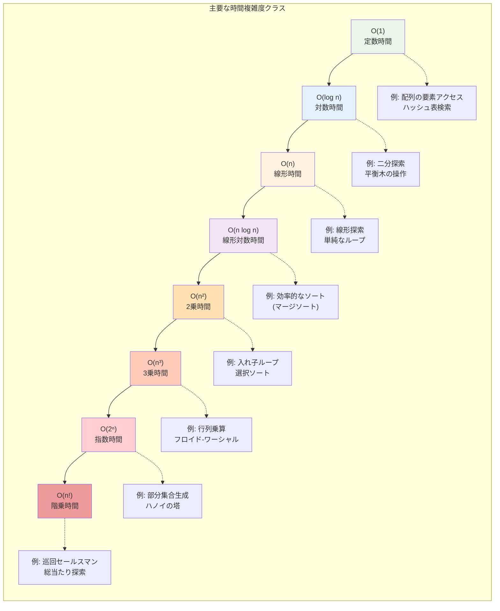
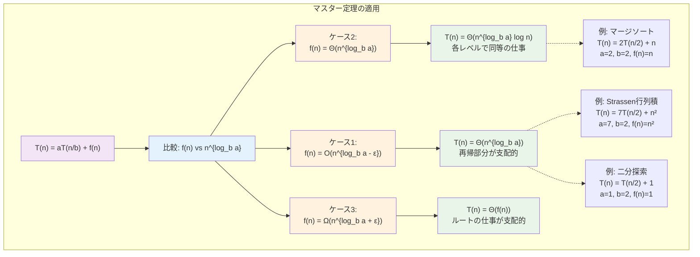
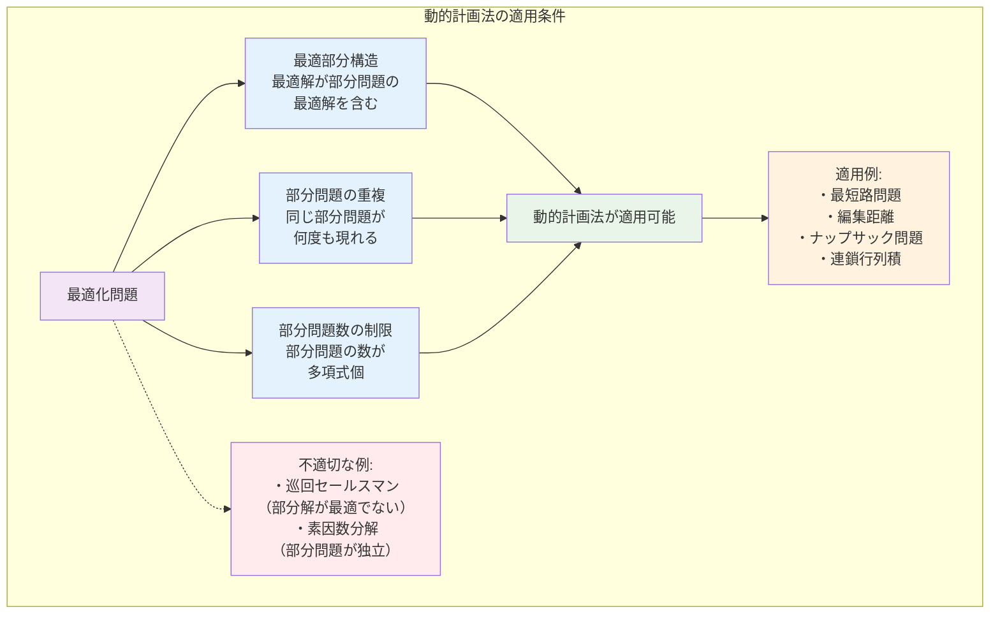
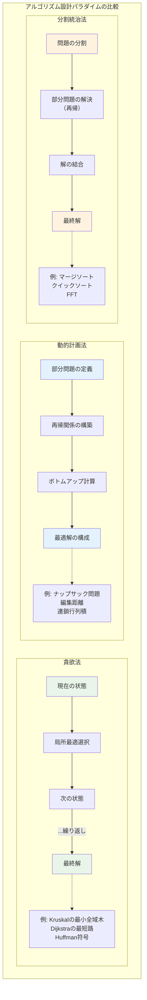

# 第6章 アルゴリズムの数学的解析

## はじめに

アルゴリズムの設計と解析は、効率的な計算を実現するための中心的な課題です。本章では、アルゴリズムの性能を数学的に厳密に分析する手法を学びます。漸近的解析、再帰的アルゴリズムの解析、主要なアルゴリズム設計パラダイム（分割統治法、動的計画法、貪欲法）について、その数学的基礎を詳しく探求します。

アルゴリズムの解析は、単に実行時間を測定することではありません。問題の構造を深く理解し、最適な解法を導出するための理論的枠組みを提供します。この理解は、新しい問題に直面したときに、適切なアプローチを選択する指針となります。

## 6.1 漸近的解析

### 6.1.1 最悪時間解析

**定義 6.1** アルゴリズム A の**最悪時間複雑度** T(n) は：
T(n) = max{A が入力 I に対して実行する基本演算の回数 | |I| = n}

最悪時間解析は性能の保証を与えるため、実用上重要です。



**例 6.1** 挿入ソートの最悪時間解析
```
InsertionSort(A[1..n]):
    for j = 2 to n:
        key = A[j]
        i = j - 1
        while i > 0 and A[i] > key:
            A[i+1] = A[i]
            i = i - 1
        A[i+1] = key
```

解析：
- 外側ループ：n-1 回実行
- j 番目の反復で、内側ループは最悪 j-1 回実行
- 総比較回数：∑_{j=2}^n (j-1) = 1 + 2 + ... + (n-1) = n(n-1)/2

したがって、T(n) = Θ(n²)

### 6.1.2 平均時間解析

**定義 6.2** 入力の確率分布 P に対する**平均時間複雑度**：
T_{avg}(n) = ∑_{|I|=n} Pr[I] · (A が I で実行する演算回数)

**例 6.2** クイックソートの平均時間解析

ピボットのランクを r とすると、分割後のサイズは r-1 と n-r。
各要素が等確率でピボットになると仮定：

T(n) = n-1 + (1/n)∑_{r=1}^n [T(r-1) + T(n-r)]

この再帰式を解くと：T(n) = Θ(n log n)

詳細な証明：
再帰式を整理すると：
nT(n) = n(n-1) + 2∑_{k=0}^{n-1} T(k)

n を n-1 に置き換えた式を引くと：
nT(n) - (n-1)T(n-1) = 2(n-1) + 2T(n-1)

両辺を n(n+1) で割ることで再帰式を単純化：
T(n)/(n+1) = T(n-1)/n + 2(n-1)/n(n+1)

この形式により、項を逐次的に展開できる：
T(n)/(n+1) = T(1)/2 + 2∑_{k=2}^{n} (k-1)/k(k+1)

部分分数分解により：(k-1)/k(k+1) = 1/k - 1/(k+1)

したがって：T(n) = 2(n+1)H_n - 4n ≈ 2n ln n

ここで H_n = 1 + 1/2 + ... + 1/n は第n調和数で、H_n ≈ ln n + γ（γはオイラー定数）

### 6.1.3 償却解析

**定義 6.3** n 個の操作列の**償却時間**は、操作列の総時間を n で割った値。

#### 集計法

**例 6.3** 動的配列の償却解析
配列が満杯になったらサイズを2倍にする：

n 個の挿入操作の総コスト：
- 通常の挿入：n 回
- 拡張のコピー：1 + 2 + 4 + ... + 2^{⌊log n⌋} < 2n

総コスト < 3n なので、償却時間は O(1)

#### ポテンシャル法

**定義 6.4** データ構造の状態 D_i に対する**ポテンシャル関数** Φ(D_i) を定義。
操作 i の償却コスト：â_i = a_i + Φ(D_i) - Φ(D_{i-1})

**例 6.4** 二進カウンタのインクリメント
ポテンシャル関数：Φ(D) = カウンタ中の1の個数

ビット反転数が k のとき：
- 実際のコスト：a_i = k
- ポテンシャル変化：ΔΦ = 1 - k + 1 = 2 - k
- 償却コスト：â_i = k + (2 - k) = 2 = O(1)

### 6.1.4 確率的解析

**定義 6.5** **期待実行時間**は、アルゴリズムの内部のランダム選択に関する期待値。

**例 6.5** ランダム化クイックソート
ピボットをランダムに選択することで、任意の入力に対して期待時間 O(n log n) を達成。

**定理 6.1** ランダム化クイックソートの期待比較回数は 2n ln n + O(n)。

*証明*：X_{ij} を「要素 i と j が比較される」指示変数とする。
期待比較回数 = E[∑_{i<j} X_{ij}] = ∑_{i<j} Pr[X_{ij} = 1]

要素 i と j（i < j）が比較される ⟺ i か j が {i, i+1, ..., j} の中で最初にピボットに選ばれる
したがって：Pr[X_{ij} = 1] = 2/(j-i+1)

期待比較回数 = ∑_{i=1}^{n-1} ∑_{j=i+1}^n 2/(j-i+1) = 2∑_{i=1}^{n-1} H_{n-i+1} ≈ 2n ln n □

## 6.2 分割統治法

### 6.2.1 分割統治の一般形

分割統治アルゴリズムの基本構造：
1. **分割**（Divide）：問題を部分問題に分割
2. **統治**（Conquer）：部分問題を再帰的に解く
3. **結合**（Combine）：部分問題の解を結合

時間複雑度の再帰式：
T(n) = aT(n/b) + f(n)
- a：部分問題の個数
- n/b：各部分問題のサイズ
- f(n)：分割と結合の時間

### 6.2.2 マスター定理

**定理 6.2**（マスター定理）a ≥ 1, b > 1 を定数、f(n) を漸近的に正の関数とする。
T(n) = aT(n/b) + f(n) に対して：

1. f(n) = O(n^{log_b a - ε}) （ある ε > 0）ならば T(n) = Θ(n^{log_b a})

2. f(n) = Θ(n^{log_b a}) ならば T(n) = Θ(n^{log_b a} log n)

3. f(n) = Ω(n^{log_b a + ε}) （ある ε > 0）かつ
   af(n/b) ≤ cf(n) （ある c < 1, 十分大きな n）ならば T(n) = Θ(f(n))



*証明の概要*：再帰木を用いる。深さ i のレベルで：
- ノード数：a^i
- 各ノードでの仕事：f(n/b^i)
- レベル i の総仕事：a^i f(n/b^i)

総仕事量 = ∑_{i=0}^{log_b n} a^i f(n/b^i)

この和の漸近的振る舞いは f(n) と n^{log_b a} の関係で決まる。□

### 6.2.3 分割統治の例

**例 6.6** マージソート
```
MergeSort(A, p, r):
    if p < r:
        q = ⌊(p + r)/2⌋
        MergeSort(A, p, q)
        MergeSort(A, q+1, r)
        Merge(A, p, q, r)
```

再帰式：T(n) = 2T(n/2) + Θ(n)
マスター定理のケース2：a = 2, b = 2, log_b a = 1, f(n) = Θ(n)
したがって：T(n) = Θ(n log n)

**例 6.7** Strassenの行列積
通常の行列積：T(n) = 8T(n/2) + Θ(n²) = Θ(n³)

Strassenのアルゴリズム：7つの部分積で計算
T(n) = 7T(n/2) + Θ(n²)

マスター定理のケース1：log_2 7 ≈ 2.807 > 2
したがって：T(n) = Θ(n^{log_2 7}) ≈ Θ(n^{2.807})

### 6.2.4 分割統治の最適性

**定理 6.3** n 個の要素の中央値を見つける決定的アルゴリズムは Θ(n) 時間で実行可能。

*アルゴリズム*（中央値の中央値）：
1. 要素を5個ずつのグループに分割
2. 各グループの中央値を見つける（定数時間）
3. 中央値の中央値を再帰的に見つける
4. これをピボットとして分割
5. 適切な側で再帰

*解析*：ピボットは少なくとも 3n/10 個の要素より大きく、
3n/10 個の要素より小さい。

再帰式：T(n) ≤ T(n/5) + T(7n/10) + cn

帰納法により T(n) = O(n) が示せる。

## 6.3 動的計画法

### 6.3.1 最適部分構造

**定義 6.6** 問題が**最適部分構造**を持つとは、最適解が部分問題の最適解を含むこと。



**例 6.8** 最短路問題
グラフ G で頂点 u から v への最短路 p が頂点 w を通るとき、
p の u-w 部分と w-v 部分もそれぞれ最短路である。

*証明*：カット&ペースト論法による。部分が最短路でなければ、
より短い路で置き換えることで全体も短くできる。□

### 6.3.2 部分問題の重複

動的計画法が有効な問題の特徴：
1. 最適部分構造
2. 部分問題の重複
3. 部分問題数が多項式個

### 6.3.3 動的計画法の設計手順

1. 最適解の構造を特徴付ける
2. 最適値を再帰的に定義
3. ボトムアップで最適値を計算
4. 計算した情報から最適解を構成

**例 6.9** 連鎖行列積

行列の列 A₁, A₂, ..., Aₙ の積を計算する最適な括弧付け。
A_i のサイズ：p_{i-1} × p_i

m[i,j] = A_i...A_j を計算する最小スカラー乗算数

再帰式：
m[i,j] = {
  0                                             if i = j
  min_{i≤k<j} {m[i,k] + m[k+1,j] + p_{i-1}p_k p_j}  if i < j
}

時間複雑度：O(n³)、空間複雑度：O(n²)

### 6.3.4 最適性の原理

**定理 6.4**（Bellmanの最適性原理）
最適方策の部分方策は、それ自体が部分問題に対して最適である。

**例 6.10** 編集距離（Levenshtein距離）
文字列 X[1..m] と Y[1..n] の編集距離 d[i,j]：

d[i,j] = min {
  d[i-1,j] + 1        （削除）
  d[i,j-1] + 1        （挿入）
  d[i-1,j-1] + δ(i,j) （置換、δ(i,j) = 0 if X[i]=Y[j], 1 otherwise）
}

境界条件：d[i,0] = i, d[0,j] = j

## 6.4 貪欲アルゴリズム

### 6.4.1 貪欲選択性

**定義 6.7** 問題が**貪欲選択性**を持つとは、局所最適な選択を行うことで
大域最適解を構成できること。



**例 6.11** 活動選択問題
n 個の活動 {a₁, ..., aₙ}、各活動 a_i は開始時刻 s_i と終了時刻 f_i を持つ。
目標：重ならない活動の最大集合を選択。

貪欲戦略：終了時刻の早い順に選択

**定理 6.5** 活動選択問題の貪欲アルゴリズムは最適解を与える。

*証明*：A を最適解、a_k を最も早く終わる活動とする。
A' = (A \ {a_j}) ∪ {a_k}（a_j は A の最初の活動）も最適解。
帰納的に議論を続けることで、貪欲解が最適であることが示せる。□

### 6.4.2 マトロイド理論

**定義 6.8** **マトロイド** M = (S, I) は以下を満たす：
1. I ⊆ 2^S（I は S の部分集合族）
2. 遺伝性：B ∈ I かつ A ⊆ B ⟹ A ∈ I
3. 交換性：A, B ∈ I かつ |A| < |B| ⟹ ∃e ∈ B\A, A ∪ {e} ∈ I

**例 6.12** グラフィックマトロイド
S = グラフの辺集合
I = {A ⊆ S | A は閉路を含まない}

**定理 6.6**（Radoの定理）重み付きマトロイドに対する貪欲アルゴリズムは最適解を与える。

### 6.4.3 貪欲アルゴリズムの例

**例 6.13** Kruskalの最小全域木アルゴリズム
```
Kruskal(G, w):
    A = ∅
    各頂点 v に対して MakeSet(v)
    辺を重みの昇順にソート
    for 各辺 (u,v) in 昇順:
        if FindSet(u) ≠ FindSet(v):
            A = A ∪ {(u,v)}
            Union(u, v)
    return A
```

時間複雑度：O(E log E) = O(E log V)（Union-Find with path compression）

**例 6.14** Huffman符号
文字の頻度に基づく最適な接頭符号の構成。

アルゴリズム：
1. 各文字を頻度付きの葉ノードとする
2. 最小頻度の2つのノードを選んで結合
3. 1つのノードになるまで繰り返す

**定理 6.7** Huffman符号は期待符号長を最小化する。

### 6.4.4 貪欲法の限界

貪欲法が最適解を与えない例：

**例 6.15** ナップサック問題（0-1版）
品物：(価値, 重さ) = {(10, 5), (6, 3), (6, 3)}
容量：7

貪欲解（価値/重さ比）：(10, 5) → 価値10
最適解：(6, 3), (6, 3) → 価値12

## 6.5 高度な解析技法

### 6.5.1 生成関数を用いた解析

**定義 6.9** 数列 {aₙ} の**生成関数**：
G(z) = ∑_{n≥0} aₙ z^n

**例 6.16** Catalan数の解析
Catalan数 Cₙ：n組の括弧の正しい並べ方の数

再帰式：Cₙ = ∑_{k=0}^{n-1} Cₖ C_{n-1-k}, C₀ = 1

生成関数：C(z) = 1 + z·C(z)²

解いて：C(z) = (1 - √(1-4z))/(2z)

展開して：Cₙ = (1/(n+1))C(2n,n)

### 6.5.2 確率的解析の高度な手法

**定理 6.8**（Chernoff限界）独立な0-1確率変数 X₁, ..., Xₙ、X = ∑Xᵢ、μ = E[X] に対して：

上側：Pr[X ≥ (1+δ)μ] ≤ exp(-δ²μ/(2+δ))（0 < δ）
下側：Pr[X ≤ (1-δ)μ] ≤ exp(-δ²μ/2)（0 < δ < 1）

**応用**：ランダム化アルゴリズムの解析、確率的方法

### 6.5.3 線形計画法による解析

**例 6.17** 最大流問題の双対性

主問題（最大流）：
maximize ∑_{(s,v)∈E} f(s,v)
subject to:
- ∑_{(u,v)∈E} f(u,v) - ∑_{(v,w)∈E} f(v,w) = 0 (v ≠ s,t)
- 0 ≤ f(u,v) ≤ c(u,v)

双対問題（最小カット）：
minimize ∑_{(u,v)∈E} c(u,v)y(u,v)

**定理 6.9**（最大流最小カット定理）最大流の値 = 最小カットの容量

## 6.6 並列アルゴリズムの解析

### 6.6.1 並列計算モデル

**PRAM**（Parallel Random Access Machine）モデル：
- p個のプロセッサ
- 共有メモリ
- 同期的実行

複雑性尺度：
- **作業量** W(n)：全プロセッサの総演算数
- **スパン** S(n)：最長の依存パス
- **並列度**：W(n)/S(n)

### 6.6.2 Brentの定理

**定理 6.10**（Brent）作業量 W、スパン S のアルゴリズムは、
p プロセッサで時間 W/p + S で実行可能。

### 6.6.3 並列アルゴリズムの例

**例 6.18** 並列プレフィックス和
入力：a₁, a₂, ..., aₙ
出力：s₁ = a₁, s₂ = a₁ + a₂, ..., sₙ = a₁ + ... + aₙ

```
ParallelPrefix(A[1..n]):
    if n = 1: return A
    
    // アップスイープ
    for i = 1 to log n:
        並列 for j = 2^i to n step 2^i:
            A[j] = A[j-2^(i-1)] + A[j]
    
    // ダウンスイープ
    for i = log n downto 1:
        並列 for j = 2^i - 2^(i-1) to n step 2^i:
            A[j] = A[j-2^(i-1)] + A[j]
```

作業量：O(n)、スパン：O(log n)

## 章末問題

### 基礎問題

1. 以下のアルゴリズムの時間複雑度を解析せよ：
   (a) 二分探索木での検索（平均・最悪）
   (b) ヒープソート
   (c) 基数ソート

2. 以下の再帰式をマスター定理を用いて解け：
   (a) T(n) = 3T(n/4) + n log n
   (b) T(n) = 2T(n/2) + n log n
   (c) T(n) = T(n/3) + T(2n/3) + n

3. フィボナッチ数列を計算する以下の方法の時間複雑度を比較せよ：
   (a) 単純な再帰
   (b) メモ化
   (c) 動的計画法
   (d) 行列累乗

4. 最長共通部分列（LCS）問題を動的計画法で解き、時間・空間複雑度を解析せよ。

### 発展問題

5. ランダム化アルゴリズムの脱乱択化について：
   (a) 決定的な中央値選択アルゴリズムを設計せよ
   (b) その時間複雑度が O(n) であることを証明せよ

6. FFT（高速フーリエ変換）について：
   (a) 分割統治による FFT アルゴリズムを説明せよ
   (b) 時間複雑度 O(n log n) を導出せよ

7. ネットワークフローアルゴリズムの解析：
   (a) Ford-Fulkerson法の時間複雑度を解析せよ
   (b) Edmonds-Karp法での改善を説明せよ

8. 文字列照合アルゴリズムの比較：
   (a) KMP法の前処理と照合の時間複雑度を解析せよ
   (b) Rabin-Karp法の期待時間複雑度を求めよ

### 探究課題

9. キャッシュ効率的アルゴリズムについて調査し、キャッシュ無視アルゴリズムの理論を説明せよ。

10. 近似アルゴリズムの解析手法について調査し、近似比の証明技法を例を挙げて説明せよ。

11. オンラインアルゴリズムの競合比解析について調査し、ページング問題での応用を論ぜよ。

12. 量子アルゴリズム（Shorのアルゴリズム、Groverのアルゴリズム）の計算量について調査し、
    古典アルゴリズムとの比較を行え。

### 実装課題

13. アルゴリズム解析ツールを実装せよ：
    ```python
    class AlgorithmAnalyzer:
        def __init__(self):
            self.execution_data = []
        
        def measure_complexity(self, algorithm, input_generator, sizes):
            """実行時間測定と複雑性推定"""
            pass
        
        def visualize_complexity(self, data):
            """計算量の可視化"""
            pass
        
        def recurrence_solver(self, a, b, f_notation):
            """再帰式のマスター定理による解析"""
            pass
    ```

14. 動的計画法の問題ソルバーを実装せよ：
    ```python
    class DPSolver:
        def longest_common_subsequence(self, X, Y):
            """最長共通部分列"""
            pass
        
        def edit_distance(self, s1, s2):
            """編集距離"""
            pass
        
        def knapsack(self, weights, values, capacity):
            """ナップサック問題"""
            pass
        
        def matrix_chain_multiplication(self, dimensions):
            """連鎖行列積"""
            pass
    ```

15. 高度なデータ構造とアルゴリズムを実装せよ：
    - Union-Find（path compression + union by rank）
    - Suffix Array 構築アルゴリズム
    - 最大流アルゴリズム（Ford-Fulkerson, Dinic）
    - FFT（高速フーリエ変換）