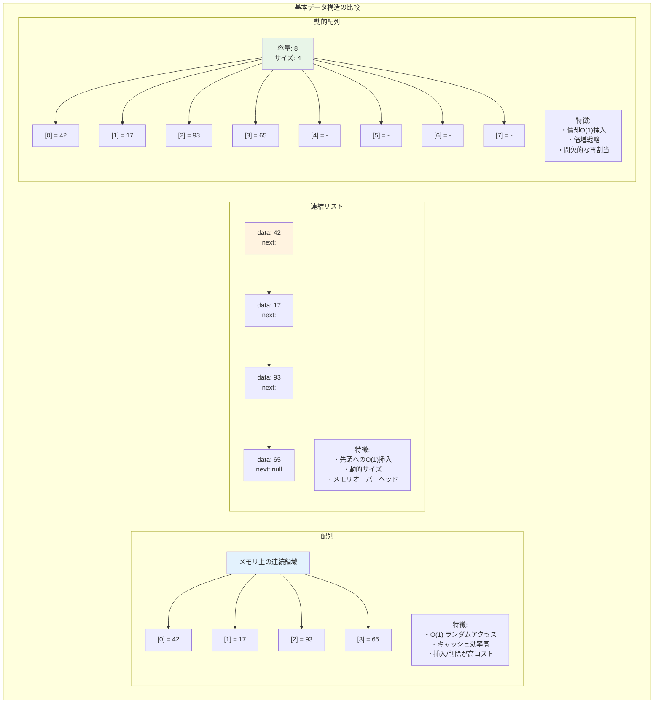
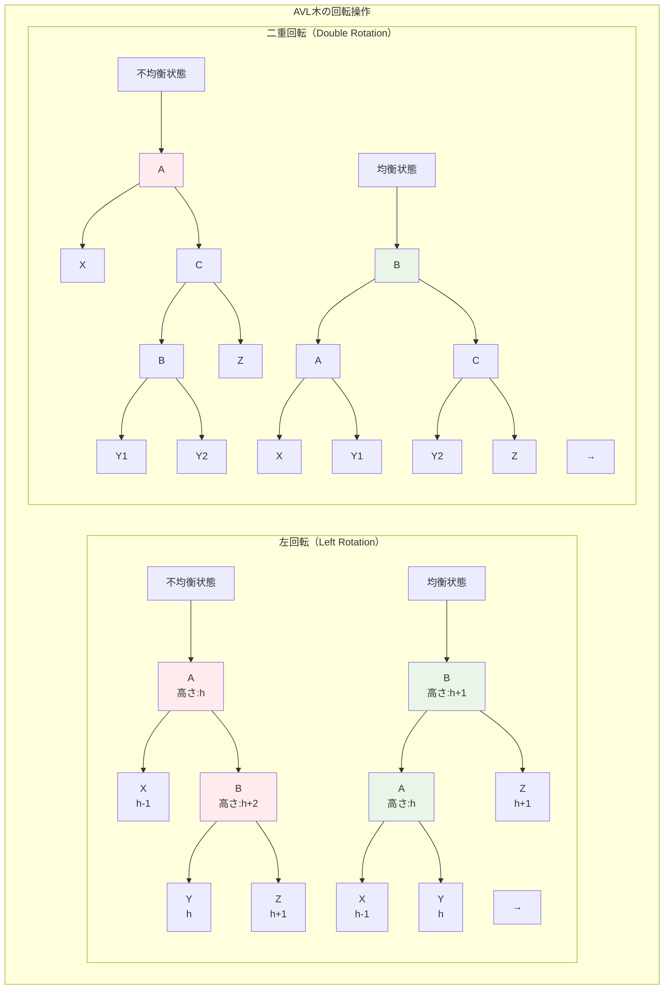
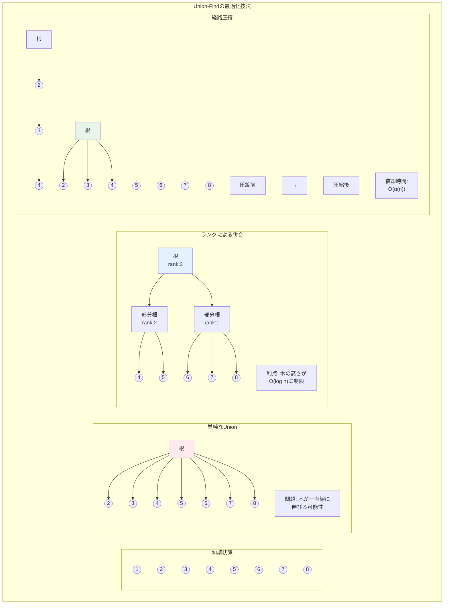
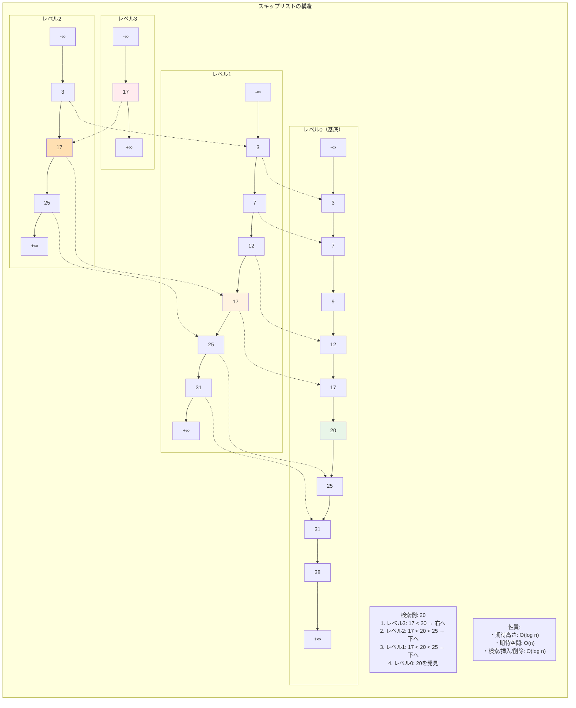

# 第7章 データ構造の理論

## はじめに

データ構造は、データを効率的に格納し、アクセスするための体系的な方法です。本章では、データ構造を数学的に厳密に分析し、その性能限界と最適性を探求します。抽象データ型から始まり、基本的なデータ構造の実装と解析、そして高度なデータ構造の理論へと進みます。

データ構造の選択は、アルゴリズムの効率に決定的な影響を与えます。本章では、各データ構造の時間・空間複雑度を詳細に分析し、問題に応じた最適なデータ構造を選択するための理論的基盤を提供します。

## 7.1 抽象データ型

### 7.1.1 代数的仕様

**定義 7.1** **抽象データ型**（Abstract Data Type, ADT）は、データの集合とその上の操作の集合を、実装から独立して定義したもの。

ADT の代数的仕様は以下から構成される：
1. **シグネチャ**：操作の名前と型
2. **公理**：操作間の関係を定める等式

**例 7.1** スタックの代数的仕様

シグネチャ：
- `new: → Stack`
- `push: Stack × Element → Stack`
- `pop: Stack → Stack`
- `top: Stack → Element`
- `isEmpty: Stack → Bool`

公理：
1. `isEmpty(new) = true`
2. `isEmpty(push(s, e)) = false`
3. `top(push(s, e)) = e`
4. `pop(push(s, e)) = s`
5. `pop(new) = error`
6. `top(new) = error`

### 7.1.2 操作の複雑性

**定義 7.2** データ構造の**性能保証**は、各操作の時間複雑度で特徴付けられる：
- 最悪時間
- 償却時間
- 期待時間

### 7.1.3 下界の証明

**定理 7.1** 比較ベースのソートアルゴリズムは、最悪の場合 Ω(n log n) 回の比較が必要。

*証明*：n! 個の可能な順列を区別する必要がある。
決定木の高さを h とすると、葉の数 ≤ 2^h。
したがって n! ≤ 2^h より h ≥ log(n!) = Ω(n log n)。□

**定理 7.2**（情報理論的下界）n 個の異なる要素から構成される任意のデータ構造において、
membership query（要素の存在確認）は最悪の場合 Ω(log n) 時間必要。

## 7.2 基本的なデータ構造

### 7.2.1 配列とリスト

**配列**の性能：
- アクセス：O(1)
- 挿入・削除：O(n)（最悪）
- 空間：Θ(n)

**連結リスト**の性能：
- アクセス：O(n)
- 先頭への挿入・削除：O(1)
- 空間：Θ(n)



**動的配列**（可変長配列）：
倍増戦略により、挿入の償却時間 O(1) を達成。

**定理 7.3** 倍増戦略を用いる動的配列において、n 回の挿入操作の総時間は O(n)。

*証明*：拡張のコストは 1 + 2 + 4 + ... + 2^k < 2n（k = ⌊log n⌋）。
通常の挿入 n 回と合わせて総コスト < 3n。□

### 7.2.2 二分探索木

**定義 7.3** **二分探索木**（BST）は、各ノード v に対して：
- 左部分木のすべてのキー < v のキー
- 右部分木のすべてのキー > v のキー

**性能解析**：
- 高さ h の BST での操作：O(h)
- 最悪の場合：h = n-1（線形）
- 平均的な場合：h = O(log n)

**定理 7.4** n 個のランダムな要素を順に挿入して構成した BST の期待高さは O(log n)。

*証明の概要*：ランダムな挿入順序は、ランダムなクイックソートの分割に対応。
期待深さの解析はクイックソートの期待比較回数の解析と同様。□

### 7.2.3 ヒープ

**定義 7.4** **二分ヒープ**は完全二分木で、ヒープ性質を満たす：
親のキー ≤ 子のキー（最小ヒープ）

**操作と複雑度**：
- `findMin`: O(1)
- `insert`: O(log n)
- `deleteMin`: O(log n)
- `buildHeap`: O(n)

**定理 7.5** n 要素の配列から二分ヒープを構築する時間は O(n)。

*証明*：高さ h のノードは高々 ⌈n/2^{h+1}⌉ 個。
各ノードでの仕事量は O(h)。

総仕事量 = ∑_{h=0}^{⌊log n⌋} ⌈n/2^{h+1}⌉ · O(h) = O(n∑_{h=0}^∞ h/2^h) = O(n) □

### 7.2.4 ハッシュ表

**定義 7.5** **ハッシュ関数** h: U → {0, 1, ..., m-1} は、
キー空間 U をハッシュ表のスロットに写像する。

#### 連鎖法

各スロットに連結リストを保持。

**定理 7.6** 単純一様ハッシュの仮定の下で、n 個の要素を m スロットのハッシュ表に格納するとき：
- 負荷率：α = n/m
- 不成功探索の期待時間：Θ(1 + α)
- 成功探索の期待時間：Θ(1 + α/2)

#### 開番地法

すべての要素を表内に格納。

**線形探査**：h(k, i) = (h'(k) + i) mod m

**定理 7.7** 負荷率 α < 1 の線形探査において：
- 期待探査数（不成功）：≤ 1/(1-α)²
- 期待探査数（成功）：≤ (1/(1-α)) ln(1/(1-α))

## 7.3 平衡木

### 7.3.1 AVL木

**定義 7.6** **AVL木**は、各ノードで左右の部分木の高さの差が高々1の二分探索木。



**定理 7.8** n ノードの AVL木の高さ h は：
1.44 log(n+2) - 1.328 ≤ h ≤ 1.44 log(n+1)

*証明*：高さ h の AVL木の最小ノード数を N_h とすると：
N_h = N_{h-1} + N_{h-2} + 1（フィボナッチ的な再帰）
これを解くと N_h = F_{h+3} - 1（F_i はフィボナッチ数）。□

**回転操作**：
- 単回転：高さの差を修正
- 二重回転：単回転で修正できない場合

各操作は O(log n) 時間で実行可能。

### 7.3.2 赤黒木

**定義 7.7** **赤黒木**は以下の性質を満たす二分探索木：
1. 各ノードは赤または黒
2. 根は黒
3. 葉（NIL）は黒
4. 赤ノードの子は黒
5. 各ノードから葉への任意のパスの黒ノード数は同じ

**定理 7.9** n ノードの赤黒木の高さは高々 2 log(n+1)。

*証明*：ノード x の黒高さを bh(x) とする。
x を根とする部分木は少なくとも 2^{bh(x)} - 1 個の内部ノードを持つ。
根の黒高さは少なくとも h/2 なので、n ≥ 2^{h/2} - 1。
したがって h ≤ 2 log(n+1)。□

**操作の解析**：
- 挿入：高々2回の回転と O(log n) の色変更
- 削除：高々3回の回転と O(log n) の色変更

### 7.3.3 B木

**定義 7.8** **B木**（次数 t ≥ 2）は以下を満たす：
1. 各ノードは最大 2t-1 個のキーを持つ
2. 各内部ノードは最小 t 個、最大 2t 個の子を持つ
3. すべての葉は同じ深さ

**定理 7.10** n 個のキーを持つ B木の高さは：
h ≤ log_t((n+1)/2)

**応用**：データベースシステムでの外部記憶アクセスの最小化

### 7.3.4 スプレー木

**定義 7.9** **スプレー木**は、アクセスされた要素を根に移動する自己調整二分探索木。

**スプレー操作**：zig、zig-zig、zig-zag の組み合わせ

**定理 7.11**（スプレー木の償却解析）
n 個の要素を持つスプレー木での m 回の操作の総時間は O((m + n) log n)。

*証明*：ポテンシャル関数 Φ = ∑_v log(size(v)) を用いた償却解析。□

## 7.4 高度なデータ構造

### 7.4.1 フィボナッチヒープ

**定義 7.10** **フィボナッチヒープ**は、遅延結合と段階的な整理を行うヒープ。

**償却時間複雑度**：
- `insert`: O(1)
- `findMin`: O(1)
- `union`: O(1)
- `extractMin`: O(log n)
- `decreaseKey`: O(1)
- `delete`: O(log n)

**定理 7.12** n 個の要素を持つフィボナッチヒープの任意のノードの次数は O(log n)。

*証明*：次数 k のノードを根とする部分木のサイズは F_{k+2} 以上。
ここで F_k はフィボナッチ数。したがって k = O(log n)。□

### 7.4.2 Union-Find構造

**定義 7.11** **Union-Find構造**（素集合データ構造）は以下の操作を提供：
- `makeSet(x)`: 単一要素 x の集合を作成
- `find(x)`: x を含む集合の代表元を返す
- `union(x, y)`: x と y を含む集合を併合



**最適化技法**：
1. **経路圧縮**：find 操作中に木を平坦化
2. **ランクによる併合**：小さい木を大きい木に接続

**定理 7.13** 経路圧縮とランクによる併合を用いた Union-Find において、
m 回の操作（n 回の makeSet を含む）の総時間は O(m α(m, n))。
ここで α は逆アッカーマン関数。

*証明の概要*：ランクによる潜在的な変化を詳細に追跡する複雑な償却解析。□

### 7.4.3 永続的データ構造

**定義 7.12** **永続的データ構造**は、更新操作が新しいバージョンを作成し、
すべての過去のバージョンへのアクセスを保持する。

**技法**：
1. **コピーによる方法**：完全なコピー（非効率）
2. **パスコピー**：変更されたパスのみコピー
3. **ファットノード法**：各ノードに変更履歴を保存

**定理 7.14** パスコピーを用いた永続的平衡二分探索木では、
各操作に O(log n) の時間と空間を要する。

### 7.4.4 効率的な文字列データ構造

#### トライ（Trie）

**定義 7.13** **トライ**は文字列集合を表現する木構造で、
各ノードが文字を表し、根からの経路が文字列を形成する。

**性能**（m: 文字列長、n: 文字列数、Σ: アルファベットサイズ）：
- 挿入・削除・検索：O(m)
- 空間：O(総文字数 × |Σ|)（最悪）
  - より正確には、ノード数に比例し、各ノードがアルファベットサイズ分のポインタを持つため

#### 接尾辞木

**定義 7.14** **接尾辞木**は、文字列のすべての接尾辞を含むトライを圧縮したもの。

**定理 7.15**（Ukkonen）長さ n の文字列の接尾辞木は O(n) 時間で構築可能。

**応用**：
- パターンマッチング：O(m)（m: パターン長）
- 最長共通部分文字列：O(n)
- 回文検出：O(n)

## 7.5 キャッシュ効率的データ構造

### 7.5.1 キャッシュモデル

**定義 7.15** **外部記憶モデル**：
- メモリ階層：高速な内部記憶（サイズ M）と低速な外部記憶
- ブロック転送：B 要素を単位として転送
- コスト：I/O 操作の回数

### 7.5.2 B木の I/O 解析

**定理 7.16** ブロックサイズ B に最適化された B木（次数 Θ(B)）では：
- 検索：O(log_B n) I/O
- 挿入・削除：O(log_B n) I/O

### 7.5.3 キャッシュ無視アルゴリズム

**定義 7.16** **キャッシュ無視アルゴリズム**は、M や B を知らずに、
すべての階層で同時に最適な性能を達成する。

**例 7.2** キャッシュ無視二分探索：
Van Emde Boas レイアウトにより、検索は O(log_B n) I/O を達成。

## 7.6 確率的データ構造

### 7.6.1 スキップリスト

**定義 7.17** **スキップリスト**は、階層的な連結リストで、
各要素が確率的に上位レベルに昇格する。



**定理 7.17** n 要素のスキップリストにおいて：
- 期待空間：O(n)
- 期待高さ：O(log n)
- 検索・挿入・削除の期待時間：O(log n)

*証明*：要素が高さ h 以上になる確率は 1/2^h。
期待される最大高さは O(log n)。□

### 7.6.2 ブルームフィルタ

**定義 7.18** **ブルームフィルタ**は、集合の要素の存在を確率的に判定する空間効率的な構造。

構成要素：
- m ビットのビット配列
- k 個の独立なハッシュ関数

**定理 7.18** n 要素を m ビットのブルームフィルタに k 個のハッシュ関数で格納するとき、
偽陽性率は約 (1 - e^{-kn/m})^k。

最適な k = (m/n) ln 2 のとき、偽陽性率は約 0.6185^{m/n}。

### 7.6.3 Count-Min スケッチ

**定義 7.19** **Count-Min スケッチ**は、データストリームの頻度を近似的に数える確率的データ構造。

パラメータ：
- 幅 w = ⌈e/ε⌉
- 深さ d = ⌈ln(1/δ)⌉

**定理 7.19** Count-Min スケッチは、確率 1-δ 以上で、
各要素の頻度を誤差 εN 以内で推定する（N: 総要素数）。

## 章末問題

### 基礎問題

1. 以下のデータ構造の操作の時間複雑度を比較せよ：
   - 配列、連結リスト、平衡二分探索木、ハッシュ表
   - 操作：検索、挿入、削除、最小値検索

2. AVL木において、挿入によって平衡が崩れたときの回転操作を場合分けして説明せよ。

3. 開番地法のハッシュ表で、二次探査と二重ハッシュ法を比較せよ。

4. ヒープソートが安定でないことを示す例を構成せよ。

### 発展問題

5. 赤黒木の削除操作の詳細なアルゴリズムを示し、高々3回の回転で済むことを証明せよ。

6. フィボナッチヒープの decreaseKey 操作の償却解析を詳細に行え。

7. 接尾辞配列を O(n) 時間で構築するアルゴリズムを説明せよ。

8. 動的な順序統計量を効率的にサポートするデータ構造を設計せよ：
   - select(k): k 番目に小さい要素を返す
   - rank(x): x より小さい要素の個数を返す

### 探究課題

9. 計算幾何学で使用される高度なデータ構造（kd木、R木など）について調査し、
   その性能特性を論ぜよ。

10. 関数型プログラミングにおける永続的データ構造の実装技法について調査し、
    命令型の実装との性能比較を行え。

11. 近年のCPUキャッシュ階層を考慮したデータ構造の最適化技法について調査せよ。

12. 機械学習で使用される近似最近傍探索のデータ構造（LSH、Annoyなど）について調査し、
    理論的保証と実用的性能のトレードオフを論ぜよ。

### 実装課題

13. 高度なデータ構造の実装と性能測定：
    ```python
    class AdvancedDataStructures:
        def implement_red_black_tree(self):
            """赤黒木の実装"""
            pass
        
        def implement_splay_tree(self):
            """スプレー木の実装"""
            pass
        
        def implement_skip_list(self):
            """スキップリストの実装"""
            pass
        
        def performance_comparison(self, structures, operations, data_sizes):
            """各データ構造の性能比較"""
            pass
    ```

14. Union-Find構造の最適化実装：
    ```python
    class UnionFind:
        def __init__(self, n):
            self.parent = list(range(n))
            self.rank = [0] * n
        
        def find_with_path_compression(self, x):
            """経路圧縮付きfind"""
            pass
        
        def union_by_rank(self, x, y):
            """ランクによる併合"""
            pass
        
        def analyze_amortized_complexity(self, operations):
            """償却計算量の実験的検証"""
            pass
    ```

15. 確率的データ構造の実装：
    - ブルームフィルタ（偽陽性率の実験的測定）
    - Count-Min スケッチ（頻度推定精度の評価）
    - HyperLogLog（カーディナリティ推定）