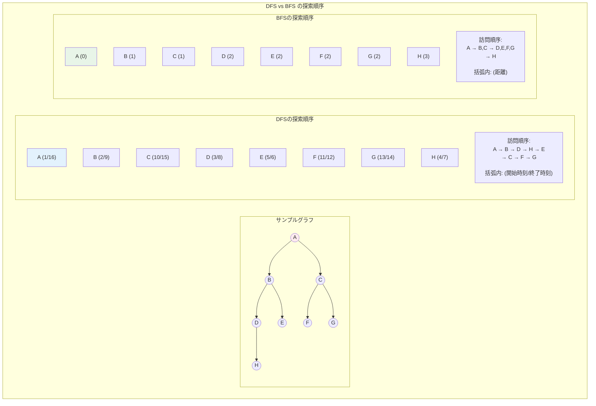
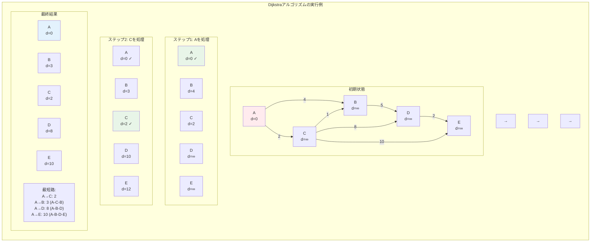
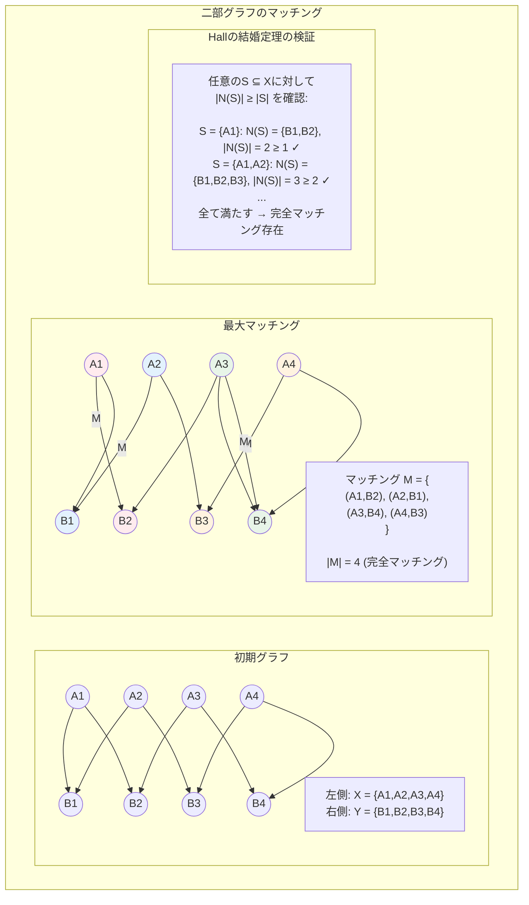

# 第8章 グラフ理論とネットワーク

## はじめに

グラフ理論は、オブジェクト間の関係を数学的に表現し分析する強力な枠組みを提供します。ネットワーク、回路設計、ソーシャルメディア、交通システムなど、現実世界の多くの問題がグラフとして自然にモデル化されます。本章では、グラフの基本的な性質から始まり、最短路、ネットワークフロー、マッチングなどの古典的問題とその効率的なアルゴリズムを詳しく学びます。

グラフアルゴリズムの理論は、単なる抽象的な数学ではありません。インターネットのルーティング、SNSの友人推薦、配送経路の最適化など、日常的に使用される技術の基盤となっています。本章では、これらの応用を念頭に置きながら、理論的な深さと実践的な洞察の両方を提供します。

## 8.1 グラフの基本理論

### 8.1.1 グラフの表現と基本概念

**定義 8.1** **グラフ** G = (V, E) は頂点集合 V と辺集合 E から構成される。
- 無向グラフ：E ⊆ {(u, v) | u, v ∈ V, u ≠ v}
- 有向グラフ：E ⊆ V × V

**グラフの表現方法**：
1. **隣接行列**：A[i,j] = 1 if (i,j) ∈ E
   - 空間：O(|V|²)
   - 辺の存在確認：O(1)
   - 全辺の走査：O(|V|²)

2. **隣接リスト**：各頂点の隣接頂点のリスト
   - 空間：O(|V| + |E|)
   - 頂点の隣接頂点走査：O(deg(v))
   - 全辺の走査：O(|V| + |E|)

### 8.1.2 基本的なグラフの性質

**定理 8.1**（握手補題）無向グラフ G = (V, E) において：
∑_{v∈V} deg(v) = 2|E|

*証明*：各辺は両端点の次数にそれぞれ1ずつ寄与する。□

**系 8.1** 無向グラフにおいて、奇数次数の頂点数は偶数個。

**定理 8.2**（Eulerの公式）連結平面グラフ G = (V, E, F) において：
|V| - |E| + |F| = 2
（F は面の集合）

**系 8.2** 単純連結平面グラフ（|V| ≥ 3）において：|E| ≤ 3|V| - 6

### 8.1.3 グラフの走査



#### 深さ優先探索（DFS）

```
DFS(G, s):
    for each v ∈ V:
        color[v] = WHITE
        π[v] = NIL
    time = 0  // グローバル変数として時刻を管理
    DFS-Visit(s)

DFS-Visit(u):
    time = time + 1  // timeはグローバル変数
    d[u] = time      // 発見時刻を記録
    color[u] = GRAY
    for each v ∈ Adj[u]:
        if color[v] == WHITE:
            π[v] = u
            DFS-Visit(v)
    color[u] = BLACK
    time = time + 1  // timeはグローバル変数
    f[u] = time      // 終了時刻を記録
```

**性質**：
- 時間複雑度：O(|V| + |E|)
- DFS木を生成
- 開始時刻 d[v] と終了時刻 f[v] を記録

#### 幅優先探索（BFS）

```
BFS(G, s):
    for each v ∈ V \ {s}:
        color[v] = WHITE
        d[v] = ∞
        π[v] = NIL
    color[s] = GRAY
    d[s] = 0
    π[s] = NIL
    Q = {s}
    while Q ≠ ∅:
        u = Dequeue(Q)
        for each v ∈ Adj[u]:
            if color[v] == WHITE:
                color[v] = GRAY
                d[v] = d[u] + 1
                π[v] = u
                Enqueue(Q, v)
        color[u] = BLACK
```

**定理 8.3** BFS は始点からの最短路（辺数）を正しく計算する。

### 8.1.4 連結性

**定義 8.2** 
- 無向グラフが**連結**：任意の2頂点間に路が存在
- 有向グラフが**強連結**：任意の2頂点間に有向路が存在

**強連結成分**の検出（Kosarajuのアルゴリズム）：
1. G で DFS を実行し、終了時刻の降順を記録
2. G^T（転置グラフ）で、その順序で DFS を実行
3. 各 DFS木が強連結成分

時間複雑度：O(|V| + |E|)

**定理 8.4** 無向グラフ G が連結 ⟺ 任意の空でない真部分集合 S ⊂ V に対して、
S と V \ S を結ぶ辺が存在。

## 8.2 最短路問題

### 8.2.1 単一始点最短路



#### Dijkstraのアルゴリズム

**前提**：非負の辺重み

```
Dijkstra(G, w, s):
    for each v ∈ V:
        d[v] = ∞
        π[v] = NIL
    d[s] = 0
    S = ∅
    Q = V
    while Q ≠ ∅:
        u = Extract-Min(Q)
        S = S ∪ {u}
        for each v ∈ Adj[u]:
            if d[v] > d[u] + w(u,v):
                d[v] = d[u] + w(u,v)
                π[v] = u
```

**定理 8.5** Dijkstraのアルゴリズムは非負重みグラフで正しく最短路を計算する。

*証明*（不変条件）：S に追加される頂点の d 値は最短距離に等しい。
帰納法により証明。□

**時間複雑度**：
- 二分ヒープ：O((|V| + |E|) log |V|)
- フィボナッチヒープ：O(|V| log |V| + |E|)

#### Bellman-Fordアルゴリズム

**利点**：負の重みを許容、負閉路を検出

```
Bellman-Ford(G, w, s):
    for each v ∈ V:
        d[v] = ∞
        π[v] = NIL
    d[s] = 0
    for i = 1 to |V| - 1:
        for each edge (u,v) ∈ E:
            if d[v] > d[u] + w(u,v):
                d[v] = d[u] + w(u,v)
                π[v] = u
    // 負閉路の検出
    for each edge (u,v) ∈ E:
        if d[v] > d[u] + w(u,v):
            return "負閉路が存在"
    return d
```

時間複雑度：O(|V| · |E|)

### 8.2.2 全点対最短路

#### Floyd-Warshallアルゴリズム

動的計画法による解法：
d_ij^(k) = 頂点 {1, 2, ..., k} を中継点として使う場合の i から j への最短距離

```
Floyd-Warshall(W):
    n = |V|
    D^(0) = W
    for k = 1 to n:
        for i = 1 to n:
            for j = 1 to n:
                d_ij^(k) = min(d_ij^(k-1), d_ik^(k-1) + d_kj^(k-1))
    return D^(n)
```

時間複雑度：O(|V|³)
空間複雑度：O(|V|²)（1つの行列を更新）

### 8.2.3 特殊なグラフでの最短路

**DAG（有向非巡回グラフ）での最短路**：
トポロジカル順序で緩和することで O(|V| + |E|) で解ける。

**定理 8.6** 単位重み（すべての辺の重みが1）のグラフでは、
BFS が O(|V| + |E|) で最短路を求める。

## 8.3 最小全域木

### 8.3.1 最小全域木の性質

**定義 8.3** 連結無向グラフ G = (V, E) の**全域木**は、
すべての頂点を含み、|V| - 1 本の辺を持つ部分グラフ。

**カット性質**：グラフの任意のカット (S, V \ S) を横切る最小重み辺は、
ある最小全域木に含まれる。

**サイクル性質**：グラフの任意のサイクル中の最大重み辺は、
すべての最小全域木に含まれない。

### 8.3.2 Kruskalのアルゴリズム

```
Kruskal(G, w):
    A = ∅
    for each v ∈ V:
        Make-Set(v)
    辺を重みの昇順にソート
    for each edge (u,v) ∈ E (昇順):
        if Find-Set(u) ≠ Find-Set(v):
            A = A ∪ {(u,v)}
            Union(u, v)
    return A
```

時間複雑度：O(|E| log |E|)

### 8.3.3 Primのアルゴリズム

```
Prim(G, w, r):
    for each v ∈ V:
        key[v] = ∞
        π[v] = NIL
    key[r] = 0
    Q = V
    while Q ≠ ∅:
        u = Extract-Min(Q)
        for each v ∈ Adj[u]:
            if v ∈ Q and w(u,v) < key[v]:
                π[v] = u
                key[v] = w(u,v)
```

時間複雑度：
- 二分ヒープ：O(|E| log |V|)
- フィボナッチヒープ：O(|E| + |V| log |V|)

**定理 8.7** KruskalとPrimのアルゴリズムは正しく最小全域木を求める。

## 8.4 ネットワークフロー

### 8.4.1 最大フロー問題

**定義 8.4** **フローネットワーク** G = (V, E) は：
- 容量関数 c: V × V → ℝ⁺
- 始点 s、終点 t

**フロー** f: V × V → ℝ は以下を満たす：
1. 容量制約：0 ≤ f(u,v) ≤ c(u,v)
2. 流量保存：∑_v f(v,u) = ∑_v f(u,v) （u ≠ s,t）

```mermaid
graph LR
    subgraph "最大フロー最小カットの例"
        subgraph "フローネットワーク"
            S((s))
            A((a))
            B((b))
            C((c))
            D((d))
            T((t))
            
            S -->|"16/16"| A
            S -->|"13/13"| B
            A -->|"10/12"| B
            A -->|"12/12"| C
            B -->|"4/9"| C
            B -->|"14/14"| D
            C -->|"7/7"| T
            C -->|"9/10"| D
            D -->|"20/20"| T
            
            Note1["表記: フロー/容量"]
        end
        
        subgraph "最小カット"
            S2((s))
            A2((a))
            B2((b))
            C2((c))
            D2((d))
            T2((t))
            
            CutLine["最小カット"]
            
            S2 -.-> A2
            S2 -.-> B2
            A2 -.-> C2
            B2 -.-> D2
            C2 -.-> T2
            D2 -.-> T2
            
            SetS["集合S: {s,a,b}"]
            SetT["集合T: {c,d,t}"]
            
            CutValue["カット容量:<br/>(a,c): 12<br/>(b,c): 9<br/>(b,d): 14<br/>合計: 35<br/><br/>最大フロー値: 35"]
        end
        
        subgraph "残余グラフ"
            RS((s))
            RA((a))
            RB((b))
            RC((c))
            RD((d))
            RT((t))
            
            RS -->|"0"| RA
            RS -->|"0"| RB
            RA -->|"2"| RB
            RA <--|"10"| RB
            RA -->|"0"| RC
            RB -->|"5"| RC
            RB <--|"4"| RC
            RB -->|"0"| RD
            RC -->|"0"| RT
            RC <--|"7"| RT
            RC -->|"1"| RD
            RD -->|"0"| RT
            
            Note2["残余容量が0の辺は<br/>sからtへのパスに<br/>含まれない"]
        end
    end
    
    style S fill:#ffebee
    style T fill:#e3f2fd
    style SetS fill:#ffe0b2
    style SetT fill:#e1f5fe
```

### 8.4.2 Ford-Fulkerson法

```
Ford-Fulkerson(G, s, t):
    for each edge (u,v) ∈ E:
        f(u,v) = 0
    while 残余グラフ G_f に s-t パスが存在:
        p = G_f における s-t パス
        c_f(p) = min{c_f(u,v) : (u,v) ∈ p}
        for each edge (u,v) ∈ p:
            if (u,v) ∈ E:
                f(u,v) = f(u,v) + c_f(p)
            else:
                f(v,u) = f(v,u) - c_f(p)
    return f
```

**定理 8.8**（最大フロー最小カット定理）
以下の条件は同値：
1. f は最大フロー
2. 残余グラフに増加路が存在しない
3. |f| = c(S,T) となるカット (S,T) が存在

### 8.4.3 効率的な実装

#### Edmonds-Karp法
増加路を BFS で見つける：O(|V| · |E|²)

#### Dinicのアルゴリズム
レベルグラフを用いたブロッキングフロー：O(|V|² · |E|)

#### Push-Relabel法
```
Push-Relabel(G, s, t):
    前処理で高さ関数とプレフローを初期化
    while 活性頂点が存在:
        v = 活性頂点
        if v から押し出し可能:
            Push(v)
        else:
            Relabel(v)
```

時間複雑度：O(|V|² · |E|)

### 8.4.4 応用

**最小費用最大フロー**：
各辺にコストを付加し、最大フロー中で総コスト最小のものを求める。

**多品種フロー**：
複数の始点・終点ペアのフローを同時に扱う。

## 8.5 マッチング理論

### 8.5.1 二部グラフのマッチング

**定義 8.5** グラフ G = (V, E) の**マッチング** M ⊆ E は、
どの2辺も共通の端点を持たない辺集合。



**定理 8.9**（Hallの結婚定理）
二部グラフ G = (X ∪ Y, E) が X を飽和するマッチングを持つ ⟺
∀S ⊆ X, |N(S)| ≥ |S|
（N(S) は S の隣接頂点集合）

**定理 8.10**（Kőnig-Egerváryの定理）
二部グラフにおいて：最大マッチングのサイズ = 最小頂点被覆のサイズ

### 8.5.2 最大マッチングアルゴリズム

#### 二部グラフの場合（Hungarian法）
最大フローへの帰着により O(|E| · |V|^{1/2}) で解ける。

#### 一般グラフの場合（Edmondsのアルゴリズム）
花（blossom）の縮約を用いる：O(|V|³)

### 8.5.3 完全マッチング

**定理 8.11**（Tutteの定理）
グラフ G が完全マッチングを持つ ⟺
∀S ⊆ V, o(G - S) ≤ |S|
（o(G - S) は G - S の奇数サイズ連結成分数）

### 8.5.4 安定マッチング

**Gale-Shapleyアルゴリズム**：
```
Gale-Shapley(男性の選好, 女性の選好):
    全員を未婚に初期化
    while 未婚の男性が存在:
        m = 未婚の男性
        w = m の選好リストの最上位の未プロポーズ女性
        if w が未婚:
            (m, w) を婚約
        else if w が現在の相手より m を選好:
            w の現在の相手を未婚に
            (m, w) を婚約
    return マッチング
```

時間複雑度：O(n²)

**定理 8.12** Gale-Shapleyアルゴリズムは安定マッチングを生成し、
それは男性最適・女性最悪である。

## 8.6 グラフの彩色

### 8.6.1 頂点彩色

**定義 8.6** グラフ G の**彩色数** χ(G) は、
隣接頂点が異なる色となるように頂点を彩色するのに必要な最小色数。

**定理 8.13**（Brooksの定理）
連結グラフ G が完全グラフでも奇サイクルでもなければ、
χ(G) ≤ Δ(G)（Δ(G) は最大次数）

### 8.6.2 辺彩色

**定理 8.14**（Vizingの定理）
単純グラフ G の辺彩色数 χ'(G) は：
Δ(G) ≤ χ'(G) ≤ Δ(G) + 1

### 8.6.3 平面グラフの彩色

**定理 8.15**（4色定理）
すべての平面グラフは4彩色可能。

**定理 8.16**（5色定理）
すべての平面グラフは5彩色可能。

*証明の概要*：最小次数が5以下であることと帰納法を用いる。□

### 8.6.4 彩色アルゴリズム

**貪欲彩色**：
頂点を任意の順序で処理し、使用可能な最小の色を割り当てる。

**定理 8.17** 適切な頂点順序により、貪欲彩色は χ(G) 色で彩色する。

## 8.7 特殊なグラフクラス

### 8.7.1 平面グラフ

**定理 8.18**（Kuratowskiの定理）
グラフが平面的 ⟺ K₅ または K₃,₃ の細分を部分グラフとして含まない。

**平面性判定**：O(|V|) アルゴリズムが存在。

### 8.7.2 木構造

**定理 8.19** 以下は同値：
1. G は木
2. G は連結で |E| = |V| - 1
3. G は非巡回で |E| = |V| - 1
4. 任意の2頂点間に唯一のパスが存在

### 8.7.3 弦グラフ

**定義 8.7** グラフが**弦グラフ**（chordal graph）⟺
長さ4以上のすべてのサイクルが弦を持つ。

**性質**：
- 完全消去順序が存在
- 多項式時間で多くの NP困難問題が解ける

## 8.8 ランダムグラフ

### 8.8.1 Erdős-Rényiモデル

**G(n,p)**：n 頂点で各辺が独立に確率 p で存在。

**定理 8.20** p = (log n + c)/n のとき：
- c → -∞ ⟹ G(n,p) はほぼ確実に非連結
- c → +∞ ⟹ G(n,p) はほぼ確実に連結

### 8.8.2 小世界ネットワーク

**Watts-Strogatzモデル**：
規則的な格子から始めて、辺をランダムに繋ぎ変える。

**性質**：
- 小さい平均距離
- 高いクラスタリング係数

### 8.8.3 スケールフリーネットワーク

**Barabási-Albertモデル**：
優先的選択により成長。

**次数分布**：P(k) ∝ k^{-γ}（べき乗則）

## 章末問題

### 基礎問題

1. 以下のグラフアルゴリズムを実装し、時間複雑度を解析せよ：
   (a) トポロジカルソート
   (b) 2-SAT の多項式時間解法
   (c) 最長パス（DAG）

2. Dijkstraのアルゴリズムが負の重みで失敗する例を構成せよ。

3. 最小全域木がユニークとなる必要十分条件を示せ。

4. 二部グラフの最大マッチングを最大フロー問題に帰着せよ。

### 発展問題

5. プラナーグラフの双対グラフについて：
   (a) 双対グラフの定義と性質を述べよ
   (b) 最短路と最小カットの双対性を説明せよ

6. グラフの木幅（treewidth）について：
   (a) 定義と計算複雑性を述べよ
   (b) 有界木幅グラフで効率的に解ける問題を列挙せよ

7. 頂点彩色問題の近似アルゴリズムについて：
   (a) 貪欲法の近似比を証明せよ
   (b) より良い近似アルゴリズムを設計せよ

8. ネットワーク信頼性について：
   (a) 最小カットと辺連結度の関係を示せ
   (b) k-辺連結グラフの判定アルゴリズムを示せ

### 探究課題

9. ソーシャルネットワーク分析で使用されるグラフ指標（中心性、クラスタリング係数など）について調査し、
   計算アルゴリズムを設計せよ。

10. グラフニューラルネットワーク（GNN）の理論的基礎について調査し、
    表現力の限界を論ぜよ。

11. 量子アルゴリズムによるグラフ問題の高速化について調査し、
    古典アルゴリズムとの比較を行え。

12. 動的グラフアルゴリズム（頂点・辺の追加削除に対応）について調査し、
    静的アルゴリズムからの改善を論ぜよ。

### 実装課題

13. グラフアルゴリズムライブラリを実装せよ：
    ```python
    class GraphAlgorithms:
        def dijkstra(self, graph, source):
            """Dijkstraの最短路アルゴリズム"""
            pass
        
        def max_flow(self, graph, source, sink):
            """最大フローアルゴリズム（Ford-Fulkerson）"""
            pass
        
        def minimum_spanning_tree(self, graph, algorithm='kruskal'):
            """最小全域木（Kruskal or Prim）"""
            pass
        
        def strongly_connected_components(self, graph):
            """強連結成分分解（Tarjanのアルゴリズム）"""
            pass
    ```

14. ネットワーク分析ツールを実装せよ：
    ```python
    class NetworkAnalysis:
        def centrality_measures(self, graph):
            """中心性指標の計算（次数、媒介、固有ベクトル中心性）"""
            pass
        
        def community_detection(self, graph):
            """コミュニティ検出アルゴリズム"""
            pass
        
        def graph_visualization(self, graph, layout='spring'):
            """グラフの可視化"""
            pass
        
        def generate_random_graphs(self, model, parameters):
            """ランダムグラフの生成（Erdős-Rényi, Barabási-Albert等）"""
            pass
    ```

15. グラフ問題の性能比較：
    - 最短路アルゴリズムの比較（Dijkstra, Bellman-Ford, Floyd-Warshall）
    - 最大フローアルゴリズムの比較（Ford-Fulkerson, Dinic, Push-Relabel）
    - 実グラフでの性能測定と分析