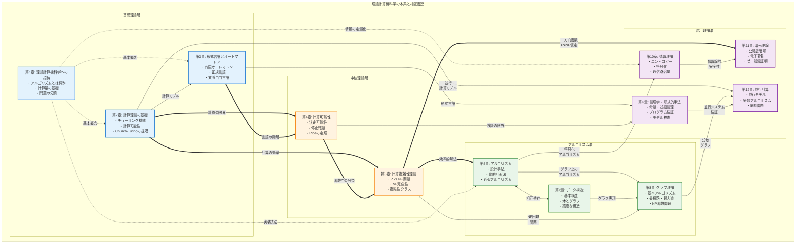
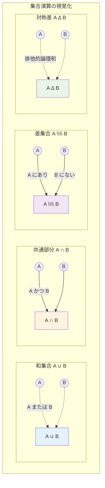
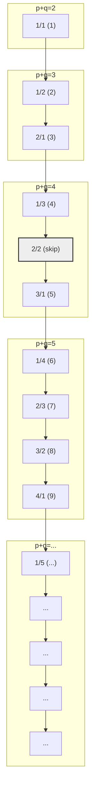
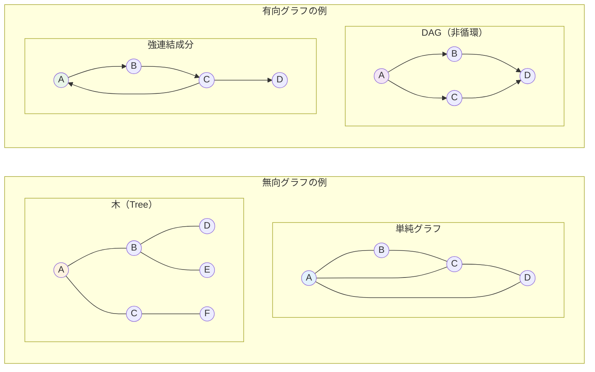

# 第1章 数学的基礎

## 理論計算機科学の全体像

本書で学ぶ理論計算機科学の全体像を以下の図に示します。各章がどのように関連し、理論がどのように発展していくかを把握してから学習を始めることで、より深い理解が得られるでしょう。



### 凡例
- **実線の矢印 (→)**: 直接的な前提知識の関係
- **二重線の矢印 (⇒)**: 強い理論的発展の関係
- **点線の矢印 (⋯>)**: 補助的な関連・応用

## はじめに

コンピュータサイエンスの理論を学ぶ上で、数学は欠かせない基盤となります。アルゴリズムの正確性を証明し、計算の複雑さを解析し、形式的な仕様を記述するには、数学的な言語と思考法が必要不可欠です。

本章では、後の章で必要となる数学的概念と証明技法を体系的に学びます。具体的には、集合論、論理学、証明技法、関係と関数、そしてグラフ理論の基礎に焦点を当てます。これらの知識は、計算理論、アルゴリズム解析、形式的手法において中核的な役割を果たします。

## 1.1 集合論

集合論は、現代数学の基礎となる言語です。

### 1.1.1 集合の基本概念

**集合**（set）とは、明確に区別できる「もの」の集まりです。集合に含まれる個々の「もの」を**要素**（element）または**元**（げん）と呼びます。
要素 a が集合 A に属することを a ∈ A と表記し、属さないことを a ∉ A と表記します。

集合を表す主な方法は2つあります：

1.  **外延的記法**（列挙）: A = {1, 2, 3, 4, 5}
    *   要素をコンマで区切り、中括弧 {} で囲みます。
    *   要素の順序は問いません ({1, 2, 3} と {3, 1, 2} は同じ集合です)。
    *   要素の重複は許されません ({1, 2, 2, 3} は {1, 2, 3} と同じ集合です)。
2.  **内包的記法**（条件指定）: A = {x | x は 1 以上 5 以下の整数}
    *   {x | P(x)} の形で、条件 P(x) を満たす要素 x 全体の集合を表します。

いくつかの重要な集合：

*   **空集合**（empty set）: 要素を一つも含まない集合。∅ または {} で表記します。
*   **自然数の集合**: ℕ = {1, 2, 3, ...} （本書では1から始めます）
*   **非負整数の集合**: ℕ₀ = {0, 1, 2, 3, ...}
*   **整数の集合**: ℤ = {..., -2, -1, 0, 1, 2, ...}
*   **有理数の集合**: ℚ = {p/q | p, q ∈ ℤ, q ≠ 0}
*   **実数の集合**: ℝ （数直線上のすべての点）
*   **複素数の集合**: ℂ = {a + bi | a, b ∈ ℝ, i² = -1}
*   **全体集合**（universal set）: 考察の対象となるすべての要素を含む集合。通常 U で表記します。

**部分集合と相等**:
集合 A のすべての要素が集合 B にも含まれるとき、A は B の**部分集合**（subset）であるといい、A ⊆ B と表記します。

*   **真部分集合**（proper subset）: A ⊆ B かつ A ≠ B のとき、A ⊂ B と表記します。
*   **相等**（equality）: A = B ⟺ A ⊆ B かつ B ⊆ A

集合 A の**冪集合**（power set）P(A) または 2^A は、A のすべての部分集合からなる集合です。
例: A = {a, b} のとき、P(A) = {∅, {a}, {b}, {a, b}}

**定理 1.1** 有限集合 A に対して、|P(A)| = 2^|A|
*証明*：A の各要素について、それを部分集合に含めるか含めないかの2通りの選択があります。A の要素数を n とすると、独立な選択が n 回あるので、部分集合の総数は 2^n となります。□

### 1.1.2 集合演算

基本的な集合演算：

1.  **和集合**（union）: A ∪ B = {x | x ∈ A または x ∈ B}
2.  **共通部分**（intersection）: A ∩ B = {x | x ∈ A かつ x ∈ B}
3.  **差集合**（difference）: A \\\\ B = {x | x ∈ A かつ x ∉ B} (A - B とも書きます)
4.  **対称差**（symmetric difference）: A Δ B = (A \\\\ B) ∪ (B \\\\ A) = (A ∪ B) \\\\ (A ∩ B)
5.  **補集合**（complement）: A^c = U \\\\ A (U は全体集合)



**定理 1.2** 任意の集合 A, B, C に対して、以下が成り立ちます：

*   **交換法則**: A ∪ B = B ∪ A, A ∩ B = B ∩ A
*   **結合法則**: (A ∪ B) ∪ C = A ∪ (B ∪ C), (A ∩ B) ∩ C = A ∩ (B ∩ C)
*   **分配法則**: A ∪ (B ∩ C) = (A ∪ B) ∩ (A ∪ C), A ∩ (B ∪ C) = (A ∩ B) ∪ (A ∩ C)
*   **吸収法則**: A ∪ (A ∩ B) = A, A ∩ (A ∪ B) = A
*   **冪等法則**: A ∪ A = A, A ∩ A = A
*   **ド・モルガンの法則**: (A ∪ B)^c = A^c ∩ B^c, (A ∩ B)^c = A^c ∪ B^c
*   **その他**: A ∪ ∅ = A, A ∩ U = A, A ∩ ∅ = ∅, A ∪ U = U, (A^c)^c = A

*証明*（ド・モルガンの法則 (A ∪ B)^c = A^c ∩ B^c のみ示します）：
x ∈ (A ∪ B)^c
⟺ x ∉ (A ∪ B)
⟺ ¬(x ∈ A ∨ x ∈ B)
⟺ (x ∉ A) ∧ (x ∉ B)
⟺ (x ∈ A^c) ∧ (x ∈ B^c)
⟺ x ∈ (A^c ∩ B^c)
よって、(A ∪ B)^c = A^c ∩ B^c が成り立ちます。□

(注意: 他の法則の証明は省略し、演習問題とします。)

**直積**:
集合 A と B の**直積**（Cartesian product）は、順序対の集合として定義されます：
A × B = {(a, b) | a ∈ A, b ∈ B}
例: {1, 2} × {a, b} = {(1, a), (1, b), (2, a), (2, b)}

n 個の集合の直積：
A₁ × A₂ × ... × Aₙ = {(a₁, a₂, ..., aₙ) | aᵢ ∈ Aᵢ for i = 1, ..., n}
とくに A × A × ... × A (n 回) を Aⁿ と書きます。

### 1.1.3 集合の濃度 (可算と非可算)

集合の**濃度**（cardinality）または**基数**は、集合の「大きさ」や「要素数」を表す概念です。

*   **有限集合**：要素数が自然数で表される集合。|A| = n と表記します。
*   **無限集合**：有限でない集合。

**定義 1.1** 集合 A が**可算**（countable）であるとは、A の要素の個数が有限であるか、または A の要素全体を自然数 1, 2, 3, ... と順番に番号付けできる（つまり自然数の集合 ℕ と一対一対応がつく）場合をいいます。有限集合はすべて可算です。無限集合のうち可算であるものを**可算無限集合**（countably infinite set）と呼びます。

可算集合の例：

*   すべての有限集合
*   自然数の集合 ℕ
*   整数の集合 ℤ (0, 1, -1, 2, -2, ... のように番号付け可能)

**定理 1.3** 有理数の集合 ℚ は可算です。
*証明の概略*：正の有理数を p/q (p, q は互いに素な自然数) としたとき、p+q の値が小さい順に、p+q の値が同じものについては p の値が小さい順に並べることで、すべての正の有理数を列挙できます。
以下にその列挙の様子を図示します。矢印の順にたどることで、すべての正の有理数を網羅的に数え上げることができます。



この図では、(k) は k 番目に数えられる有理数を示します。分母と分子の和 (p+q) が小さいものから順に、和が同じ場合は分子 p が小さいものから順に並べています。既約でない分数 (例: 2/2) はスキップします。
この列挙により、正の有理数全体に番号を振ることができます。負の有理数と0を含めても、同様の手法（たとえば、0, 正の有理数1, 負の有理数1, 正の有理数2, ... のように交互に並べる）で列挙可能であり、全体の可算性が保たれます。□

**非可算集合**（uncountable set）は、可算でない無限集合です。
**定理 1.4**（Cantor）実数の集合 ℝ は非可算です。
*証明*：背理法によります。ℝ が可算であると仮定し、実数を r₁, r₂, r₃, ... と列挙できるとします。
区間 [0, 1] の実数の小数展開を考えます：
r₁ = 0.d₁₁d₁₂d₁₃...
r₂ = 0.d₂₁d₂₂d₂₃...
r₃ = 0.d₃₁d₃₂d₃₃...
...
ここで、新しい実数 r = 0.e₁e₂e₃... を以下のように構成します：
各 i について、eᵢ ≠ dᵢᵢ となるように選びます（例：dᵢᵢ = 5 なら eᵢ = 6、dᵢᵢ ≠ 5 なら eᵢ = 5）
この r は [0, 1] の実数ですが、すべての i に対して rᵢ と異なります（第 i 桁が異なります）。
これは、ℝ のすべての実数が列挙されたという仮定に矛盾します。
したがって、ℝ は非可算です。□

## 1.2 論理学

論理学は、正しい推論の形式を研究する分野です。

### 1.2.1 命題論理

**命題**（proposition）とは、真 (true, T, 1) または偽 (false, F, 0) のいずれかの値をとる文です。
例：「地球は丸い」（真）、「1 + 1 = 3」（偽）

命題を変数 p, q, r, ... で表し、論理演算子を用いて複合命題を作ります。
主な論理演算子：

1.  **否定**（negation）: ¬p（「p でない」）
2.  **論理積**（conjunction）: p ∧ q（「p かつ q」）
3.  **論理和**（disjunction）: p ∨ q（「p または q」）
4.  **含意**（implication）: p → q（「p ならば q」）。p が偽であれば q の真偽に関わらず真です。
5.  **同値**（equivalence）: p ↔ q（「p と q は同値」）。(p → q) ∧ (q → p) と同じです。

**真理値表**（truth table）は、命題の真理値を体系的に示す表です。

| p | q | ¬p | p ∧ q | p ∨ q | p → q | p ↔ q |
|---|---|----|-------|-------|-------|-------|
| T | T | F  | T     | T     | T     | T     |
| T | F | F  | F     | T     | F     | F     |
| F | T | T  | F     | T     | T     | F     |
| F | F | T  | F     | F     | T     | T     |

**論理的同値**:
二つの論理式 φ と ψ が**論理的に同値**（logically equivalent）であるとは、いかなる真理値割当に対しても同じ真理値をとることであり、φ ≡ ψ と書きます。
重要な論理的同値関係：

1.  **二重否定**: ¬¬p ≡ p
2.  **交換法則**: p ∧ q ≡ q ∧ p, p ∨ q ≡ q ∨ p
3.  **結合法則**: (p ∧ q) ∧ r ≡ p ∧ (q ∧ r), (p ∨ q) ∨ r ≡ p ∨ (q ∨ r)
4.  **分配法則**: p ∧ (q ∨ r) ≡ (p ∧ q) ∨ (p ∧ r), p ∨ (q ∧ r) ≡ (p ∨ q) ∧ (p ∨ r)
5.  **吸収法則**: p ∧ (p ∨ q) ≡ p, p ∨ (p ∧ q) ≡ p
6.  **冪等法則**: p ∧ p ≡ p, p ∨ p ≡ p
7.  **ド・モルガンの法則**: ¬(p ∧ q) ≡ ¬p ∨ ¬q, ¬(p ∨ q) ≡ ¬p ∧ ¬q
8.  **含意の書き換え**: p → q ≡ ¬p ∨ q
9.  **対偶**: p → q ≡ ¬q → ¬p

**定義 1.3**

*   **恒真式**（tautology）：すべての真理値割当で真となる論理式。例: p ∨ ¬p
*   **矛盾式**（contradiction）：すべての真理値割当で偽となる論理式。例: p ∧ ¬p
*   **充足可能式**（satisfiable formula）：真となるような真理値割当が少なくとも一つ存在する論理式。

**定理 1.5** 論理式 φ が恒真式である ⟺ ¬φ が矛盾式である。
*証明*：φ が恒真式であれば、すべての真理値割当でφが真となる。したがって、すべての真理値割当で¬φが偽となるため、¬φは矛盾式である。逆向きも同様に証明できる。□

### 1.2.2 述語論理

命題論理では扱えない「すべての x について...」「ある x が存在して...」といった表現を扱うための論理です。
**述語**（predicate）P(x) は、変数 x に特定の値を代入すると命題となるものです。
例: P(x) = 「x は偶数である」

**量化子**（quantifier）：

*   ∀（全称量化子）：「すべての x について」
*   ∃（存在量化子）：「ある x が存在して」

例:
*   ∀x ∈ ℕ, P(x) : 「すべての自然数 x について P(x) が成り立つ」
*   ∃x ∈ ℝ, x² = 2 : 「x² = 2 となる実数 x が存在する」

**述語論理の構文**:

*   **項**（term）：個体変数、個体定数、または関数記号と項から構成されます。
    *   個体変数は項です。
    *   個体定数は項です。
    *   t₁, ..., tₙ が項で f が n 項関数記号なら、f(t₁, ..., tₙ) は項です。
*   **原子論理式**（atomic formula）：述語記号と項から構成されます。
    *   t₁, ..., tₙ が項で P が n 項述語記号なら、P(t₁, ..., tₙ) は原子論理式です。
*   **論理式**（formula）：原子論理式や論理結合子、量化子を用いて帰納的に定義されます。
    *   原子論理式は論理式です。
    *   φ, ψ が論理式なら、¬φ, φ ∧ ψ, φ ∨ ψ, φ → ψ, φ ↔ ψ は論理式です。
    *   φ が論理式で x が変数なら、∀x φ, ∃x φ は論理式です。

**定義 1.4**

*   **束縛変数**（bound variable）：量化子の作用域内にある変数です。
*   **自由変数**（free variable）：束縛されていない変数です。
例：∀x (P(x) → Q(x, y)) において、x は束縛変数、y は自由変数です。

**解釈**（interpretation）I は以下から構成されます：

*   空でない集合 D（議論領域）
*   各定数記号 c に対する D の要素 I(c)
*   各 n 項関数記号 f に対する関数 I(f): Dⁿ → D
*   各 n 項述語記号 P に対する関係 I(P) ⊆ Dⁿ

ある解釈 I のもとで論理式 φ が真であるとき、I ⊨ φ と書きます。
*   **妥当式**（valid formula）：すべての解釈で真となる論理式。
*   **充足可能式**（satisfiable formula）：真となる解釈が少なくとも一つ存在する論理式。

## 1.3 証明技法

数学的証明は、前提から結論を論理的に導出する厳密な議論です。コンピュータサイエンスでは、アルゴリズムの正当性、計算複雑性の解析、システムの性質の検証など、さまざまな場面で証明が必要となります。

### 1.3.1 直接証明

**直接証明**（direct proof）は、前提から出発し、論理的推論の連鎖により結論を導くもっとも基本的な証明方法です。
命題「P ならば Q」（P → Q）の直接証明：

1.  P を仮定します。
2.  定義、公理、既知の定理などを用いて論理的ステップを積み重ねます。
3.  最終的に Q を導出します。

**例 1.1** 「n が偶数ならば n² も偶数である」を証明せよ。
*証明*：n を偶数とします。偶数の定義より、ある整数 k が存在して n = 2k と表せます。
このとき、n² = (2k)² = 4k² = 2(2k²) となります。
2k² は整数なので、n² は 2 の倍数、すなわち偶数です。□

### 1.3.2 対偶による証明

命題 P → Q を証明する代わりに、その**対偶**（contrapositive）¬Q → ¬P を証明する方法です。
**定理 1.6** P → Q と ¬Q → ¬P は論理的に同値である。
*証明*：真理値表により確認できる。また、P → Q ≡ ¬P ∨ Q および ¬Q → ¬P ≡ ¬(¬Q) ∨ ¬P ≡ Q ∨ ¬P ≡ ¬P ∨ Q より明らか。□

**例 1.2** 「n² が偶数ならば n も偶数である」を証明せよ。
*証明*（対偶による）：対偶「n が奇数ならば n² も奇数である」を証明します。
n を奇数とすると、ある整数 k が存在して n = 2k + 1 と表せます。
このとき、n² = (2k + 1)² = 4k² + 4k + 1 = 2(2k² + 2k) + 1 となります。
2k² + 2k は整数なので、n² は奇数の形をしています。□

### 1.3.3 背理法

命題 P を証明するために、¬P を仮定し、そこから矛盾を導く方法です。
論理的根拠：¬P → ⊥（矛盾）が真であれば、¬P は偽でなければならず、したがって P は真となります。

**例 1.3** √2 は無理数であることを証明せよ。
*証明*（背理法）：√2 が有理数であると仮定します。すると、互いに素な正整数 p, q が存在して √2 = p/q と表せます。
両辺を2乗すると、2 = p²/q²、よって 2q² = p² となります。
この式より p² は偶数なので、例1.2より p も偶数です。
よって、ある整数 k が存在して p = 2k と表せます。
これを 2q² = p² に代入すると、2q² = (2k)² = 4k²、すなわち q² = 2k² となります。
これより q² は偶数なので、q も偶数です。
しかし、p と q が共に偶数であることは、p と q が互いに素であることに矛盾します。
したがって、√2 は無理数です。□

### 1.3.4 数学的帰納法

自然数 n に関する命題 P(n) がすべての n ≥ n₀ で成り立つことを証明する強力な手法です。

1.  **基底段階**（base case）：P(n₀) が真であることを示します。
2.  **帰納段階**（inductive step）：任意の k ≥ n₀ に対して、P(k) → P(k+1) を示します（P(k) を**帰納法の仮定**といいます）。

**例 1.4** すべての n ≥ 1 に対して、1 + 2 + ... + n = n(n+1)/2 が成り立つことを証明せよ。
*証明*：P(n) を「1 + 2 + ... + n = n(n+1)/2」とします。
基底：n = 1 のとき、左辺 = 1、右辺 = 1(1+1)/2 = 1 なので成立します。
帰納段階：k ≥ 1 に対して P(k) が成り立つと仮定します。すなわち、1 + 2 + ... + k = k(k+1)/2 です。
P(k+1) を示すために、1 + 2 + ... + k + (k+1) を考えます。
1 + 2 + ... + k + (k+1)
= (1 + 2 + ... + k) + (k+1)
= k(k+1)/2 + (k+1)  （帰納法の仮定より）
= (k+1)(k/2 + 1)
= (k+1)(k+2)/2
= (k+1)((k+1)+1)/2
これは P(k+1) の形です。
数学的帰納法により、すべての n ≥ 1 で命題が成立します。□

**強い帰納法**（strong induction）では、帰納段階で P(n₀), P(n₀+1), ..., P(k) すべてを仮定して P(k+1) を示します。

**例 1.5** すべての n ≥ 2 は素数の積として表せることを証明せよ。
*証明*（強い帰納法）：P(n) を「n は素数の積として表せる」とします。
基底：n = 2 のとき、2 自身が素数なので成立します。
帰納段階：2 ≤ m ≤ k なるすべての m が素数の積として表せると仮定します。
k+1 について考えます：

*   k+1 が素数なら、それ自身が素数の積表示です。
*   k+1 が合成数なら、k+1 = ab (1 < a, b < k+1) と表せます。
    仮定より 2 ≤ a ≤ k かつ 2 ≤ b ≤ k なので、a と b は帰納法の仮定を満たします。
    よって、a と b は素数の積として表せるので、k+1 も素数の積として表せます。
したがって、すべての n ≥ 2 は素数の積として表せます。□

## 1.4 関係と関数

### 1.4.1 関係

**定義 1.5** 集合 A から集合 B への**二項関係**（binary relation）R は、直積 A × B の部分集合です。
(a, b) ∈ R のとき、aRb と表記します。
とくに、A = B のとき、R を A 上の関係といいます。

例：

*   整数の集合 ℤ 上の「より小さい」関係：< = {(a, b) | a, b ∈ ℤ, a < b}
*   集合 A の冪集合 P(A) 上の「部分集合」関係：⊆ = {(X, Y) | X, Y ∈ P(A), X ⊆ Y}

集合 A 上の関係 R について、以下の性質を考えます：

*   **反射的**（reflexive）: ∀a ∈ A, aRa
*   **対称的**（symmetric）: ∀a, b ∈ A, aRb → bRa
*   **反対称的**（antisymmetric）: ∀a, b ∈ A, (aRb ∧ bRa) → a = b
*   **推移的**（transitive）: ∀a, b, c ∈ A, (aRb ∧ bRc) → aRc

**定義 1.6**

*   **同値関係**（equivalence relation）: 反射的、対称的、かつ推移的な関係です。
*   **半順序関係**（partial order relation）: 反射的、反対称的、かつ推移的な関係です。

例：
*   整数の集合 ℤ 上の合同関係 (a ≡ b (mod m)) は同値関係です。
*   冪集合 P(A) 上の ⊆ は半順序関係です。
*   ≤ は反射的、反対称的、推移的（全順序）です。

集合 A 上の同値関係 R に対して、要素 a の**同値類**（equivalence class）を：
[a] = {b ∈ A | aRb}
と定義します。

**定理 1.7** 集合 A 上の同値関係 R に対して：

1.  ∀a ∈ A, a ∈ [a]（同値類は空でない）
2.  aRb ⟺ [a] = [b]
3.  [a] ∩ [b] ≠ ∅ → [a] = [b]（同値類は互いに素か、または等しい）
4.  A は同値類の直和として表せる（A の**分割**を与える）

*証明*：(1) 反射性より a ∈ [a]。(2) (⇒) aRb なら [a] = [b] を示す。c ∈ [a] とすると aRc。推移性と対称性より bRc、すなわち c ∈ [b]。よって [a] ⊆ [b]。同様に [b] ⊆ [a]。(⇐) [a] = [b] かつ a ∈ [a] = [b] より aRb。(3) と (4) は (2) から従う。□

### 1.4.2 関数

**定義 1.7** 集合 A から集合 B への**関数**（function）f は、以下を満たす関係です：

*   ∀a ∈ A, ∃b ∈ B, (a, b) ∈ f（全域性）
*   ∀a ∈ A, ∀b₁, b₂ ∈ B, ((a, b₁) ∈ f ∧ (a, b₂) ∈ f) → b₁ = b₂（一意性）

通常、(a, b) ∈ f を f(a) = b と書きます。f: A → B と表記します。
*   A を f の**定義域**（domain）といいます。
*   B を f の**終域**（codomain）といいます。
*   {f(a) | a ∈ A} を f の**値域**（range）といいます。

**定義 1.8** 関数 f: A → B について：

*   **単射**（injection, one-to-one）: ∀a₁, a₂ ∈ A, f(a₁) = f(a₂) → a₁ = a₂
   （異なる要素は異なる要素に写る）
*   **全射**（surjection, onto）: ∀b ∈ B, ∃a ∈ A, f(a) = b
   （終域のすべての要素が写される）
*   **全単射**（bijection, one-to-one correspondence）:
   f が単射かつ全射であることです。

**例 1.7**

*   f: ℤ → ℤ, f(x) = 2x は単射ですが全射ではありません（奇数が写されません）。
*   f: ℝ → ℝ, f(x) = x³ は全単射です。
*   f: ℝ → ℝ, f(x) = x² は単射ではありません (例: f(2)=f(-2)=4)。また、終域を ℝ とすると全射でもありません (負の値を取りません)。

**定義 1.9** 関数 f: A → B と g: B → C の**合成**（composition）g ∘ f: A → C を：
(g ∘ f)(a) = g(f(a)) for all a ∈ A
と定義します。

**定理 1.8**

1.  結合法則：(h ∘ g) ∘ f = h ∘ (g ∘ f)
2.  f, g が単射なら g ∘ f も単射です。
3.  f, g が全射なら g ∘ f も全射です。
4.  f, g が全単射なら g ∘ f も全単射です。

**定義 1.10** 関数 f: A → B が全単射のとき、**逆関数**（inverse function）f⁻¹: B → A が存在し：
f⁻¹(b) = a ⟺ f(a) = b
を満たします。このとき、以下が成り立ちます：

*   f⁻¹ ∘ f = idₐ（A 上の恒等関数）
*   f ∘ f⁻¹ = idᵦ（B 上の恒等関数）

## 1.5 グラフ理論の基礎

グラフ理論は、点（頂点）とそれらを結ぶ線（辺）からなる構造を扱う分野です。

### 1.5.1 グラフの定義

**定義 1.11** **グラフ**（graph）G は、頂点集合 V(G) と辺集合 E(G) の組 G = (V, E) です。

*   **無向グラフ**（undirected graph）: E は V の要素の非順序対の集合（または2要素部分集合）。
*   **有向グラフ**（directed graph, digraph）: E は V の要素の順序対の集合。

*   無向グラフでは辺を {u, v} または単に uv と表記します。
*   有向グラフでは辺を (u, v) または u → v と表記します（u から v への辺）。

*   **ループ**（loop）: (v, v) の形の辺。
*   **多重辺**（multiple edges）: 同じ頂点対を結ぶ複数の辺。
*   **単純グラフ**（simple graph）: ループも多重辺も持たないグラフ。とくに断りがなければ単純グラフを考えます。



**定義 1.12** 無向グラフ G において、頂点 v の**次数**（degree）deg(v) は、v に接続する辺の数です。
有向グラフ G において、頂点 v の：

*   **入次数**（in-degree）：deg⁻(v) = |{u ∈ V | (u, v) ∈ E}|
*   **出次数**（out-degree）：deg⁺(v) = |{u ∈ V | (v, u) ∈ E}|

**定理 1.9**（握手補題）無向グラフ G = (V, E) において：
Σ_{v∈V} deg(v) = 2|E|
（すべての頂点の次数の和は、辺の数の2倍に等しい）
系：次数が奇数である頂点の数は偶数個です。

### 1.5.2 道と閉路

**定義 1.13** グラフ G における頂点の列 v₀, v₁, ..., vₖ について：

1.  **歩道**（walk）：各 i で vᵢvᵢ₊₁ ∈ E (有向グラフの場合は (vᵢ, vᵢ₊₁) ∈ E)
    *   歩道の**長さ**は辺の数 k です。
2.  **道**（path）：すべての頂点が異なる歩道です。
3.  **閉路**（cycle, circuit）：v₀ = vₖ であり、v₀, ..., vₖ₋₁ が道である長さ k ≥ 1 の歩道です（単純グラフでは k ≥ 3）。

**定義 1.14**

*   無向グラフ G が**連結**（connected）：任意の2頂点間に道が存在します。
*   有向グラフ G が**強連結**（strongly connected）：任意の2頂点間に有向道が存在します。
*   有向グラフ G が**弱連結**（weakly connected）：基礎となる無向グラフ（辺の向きを無視したグラフ）が連結です。

### 1.5.3 木

**定義 1.15** **木**（tree）は、連結で閉路を持たない無向グラフです。
**森**（forest）は、閉路を持たない無向グラフ（木の集まり）です。

**定理 1.10** n 頂点のグラフ G について、以下は同値です：

1.  G は木です。
2.  G は連結で、辺数は n-1 です。
3.  G は閉路を持たず、辺数は n-1 です。
4.  G の任意の2頂点間に道がちょうど1つ存在します。
5.  G は閉路を持たないが、任意の辺を加えると閉路が1つできる最小のグラフです。
6.  G は連結だが、任意の辺を除去すると非連結になる最大のグラフです。

*証明の概略*：
（1→2）木は連結である。辺数については頂点数に関する帰納法で示せる。n=1 では自明。n≥2 で成立すると仮定し、n+1 頂点の木 T を考える。葉（次数1の頂点）vを除去すると、n 頂点の木 T' ができ、帰納法の仮定により |E(T')| = n-1。よって |E(T)| = |E(T')| + 1 = n。
（2→3）連結で n-1 本の辺を持つグラフに閉路があるとすると、閉路上の1辺を除去しても連結性が保たれ、n-2 本の辺で連結グラフとなる。しかし n≥2 のとき、n 頂点の連結グラフには最低 n-1 本の辺が必要なので矛盾。
（3→4）と他の同値性も同様に証明できる。□

### 1.5.4 その他のグラフの概念

**定義 1.16** グラフ G が**二部グラフ**（bipartite graph）であるとは、
頂点集合 V を V₁ と V₂ の2つの互いに素な部分集合に分割でき (V = V₁ ∪ V₂ かつ V₁ ∩ V₂ = ∅)、
すべての辺が V₁ と V₂ の間を結ぶことです。
(V₁, V₂) を二部グラフの**部集合**（partite sets）といいます。

**定理 1.11** グラフ G が二部グラフ ⟺ G は奇数長の閉路を持ちません。

**定義 1.17** n 頂点の**完全グラフ**（complete graph）Kₙ は、
任意の2頂点間に辺が存在する単純グラフです。

*   辺数：|E(Kₙ)| = n(n-1)/2

**定義 1.18** m 頂点と n 頂点の部集合を持つ**完全二部グラフ**（complete bipartite graph）K_{m,n} は、
部集合 V₁ (|V₁|=m) と V₂ (|V₂|=n) を持ち、V₁ の各頂点と V₂ の各頂点の間に辺が存在する二部グラフです。

*   辺数：|E(K_{m,n})| = mn

## 章末問題

### 基礎問題

1.  集合 A = {1, 2, 3, 4} に対して、以下を求めよ：
    (a) P(A) の要素数
    (b) A × A の要素数
    (c) A 上の反射的関係の個数

2.  ド・モルガンの法則 (A ∩ B)^c = A^c ∪ B^c を証明せよ。

3.  関数 f: ℝ → ℝ, f(x) = 2x + 1 について：
    (a) f は単射であることを示せ
    (b) f は全射であることを示せ
    (c) f の逆関数を求めよ

4.  グラフ K₄ について：
    (a) 頂点数と辺数を求めよ
    (b) 各頂点の次数を求めよ
    (c) 握手補題が成り立つことを確認せよ

5.  数学的帰納法を用いて、すべての n ≥ 1 に対して 1² + 2² + ... + n² = n(n+1)(2n+1)/6 が成り立つことを証明せよ。

### 発展問題

6.  n³ - n は常に6の倍数であることを数学的帰納法で証明せよ。

7.  関数 f: ℝ → ℝ, f(x) = x³ - x について：
    (a) f は単射か？
    (b) f は全射か？
    (c) f の値域を求めよ

8.  可算無限個の可算集合の和集合は可算であることを証明せよ。

9.  集合 A 上の関係 R が推移的であることと、R ∘ R ⊆ R が成り立つことが同値であることを示せ。

10. n 頂点の木において、次数が k の頂点が nₖ 個あるとき、n₁ = 2 + Σ_{k≥3}(k-2)nₖ が成り立つことを証明せよ。（n₁ は葉の数）

### 探究課題

11. グラフの彩色問題について調査し、4色定理の歴史とコンピューターによる証明の意義について論ぜよ。

12. Cantor の対角線論法を用いて、区間 (0,1) の実数の集合が非可算であることを証明せよ。さらに、この手法が集合論においてどのような意義を持つかを調べよ。

13. 同値関係と分割の関係について詳しく調べ、商集合の概念とその応用例を調査せよ。

### 実装課題

14. 集合演算を実装せよ。以下の機能を含むこと：
    *   和集合、共通部分、差集合
    *   冪集合の生成
    *   直積の計算

    ```python
    class SetOperations:
        def __init__(self, elements):
            self.elements = set(elements)

        def union(self, other_set):
            # 和集合を実装
            pass

        def intersection(self, other_set):
            # 共通部分を実装
            pass

        def difference(self, other_set):
            # 差集合を実装
            pass

        def power_set(self):
            # 冪集合を実装
            pass

        def cartesian_product(self, other_set):
            # 直積を実装
            pass
    ```

15. グラフの基本アルゴリズムを実装せよ：
    *   隣接リストまたは隣接行列によるグラフ表現
    *   幅優先探索 (BFS)
    *   深さ優先探索 (DFS)
    *   連結成分の検出
    *   二部グラフの判定

16. 関係の性質を判定するプログラムを作成せよ。与えられた関係が反射的、対称的、推移的かどうかを判定し、同値関係や半順序関係かを判断する機能を実装せよ。