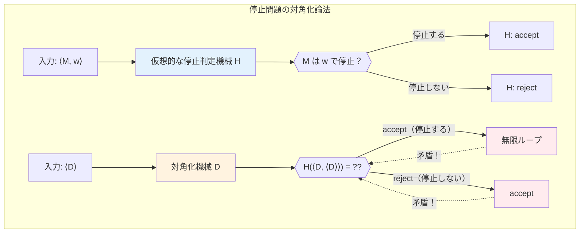
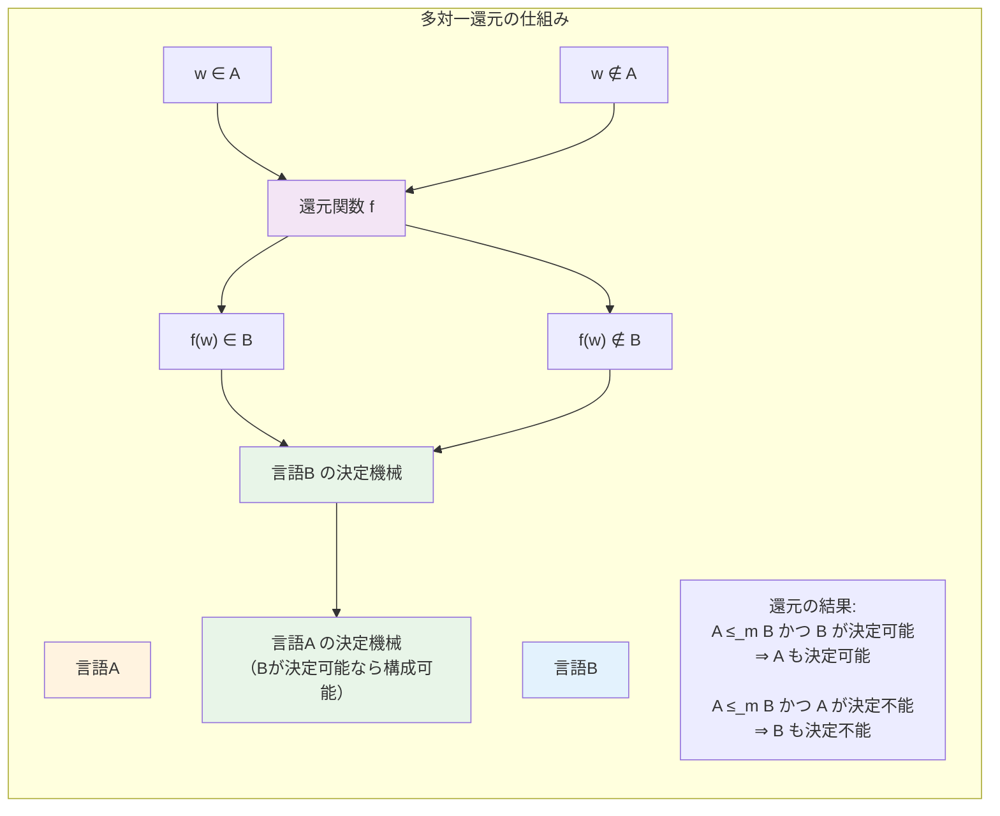
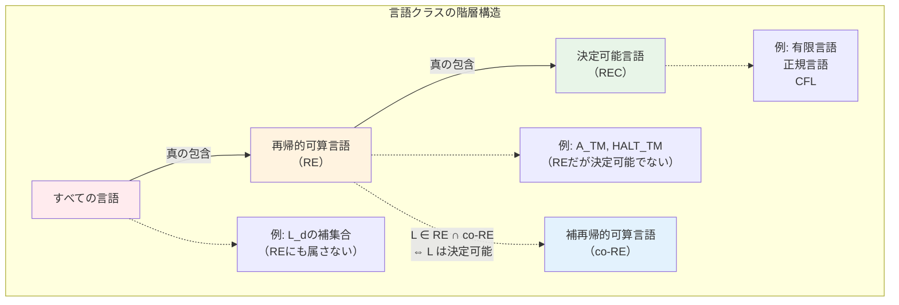
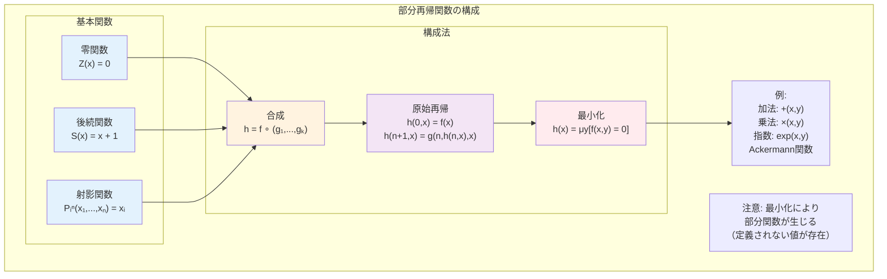

# 第4章 計算可能性理論

## はじめに

計算可能性理論は、計算の本質的な限界を探究する分野です。第2章で学んだチューリング機械を用いて、どのような問題が計算可能で、どのような問題が計算不可能なのかを厳密に分析します。本章では、決定不能問題の存在を証明し、問題間の還元可能性を通じて計算不可能性の階層構造を明らかにします。

決定不能問題の研究は、単なる理論的興味にとどまりません。プログラムの正当性検証、コンパイラ最適化、人工知能など、実践的な計算機科学の多くの分野で、計算可能性の限界が本質的な制約として現れます。これらの限界を理解することは、実現可能なシステムを設計する上で不可欠です。

## 4.1 決定不能問題

### 4.1.1 停止問題

**定義 4.1** **停止問題**（Halting Problem）は以下の言語として定義される：
HALT_TM = {⟨M, w⟩ | M はチューリング機械で、入力 w で停止する}



**定理 4.1** HALT_TM は決定不能である。

*証明*：HALT_TM が決定可能と仮定し、それを決定する機械を H とする。
H は以下のように動作する：
- H(⟨M, w⟩) = accept if M は w で停止
- H(⟨M, w⟩) = reject if M は w で停止しない

ここで、以下の機械 D を構成する：
```
D = "入力 ⟨M⟩ に対して：
1. H を入力 ⟨M, ⟨M⟩⟩ で実行する
2. H が accept なら無限ループに入る
3. H が reject なら accept する"
```

D(⟨D⟩) の動作を考える：
- D が ⟨D⟩ で停止する場合：
  H(⟨D, ⟨D⟩⟩) = accept となるので、D は無限ループに入る（矛盾）
- D が ⟨D⟩ で停止しない場合：
  H(⟨D, ⟨D⟩⟩) = reject となるので、D は accept して停止する（矛盾）

いずれの場合も矛盾が生じるので、HALT_TM は決定不能である。□

### 4.1.2 対角化言語

**定義 4.2** **対角化言語** L_d を以下のように定義する：
L_d = {⟨M⟩ | M は ⟨M⟩ を受理しない}

この定義は、各チューリング機械を自身の符号化に適用するという「対角化」の考え方に基づいています。

**定理 4.2** L_d は認識可能でない。

*証明*：L_d が認識可能と仮定し、それを認識する機械を M_d とする。
⟨M_d⟩ ∈ L_d かどうかを考える：

- ⟨M_d⟩ ∈ L_d の場合：
  定義より M_d は ⟨M_d⟩ を受理しない
  しかし M_d は L_d を認識するので、⟨M_d⟩ ∈ L_d なら M_d は ⟨M_d⟩ を受理する（矛盾）

- ⟨M_d⟩ ∉ L_d の場合：
  定義より M_d は ⟨M_d⟩ を受理する
  しかし M_d は L_d を認識するので、⟨M_d⟩ ∉ L_d なら M_d は ⟨M_d⟩ を受理しない（矛盾）

したがって、L_d は認識可能でない。□

### 4.1.3 受理問題

**定義 4.3** **受理問題** A_TM は以下の言語として定義される：
A_TM = {⟨M, w⟩ | M はチューリング機械で、w を受理する}

**定理 4.3** A_TM は認識可能だが決定可能でない。

*証明*：
（認識可能性）万能チューリング機械 U が A_TM を認識する。
U は入力 ⟨M, w⟩ に対して M の w での計算をシミュレートし、
M が受理すれば U も受理する。

（決定不能性）A_TM が決定可能と仮定し、その決定機械を R とする。
以下の機械 D を構成する：

```
D = "入力 ⟨M⟩ に対して：
1. R を使って ⟨M, ⟨M⟩⟩ ∈ A_TM かどうかテストする
2. R が accept なら reject、reject なら accept する"
```

D の動作を分析すると：
- D は ⟨M⟩ を受理する ⟺ R は ⟨M, ⟨M⟩⟩ を拒否する
                     ⟺ ⟨M, ⟨M⟩⟩ ∉ A_TM
                     ⟺ M は ⟨M⟩ を受理しない

D 自身に ⟨D⟩ を入力した場合を考える：
- D は ⟨D⟩ を受理する ⟺ D は ⟨D⟩ を受理しない

これは矛盾である。したがって、A_TM は決定不能である。□

## 4.2 還元可能性

### 4.2.1 多対一還元

**定義 4.4** 言語 A が言語 B に**多対一還元可能**（many-one reducible）であるとは、
計算可能関数 f: Σ* → Σ* が存在して、すべての w に対して
w ∈ A ⟺ f(w) ∈ B
が成り立つことである。これを A ≤_m B と表記する。



**定理 4.4** A ≤_m B かつ B が決定可能ならば、A も決定可能である。

*証明*：B を決定する機械を M_B、還元関数を f とする。
A を決定する機械 M_A を以下のように構成する：

```
M_A = "入力 w に対して：
1. f(w) を計算する
2. M_B を f(w) で実行する
3. M_B が accept なら accept、reject なら reject"
```

f は計算可能で M_B は必ず停止するので、M_A も必ず停止する。
また、w ∈ A ⟺ f(w) ∈ B より、M_A は A を正しく決定する。□

**系 4.1** A ≤_m B かつ A が決定不能ならば、B も決定不能である。

### 4.2.2 還元による決定不能性の証明

**定理 4.5** E_TM = {⟨M⟩ | L(M) = ∅} は決定不能である。

*証明*：A_TM ≤_m E̅_TM を示す（E̅_TM は E_TM の補集合）。

還元関数 f を以下のように定義する：
入力 ⟨M, w⟩ に対して、f(⟨M, w⟩) = ⟨M'⟩ ここで M' は：

```
M' = "入力 x に対して：
1. x = w かチェックする（異なれば reject）
2. M を w で実行する
3. M が accept なら accept"
```

このとき：
- M が w を受理する ⟺ L(M') = {w} ≠ ∅ ⟺ ⟨M'⟩ ∈ E̅_TM
- M が w を受理しない ⟺ L(M') = ∅ ⟺ ⟨M'⟩ ∉ E̅_TM

したがって A_TM ≤_m E̅_TM が成り立ち、E̅_TM は決定不能。
よって E_TM も決定不能である。□

**定理 4.6** EQ_TM = {⟨M₁, M₂⟩ | L(M₁) = L(M₂)} は決定不能である。

*証明*：E_TM ≤_m EQ_TM を示す。

還元関数 f を以下のように定義する：
入力 ⟨M⟩ に対して、f(⟨M⟩) = ⟨M, M_∅⟩
ここで M_∅ はすべての入力を拒否する機械。

このとき：
- L(M) = ∅ ⟺ L(M) = L(M_∅) ⟺ ⟨M, M_∅⟩ ∈ EQ_TM

したがって E_TM ≤_m EQ_TM が成り立ち、EQ_TM は決定不能である。□

### 4.2.3 チューリング還元

**定義 4.5** 言語 A が言語 B に**チューリング還元可能**（Turing reducible）であるとは、
B を決定するオラクルを使って A を決定する機械が存在することである。
これを A ≤_T B と表記する。

**性質**：
- A ≤_m B ⟹ A ≤_T B（逆は一般に成立しない）
- ≤_T は推移的：A ≤_T B かつ B ≤_T C ⟹ A ≤_T C

## 4.3 再帰的可算言語の階層

### 4.3.1 言語クラスの包含関係

**定理 4.7** 以下の真の包含関係が成り立つ：
決定可能言語 ⊊ 再帰的可算言語 ⊊ すべての言語



*証明*：
（決定可能 ⊆ 再帰的可算）定義より明らか。

（真の包含）A_TM は再帰的可算だが決定可能でない。

（再帰的可算 ⊊ すべて）L_d の補集合 L̅_d を考える。
L̅_d が再帰的可算と仮定すると、それを認識する機械 M が存在する。
以下の機械 M' を構成する：

```
M' = "入力 ⟨N⟩ に対して：
1. M を ⟨N⟩ で実行する
2. M が accept なら reject
3. （M が accept しなければ永遠に動作）"
```

M' は L_d を認識することになるが、これは L_d が認識可能でないことに矛盾。
したがって L̅_d は再帰的可算でない。□

### 4.3.2 言語の算術階層

**定義 4.6** **算術階層**（Arithmetical Hierarchy）：
- Σ₀ = Π₀ = 決定可能言語
- Σₙ₊₁ = {L | L は Πₙ 言語へのオラクルで認識可能}
- Πₙ₊₁ = {L | L̅ ∈ Σₙ₊₁}

**例**：
- Σ₁ = 再帰的可算言語
- Π₁ = 補再帰的可算言語（co-RE）
- A_TM ∈ Σ₁ \ Π₁
- HALT_TM ∈ Σ₁ \ Π₁

### 4.3.3 Postの定理

**定理 4.8**（Postの定理）言語 L について、以下は同値：
1. L ∈ Σₙ
2. ある決定可能な関係 R が存在して、
   x ∈ L ⟺ ∃y₁∀y₂∃y₃...Qₙyₙ R(x, y₁, ..., yₙ)
   （Qₙ は n が奇数なら ∃、偶数なら ∀）

この定理は、算術階層の各レベルが量化子の交代数に対応することを示しています。

## 4.4 Riceの定理

### 4.4.1 チューリング機械の性質

**定義 4.7** 言語の性質 P が**非自明**（non-trivial）であるとは、
- ある機械 M₁ に対して L(M₁) は性質 P を持つ
- ある機械 M₂ に対して L(M₂) は性質 P を持たない
ことである。

### 4.4.2 Riceの定理の主張と証明

**定理 4.9**（Riceの定理）L_P = {⟨M⟩ | L(M) は性質 P を持つ} とする。
P が言語の非自明な性質ならば、L_P は決定不能である。

*証明*：P を非自明な性質とする。
一般性を失わずに、∅ は性質 P を持たないと仮定する
（そうでなければ P の否定を考える）。

性質 P を持つ言語 L を認識する機械を M_L とする。
A_TM ≤_m L_P を示す。

還元関数 f を以下のように定義する：
入力 ⟨M, w⟩ に対して、f(⟨M, w⟩) = ⟨M'⟩ ここで M' は：

```
M' = "入力 x に対して：
1. M を w で実行する
2. M が accept したら、M_L を x で実行する
3. M_L が accept なら accept"
```

このとき：
- M が w を受理する場合：L(M') = L(M_L) = L
  L は性質 P を持つので ⟨M'⟩ ∈ L_P
- M が w を受理しない場合：L(M') = ∅
  ∅ は性質 P を持たないので ⟨M'⟩ ∉ L_P

したがって A_TM ≤_m L_P が成り立ち、L_P は決定不能である。□

### 4.4.3 Riceの定理の応用

Riceの定理により、以下の問題はすべて決定不能：

1. {⟨M⟩ | L(M) は有限}
2. {⟨M⟩ | L(M) は正規言語}
3. {⟨M⟩ | L(M) は文脈自由言語}
4. {⟨M⟩ | |L(M)| = k}（k は定数）
5. {⟨M⟩ | L(M) は決定可能}

これらはすべて言語の非自明な性質だからです。

## 4.5 計算可能関数

### 4.5.1 部分再帰関数

**定義 4.8** **部分再帰関数**（partial recursive function）は以下の基本関数から、
合成、原始再帰、最小化によって構成される関数である。

基本関数：
1. **零関数**：Z(x) = 0
2. **後続関数**：S(x) = x + 1
3. **射影関数**：Pᵢⁿ(x₁, ..., xₙ) = xᵢ

構成法：
1. **合成**：h(x̄) = f(g₁(x̄), ..., gₖ(x̄))
2. **原始再帰**：
   - h(0, x̄) = f(x̄)
   - h(n+1, x̄) = g(n, h(n, x̄), x̄)
3. **最小化**：h(x̄) = μy[f(x̄, y) = 0]



### 4.5.2 計算可能性の同値性

**定理 4.10** 以下は同値である：
1. f はチューリング計算可能
2. f は部分再帰関数
3. f はラムダ計算で定義可能
4. f は一般再帰関数

この結果は、計算可能性の概念が計算モデルによらず普遍的であることを示しています。

### 4.5.3 不動点定理

**定理 4.11**（Kleeneの再帰定理）すべての計算可能関数 f に対して、
ある n が存在して φₙ = φ_{f(n)} となる。

ここで φₙ は符号 n を持つチューリング機械が計算する部分関数。

*証明の概要*：自己言及的な構成を用いる。
機械が自身の記述を得られることを利用して、f(⟨M⟩) と同じ動作をする機械 M を構成する。□

**応用**：
- 自己複製プログラムの存在
- ウイルスの理論的可能性
- 再帰的定義の正当化

## 4.6 相対計算可能性

### 4.6.1 オラクルチューリング機械

**定義 4.9** 言語 A に対する**オラクルチューリング機械** M^A は、
通常のチューリング機械に「オラクルへの問い合わせ」操作を追加したものである。

オラクルへの問い合わせ：
- 特別なテープに文字列 w を書く
- 問い合わせ状態に遷移
- 即座に w ∈ A なら YES状態、w ∉ A なら NO状態に遷移

### 4.6.2 相対化

**定義 4.10** 
- P^A = {L | ある多項式時間オラクル機械 M^A が L を決定}
- NP^A = {L | ある非決定性多項式時間オラクル機械 M^A が L を認識}

**定理 4.12** あるオラクル A, B が存在して：
- P^A = NP^A
- P^B ≠ NP^B

この結果は、P vs NP 問題が相対化では解決できないことを示しています。

### 4.6.3 チューリング次数

**定義 4.11** 言語 A, B に対して：
- A ≡_T B ⟺ A ≤_T B かつ B ≤_T A

≡_T は同値関係であり、その同値類を**チューリング次数**（Turing degree）という。

**性質**：
- チューリング次数は半順序をなす
- 決定可能言語はすべて同じ次数（最小次数）
- 任意の次数に対して、それより真に大きい次数が存在

## 章末問題

### 基礎問題

1. 以下の言語が決定可能か、認識可能か、またはどちらでもないか判定し、証明せよ：
   (a) {⟨M⟩ | M は偶数長の文字列のみを受理する}
   (b) {⟨M⟩ | M は少なくとも10個の文字列を受理する}
   (c) {⟨M, w, k⟩ | M は w を k ステップ以内に受理する}

2. A_TM から以下の言語への多対一還元を構成せよ：
   (a) REGULAR_TM = {⟨M⟩ | L(M) は正規言語}
   (b) ALL_TM = {⟨M⟩ | L(M) = Σ*}

3. L₁, L₂ が認識可能ならば L₁ ∪ L₂ も認識可能であることを証明せよ。

4. 決定可能言語が補集合、和集合、積集合に関して閉じていることを証明せよ。

### 発展問題

5. 以下を証明せよ：
   (a) HALT_TM ≤_m A_TM だが A_TM ≤_m HALT_TM ではない
   (b) したがって、多対一還元は一般に対称的でない

6. K = {x | φₓ(x) は定義される} とする。K が創造的集合（creative set）であることを示せ。

7. Postの対応問題（PCP）が決定不能であることを証明せよ。

8. 算術階層において Σₙ ∪ Πₙ ⊊ Σₙ₊₁ ∩ Πₙ₊₁ であることを示せ。

### 探究課題

9. 計算可能性理論の歴史的発展を調査し、ヒルベルトのEntscheidungsproblemとの関連を論ぜよ。

10. ハイパー計算（hypercomputation）の概念について調査し、チューリング機械を超える計算モデルの可能性と限界について論ぜよ。

11. 構成的数学における計算可能性の役割について調査し、古典数学との違いを具体例を挙げて説明せよ。

12. DNA計算や量子計算が計算可能性の観点からチューリング機械とどのような関係にあるか論ぜよ。

### 実装課題

13. 停止問題の「部分的」解決を実装せよ：
    ```python
    def partial_halt_checker(program_code, input_string, max_steps=10000):
        """
        有限ステップ内での停止判定
        戻り値: 'halts', 'loops', 'unknown'
        """
        # 簡単なインタープリター実装
        # max_steps以内に停止すれば判定、そうでなければ不明
        pass
    ```

14. 多対一還元のシミュレータを実装せよ：
    ```python
    class Reduction:
        def __init__(self, source_problem, target_problem, reduction_function):
            self.source = source_problem
            self.target = target_problem  
            self.reduce = reduction_function
        
        def verify_reduction(self, test_cases):
            """還元の正当性を検証"""
            for instance in test_cases:
                reduced = self.reduce(instance)
                assert (instance in self.source) == (reduced in self.target)
    ```

15. 再帰関数のシミュレータを実装せよ：
    - 原始再帰関数の定義と計算
    - μ演算子（最小化）の実装
    - Ackermann関数などの非原始再帰関数の例