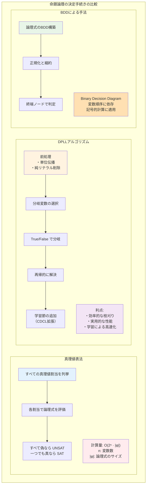
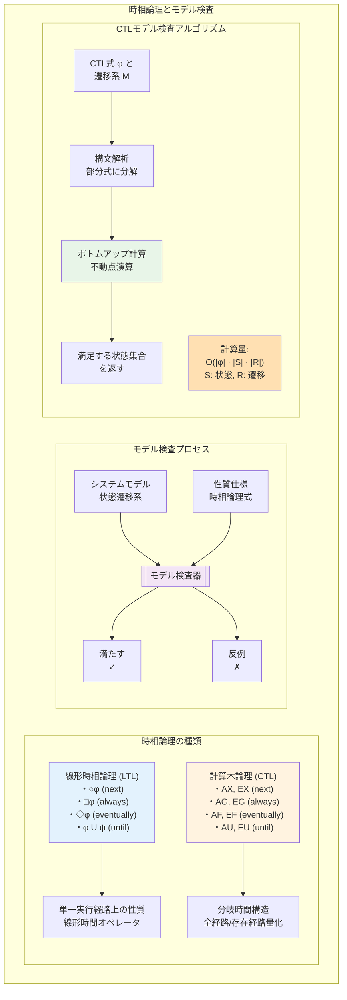
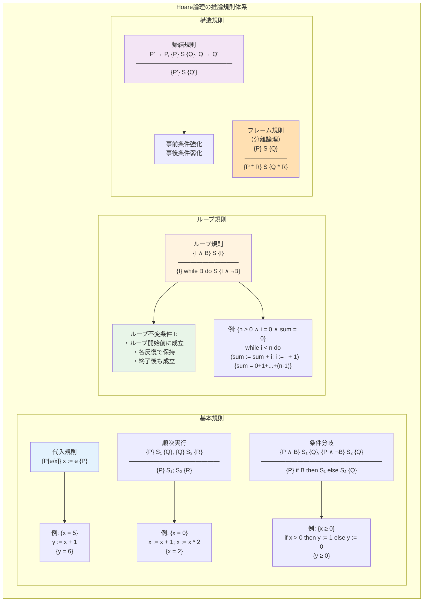
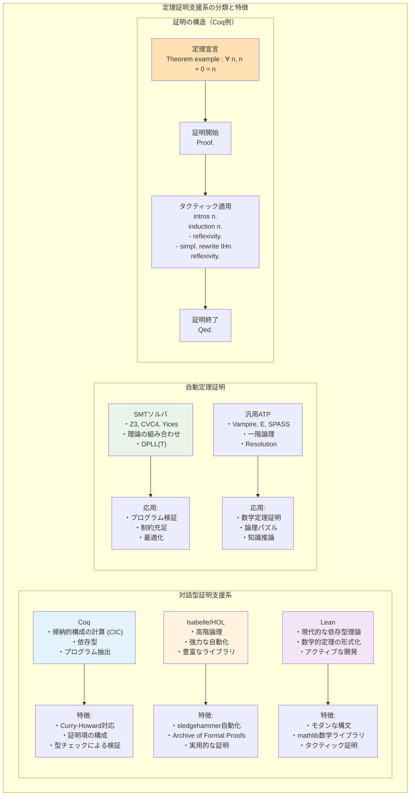

# 第9章 論理学と形式的手法

## はじめに

論理学は、正しい推論の原理を研究する学問であり、コンピュータサイエンスの理論的基盤を形成します。形式的手法は、この論理学を用いてシステムの仕様記述、設計、検証を厳密に行う技術です。本章では、命題論理から始まり、一階述語論理、時相論理、そしてプログラム検証の理論まで、段階的に学習します。

ソフトウェアの複雑性が増大する現代において、形式的手法の重要性はますます高まっています。航空機制御システム、医療機器、金融システムなど、高い信頼性が要求される分野では、数学的に厳密な検証が不可欠です。本章で学ぶ理論と技術は、これらの要求に応える基礎を提供します。

## 9.1 命題論理

### 9.1.1 構文と意味論

**定義 9.1** **命題論理式**の構文的定義：
1. 命題変数 p, q, r, ... は論理式
2. φ, ψ が論理式なら、¬φ, (φ ∧ ψ), (φ ∨ ψ), (φ → ψ), (φ ↔ ψ) も論理式

**定義 9.2** **真理値割当** v: Var → {0, 1} を命題変数から真理値への関数とする。
v の論理式への拡張 v̂ を帰納的に定義：
- v̂(p) = v(p)（命題変数）
- v̂(¬φ) = 1 - v̂(φ)
- v̂(φ ∧ ψ) = min(v̂(φ), v̂(ψ))
- v̂(φ ∨ ψ) = max(v̂(φ), v̂(ψ))
- v̂(φ → ψ) = max(1 - v̂(φ), v̂(ψ))
- v̂(φ ↔ ψ) = 1 ⟺ v̂(φ) = v̂(ψ)

### 9.1.2 論理的帰結と同値

**定義 9.3** 
- φ が**恒真式**（トートロジー）⟺ すべての v で v̂(φ) = 1、記号：⊨ φ
- φ が**充足可能** ⟺ ある v で v̂(φ) = 1
- φ が**矛盾** ⟺ すべての v で v̂(φ) = 0

**定義 9.4** Σ ⊨ φ（Σ が φ を意味論的に含意）⟺ 
Σ のすべての式を真にする割当は φ も真にする

### 9.1.3 標準形

**定義 9.5** 
- **リテラル**：命題変数またはその否定
- **節**（clause）：リテラルの選言
- **連言標準形**（CNF）：節の連言
- **選言標準形**（DNF）：連言節の選言

**定理 9.1** すべての論理式は等価な CNF および DNF に変換可能。

*アルゴリズム*（CNF への変換）：
1. → と ↔ を除去：φ → ψ ≡ ¬φ ∨ ψ
2. ¬ を内側に押し込む（De Morgan）
3. ∨ を ∧ の上に分配

### 9.1.4 命題論理の決定手続き



#### 真理値表法
時間複雑度：O(2^n · |φ|)（n は変数数）

#### DPLLアルゴリズム
```
DPLL(φ, v):
    φ' = Propagate(φ, v)  // 単位伝播
    if φ' = ⊤: return SAT
    if φ' = ⊥: return UNSAT
    l = ChooseLiteral(φ')  // 分岐変数選択
    if DPLL(φ', v ∪ {l = true}) = SAT:
        return SAT
    return DPLL(φ', v ∪ {l = false})
```

**最適化技法**：
- 単位伝播（unit propagation）
- 純リテラル削除（pure literal elimination）
- 学習節の追加（CDCL）

### 9.1.5 健全性と完全性

**定義 9.6** 証明体系が**健全**（sound）⟺ ⊢ φ ⟹ ⊨ φ

**定義 9.7** 証明体系が**完全**（complete）⟺ ⊨ φ ⟹ ⊢ φ

**定理 9.2** 命題論理の自然演繹は健全かつ完全である。

### 9.1.6 コンパクト性定理

**定理 9.3**（コンパクト性定理）
Σ ⊨ φ ⟺ ある有限部分集合 Σ₀ ⊆ Σ に対して Σ₀ ⊨ φ

*証明の概要*：完全性定理を用いて、構文的証明の有限性から導く。□

**応用**：無限のオブジェクトに関する性質を有限の近似で捉える。

## 9.2 一階述語論理

### 9.2.1 構文

**定義 9.8** **一階言語**は以下から構成：
- 変数：x, y, z, ...
- 定数記号：a, b, c, ...
- 関数記号：f, g, h, ...（各々アリティを持つ）
- 述語記号：P, Q, R, ...（各々アリティを持つ）
- 論理記号：¬, ∧, ∨, →, ↔, ∀, ∃
- 補助記号：(, )

**項**の帰納的定義：
1. 変数と定数は項
2. t₁, ..., tₙ が項で f が n 項関数なら f(t₁, ..., tₙ) は項

**論理式**の帰納的定義：
1. t₁, ..., tₙ が項で P が n 項述語なら P(t₁, ..., tₙ) は原子式
2. φ, ψ が論理式なら ¬φ, (φ ∧ ψ) なども論理式
3. φ が論理式で x が変数なら ∀x φ, ∃x φ も論理式

### 9.2.2 意味論

**定義 9.9** **構造**（解釈）M = (D, I) は：
- D：空でない領域（議論領域）
- I：解釈関数
  - 定数記号 c に対して I(c) ∈ D
  - n 項関数記号 f に対して I(f): Dⁿ → D
  - n 項述語記号 P に対して I(P) ⊆ Dⁿ

**定義 9.10** 変数割当 s: Var → D に対する充足関係 M, s ⊨ φ を定義

### 9.2.3 前束標準形

**定理 9.4** すべての一階論理式は等価な前束標準形に変換可能：
Q₁x₁...Qₙxₙ ψ（Qᵢ ∈ {∀, ∃}、ψ は量化子を含まない）

*変換手順*：
1. 束縛変数の改名
2. 量化子の外への移動

### 9.2.4 Skolem化

**定義 9.11** **Skolem化**：存在量化子を除去し、新しい関数記号を導入

例：∀x∃y P(x, y) → ∀x P(x, f(x))（f は新しい Skolem 関数）

**定理 9.5** φ が充足可能 ⟺ φ の Skolem 標準形が充足可能

### 9.2.5 完全性定理

**定理 9.6**（Gödelの完全性定理）
一階述語論理は健全かつ完全である：Σ ⊨ φ ⟺ Σ ⊢ φ

*証明の概要*：
（健全性）帰納法による直接的な証明
（完全性）Henkin の方法：無矛盾な理論から構造を構成□

### 9.2.6 決定不能性

**定理 9.7** 一階述語論理の妥当性問題は決定不能である。

*証明*：停止問題からの還元による。□

**決定可能な断片**：
- 単項述語論理
- ∀*∃* 形の文
- Presburger 算術

## 9.3 時相論理

### 9.3.1 線形時相論理（LTL）

**定義 9.12** **LTL の構文**：
- 命題変数 p は LTL 式
- φ, ψ が LTL 式なら ¬φ, φ ∧ ψ も LTL 式
- φ が LTL 式なら ○φ, □φ, ◇φ, φ U ψ も LTL 式

**意味論**：無限列 π = s₀s₁s₂... 上で定義
- π, i ⊨ ○φ ⟺ π, i+1 ⊨ φ（次の状態）
- π, i ⊨ □φ ⟺ ∀j ≥ i, π, j ⊨ φ（常に）
- π, i ⊨ ◇φ ⟺ ∃j ≥ i, π, j ⊨ φ（いつか）
- π, i ⊨ φ U ψ ⟺ ∃j ≥ i, (π, j ⊨ ψ ∧ ∀k(i ≤ k < j → π, k ⊨ φ))（まで）

### 9.3.2 計算木論理（CTL）

**定義 9.13** **CTL の構文**：
状態式と経路式を相互再帰的に定義
- A（すべての経路で）、E（ある経路で）

**CTL の基本演算子**：
- AX, EX（次の状態）
- AF, EF（いつか）
- AG, EG（常に）
- AU, EU（まで）

### 9.3.3 モデル検査



**定義 9.14** **モデル検査問題**：
与えられた有限状態システム M と時相論理式 φ に対して、M ⊨ φ ?

#### CTL モデル検査アルゴリズム
```
CTLCheck(M, φ):
    case φ of
        p: return {s | p ∈ L(s)}
        ¬ψ: return S \ CTLCheck(M, ψ)
        ψ₁ ∧ ψ₂: return CTLCheck(M, ψ₁) ∩ CTLCheck(M, ψ₂)
        EX ψ: return {s | ∃s', s → s' ∧ s' ∈ CTLCheck(M, ψ)}
        EF ψ: return 最小不動点 Z. CTLCheck(M, ψ) ∪ CTLCheck(M, EX Z)
        EG ψ: return 最大不動点 Z. CTLCheck(M, ψ) ∩ CTLCheck(M, EX Z)
        E[ψ₁ U ψ₂]: return 最小不動点 Z. CTLCheck(M, ψ₂) ∪ 
                     (CTLCheck(M, ψ₁) ∩ CTLCheck(M, EX Z))
```

時間複雑度：O(|φ| · |S| · |R|)（S：状態集合、R：遷移関係）

### 9.3.4 公平性

**定義 9.15** **公平性制約**：
- 弱公平性：永続的に可能なアクションはいつか実行される
- 強公平性：無限回可能なアクションはいつか実行される

**公平性を含む CTL**：
- A_fair、E_fair オペレータの追加
- 公平な経路のみを考慮

## 9.4 プログラム検証

### 9.4.1 Hoare論理

**定義 9.16** **Hoare三つ組** {P} S {Q}：
- P：事前条件
- S：プログラム文
- Q：事後条件

**意味**：P が成立する状態で S を実行し、正常終了すれば Q が成立

### 9.4.2 推論規則



**基本的な推論規則**：

1. **代入規則**：
   ```
   {P[e/x]} x := e {P}
   ```

2. **順次実行**：
   ```
   {P} S₁ {Q}, {Q} S₂ {R}
   ―――――――――――――――――――――
        {P} S₁; S₂ {R}
   ```

3. **条件分岐**：
   ```
   {P ∧ B} S₁ {Q}, {P ∧ ¬B} S₂ {Q}
   ――――――――――――――――――――――――――――
      {P} if B then S₁ else S₂ {Q}
   ```

4. **ループ**：
   ```
   {I ∧ B} S {I}
   ―――――――――――――――――――
   {I} while B do S {I ∧ ¬B}
   ```
   （I はループ不変条件）

5. **帰結規則**：
   ```
   P' → P, {P} S {Q}, Q → Q'
   ――――――――――――――――――――
         {P'} S {Q'}
   ```

### 9.4.3 最弱事前条件

**定義 9.17** **最弱事前条件** wp(S, Q)：
S の実行後に Q を保証する最も弱い事前条件

**計算規則**：
- wp(x := e, Q) = Q[e/x]
- wp(S₁; S₂, Q) = wp(S₁, wp(S₂, Q))
- wp(if B then S₁ else S₂, Q) = (B → wp(S₁, Q)) ∧ (¬B → wp(S₂, Q))
- wp(while B do S, Q) = 最小不動点（一般には計算不能）

### 9.4.4 プログラムの全正当性

**定義 9.18** 
- **部分正当性**：{P} S {Q} - 終了すれば Q が成立
- **全正当性**：[P] S [Q] - 必ず終了し、Q が成立

**停止性の証明**：
- 整礎関係による順序の導入
- 各ループ反復で順序が真に減少することを示す

### 9.4.5 分離論理

**動機**：ヒープを使うプログラムの検証

**新しい述語**：
- emp：空ヒープ
- x ↦ v：x が v を指す単一セル
- P * Q：分離結合（disjoint union）

**フレーム規則**：
```
    {P} S {Q}
―――――――――――――――
{P * R} S {Q * R}
```
（S が R に言及しない変数のみを変更）

## 9.5 形式的仕様記述

### 9.5.1 代数的仕様

**例 9.1** スタックの代数的仕様
```
sorts: Stack, Elem, Bool
operations:
    empty: → Stack
    push: Stack × Elem → Stack
    pop: Stack → Stack
    top: Stack → Elem
    isEmpty: Stack → Bool
axioms:
    isEmpty(empty) = true
    isEmpty(push(s, e)) = false
    top(push(s, e)) = e
    pop(push(s, e)) = s
```

### 9.5.2 Z記法

**基本要素**：
- スキーマ：状態と操作の構造化記述
- 集合論と型理論に基づく

**例 9.2** カウンタの仕様
```
┌─ Counter ────────
│ value: ℕ
│ limit: ℕ
├────────────────
│ value ≤ limit
└────────────────

┌─ Increment ──────
│ ΔCounter
│ amount?: ℕ
├────────────────
│ value' = value + amount?
│ value' ≤ limit
└────────────────
```

### 9.5.3 時相論理による仕様

**安全性**（Safety）：「悪いことは起こらない」
- □(request → ◇grant)（要求にはいつか応答）

**活性**（Liveness）：「良いことがいつか起こる」
- □◇enabled（永遠に有効化される）

**公平性**（Fairness）：
- □◇request → □◇grant（無限回要求→無限回許可）

## 9.6 定理証明支援系

### 9.6.1 対話型定理証明



**主要なシステム**：
- Coq：帰納的構成の計算（CIC）に基づく
- Isabelle/HOL：高階論理
- Lean：依存型理論

**証明の構造**：
```coq
Theorem example : ∀ n : nat, n + 0 = n.
Proof.
  intros n.
  induction n.
  - reflexivity.
  - simpl. rewrite IHn. reflexivity.
Qed.
```

### 9.6.2 自動定理証明

**SMTソルバ**：
- 理論の組み合わせ（算術、配列、ビットベクトル）
- DPLL(T)アルゴリズム

**応用**：
- プログラム検証
- 制約充足問題
- 最適化問題

### 9.6.3 証明の形式化

**利点**：
- 機械的検証可能性
- 証明の再利用
- 大規模な数学的開発

**課題**：
- 証明の記述コスト
- 自動化の限界
- 抽象化のギャップ

## 章末問題

### 基礎問題

1. 以下の論理式の充足可能性を判定し、充足可能な場合はモデルを示せ：
   (a) (p → q) ∧ (q → r) ∧ (r → p)
   (b) (p ∨ q ∨ r) ∧ (¬p ∨ ¬q) ∧ (¬q ∨ ¬r) ∧ (¬r ∨ ¬p)

2. 以下の一階論理式を前束標準形に変換せよ：
   (a) ∀x(P(x) → ∃y Q(x, y)) ∧ ∃z R(z)
   (b) ¬∀x∃y(P(x, y) ↔ ¬∃z Q(y, z))

3. 以下の Hoare 三つ組を証明せよ：
   (a) {x = n ∧ n ≥ 0} y := 1; while x > 0 do (y := y * x; x := x - 1) {y = n!}
   (b) {true} x := a; y := b; z := x; x := y; y := z {x = b ∧ y = a}

4. CTL 式 AG(request → AF grant) の意味を説明し、
   この性質を満たす/満たさない状態遷移系の例を示せ。

### 発展問題

5. Resolution による自動定理証明について：
   (a) Resolution の健全性と完全性を証明せよ
   (b) Horn 節に対する効率的な戦略を説明せよ

6. Büchi オートマトンと LTL の関係について：
   (a) LTL 式から等価な Büchi オートマトンへの変換を説明せよ
   (b) この変換の複雑性を解析せよ

7. 分離論理を用いて、連結リストの反転アルゴリズムを検証せよ。

8. 型理論と論理の対応（Curry-Howard 対応）について説明し、
   具体例を用いて証明とプログラムの関係を示せ。

### 探究課題

9. 並行プログラムの検証手法について調査し、
   共有メモリとメッセージパッシングそれぞれの検証技法を比較せよ。

10. 確率的モデル検査について調査し、
    マルコフ連鎖上の時相論理（PCTL）とその検証アルゴリズムを説明せよ。

11. 依存型を用いたプログラム検証について調査し、
    Coq や Agda での証明付きプログラミングの実例を示せ。

12. ハイブリッドシステム（連続・離散混在系）の形式的検証について調査し、
    主要なアプローチと課題を論ぜよ。