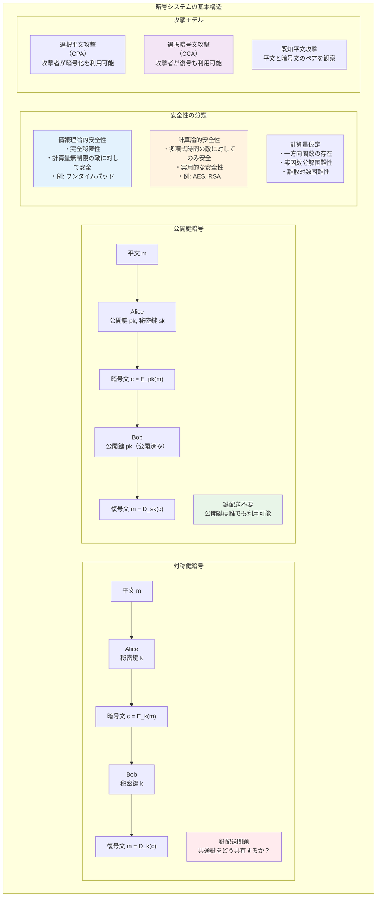
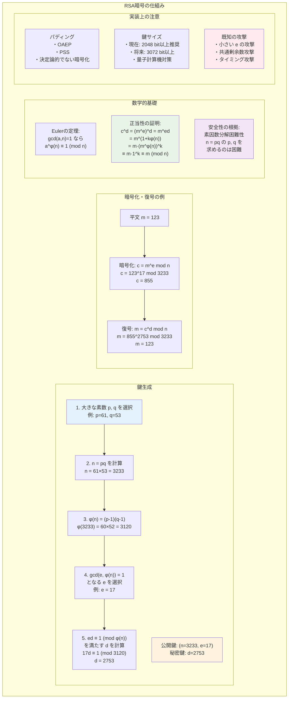
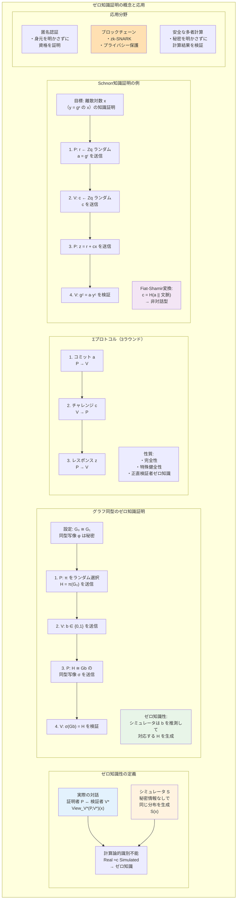

# 第11章 暗号理論の数学的基礎

## はじめに

暗号理論は、情報の機密性、完全性、真正性を保証するための数学的手法を研究する分野です。古代の単純な置換暗号から始まり、現代では高度な数学的構造に基づく暗号システムが、電子商取引、デジタル通信、クラウドコンピューティングなど、デジタル社会のあらゆる場面で使用されています。

本章では、現代暗号理論の数学的基礎を体系的に学びます。計算論的安全性の概念から始まり、公開鍵暗号の数学的原理、デジタル署名、そして最新のゼロ知識証明まで、暗号理論の核心的な概念とその数学的基盤を詳しく探求します。これらの理論は、安全なデジタル社会を支える基盤技術となっています。

## 11.1 暗号理論の基礎概念

### 11.1.1 暗号システムの定義

**定義 11.1** **暗号システム**は以下の5つ組 (P, C, K, E, D) で定義される：
- P：平文空間（plaintext space）
- C：暗号文空間（ciphertext space）
- K：鍵空間（key space）
- E = {E_k : P → C | k ∈ K}：暗号化関数の族
- D = {D_k : C → P | k ∈ K}：復号関数の族

正当性条件：∀k ∈ K, ∀m ∈ P, D_k(E_k(m)) = m

### 11.1.2 安全性の定義

#### 完全秘匿性（Shannon）

**定義 11.2** 暗号システムが**完全秘匿性**を持つ ⟺
∀m ∈ P, ∀c ∈ C, Pr[M = m | C = c] = Pr[M = m]

**定理 11.1** 完全秘匿性を持つ暗号システムでは |K| ≥ |P|

*証明*：|K| < |P| と仮定。ある c に対して、c に暗号化される平文の数は高々 |K| 個。
したがって、ある平文 m は c に暗号化されない。
これは Pr[M = m | C = c] = 0 ≠ Pr[M = m] となり矛盾。□

#### 計算論的安全性

**定義 11.3** 暗号システムが**計算論的に安全** ⟺
すべての多項式時間アルゴリズム A に対して、A の優位性が無視できる：
|Pr[A が正しく推測] - 1/|P|| < negl(n)

ここで negl(n) は無視できる関数（任意の多項式より速く 0 に収束）。

### 11.1.3 一方向関数

**定義 11.4** 関数 f: {0,1}* → {0,1}* が**一方向関数**であるとは：
1. f は多項式時間で計算可能
2. すべての確率的多項式時間アルゴリズム A に対して：
   Pr[f(A(f(x))) = f(x)] < negl(n)
   （x は一様ランダムに選択）

**候補となる一方向関数**：
- 整数の積：f(p, q) = pq（p, q は素数）
- 離散対数：f(x) = g^x mod p
- 格子問題に基づく関数

### 11.1.4 疑似乱数生成器

**定義 11.5** 関数 G: {0,1}^n → {0,1}^{l(n)} (l(n) > n) が**疑似乱数生成器**（PRG）であるとは、
すべての多項式時間識別器 D に対して：
|Pr[D(G(s)) = 1] - Pr[D(r) = 1]| < negl(n)

ここで s ∈ {0,1}^n は一様ランダム、r ∈ {0,1}^{l(n)} は一様ランダム。

**定理 11.2** 一方向関数が存在すれば、疑似乱数生成器が存在する。

## 11.2 対称鍵暗号

### 11.2.1 ストリーム暗号

**定義 11.6** **ストリーム暗号**は、疑似乱数生成器を用いて鍵ストリームを生成し、
平文と XOR することで暗号化を行う：
- 暗号化：c_i = m_i ⊕ k_i
- 復号：m_i = c_i ⊕ k_i

**例 11.1** RC4、ChaCha20

### 11.2.2 ブロック暗号

**定義 11.7** **ブロック暗号**は、固定長のブロックを暗号化する関数族：
E: {0,1}^k × {0,1}^n → {0,1}^n

理想的には、各鍵に対して E_k は {0,1}^n 上のランダムな置換。

#### Feistel 構造

n ビットを左右に分割し、ラウンド関数 F を用いて：
- L_{i+1} = R_i
- R_{i+1} = L_i ⊕ F(K_i, R_i)

**性質**：F が一方向でも全体は可逆（同じ操作で復号）

#### AES（Advanced Encryption Standard）

- ブロックサイズ：128 ビット
- 鍵サイズ：128, 192, 256 ビット
- 操作：SubBytes, ShiftRows, MixColumns, AddRoundKey

### 11.2.3 暗号利用モード

**ECB（Electronic Codebook）**：
各ブロックを独立に暗号化。同じ平文ブロックは同じ暗号文に。

**CBC（Cipher Block Chaining）**：
C_i = E_k(M_i ⊕ C_{i-1}), C_0 = IV

**CTR（Counter）**：
C_i = M_i ⊕ E_k(IV || i)

**定理 11.3** PRF（疑似ランダム関数）を用いた CTR モードは IND-CPA 安全。

### 11.2.4 認証付き暗号

**定義 11.8** **認証付き暗号**（Authenticated Encryption）は、
機密性と完全性を同時に提供する。

**GCM（Galois/Counter Mode）**：
- CTR モードで暗号化
- Galois 体上の演算で認証タグ生成

## 11.3 公開鍵暗号

### 11.3.1 RSA 暗号

**設定**：
1. 大きな素数 p, q を選択
2. n = pq, φ(n) = (p-1)(q-1)
3. gcd(e, φ(n)) = 1 なる e を選択
4. ed ≡ 1 (mod φ(n)) なる d を計算
5. 公開鍵：(n, e)、秘密鍵：d

**暗号化・復号**：
- 暗号化：c = m^e mod n
- 復号：m = c^d mod n

**正当性**：Euler の定理より
c^d = (m^e)^d = m^{ed} = m^{1+kφ(n)} = m · (m^{φ(n)})^k ≡ m (mod n)

**安全性の仮定**：
- **RSA 仮定**：RSA 関数の逆計算は困難
- **強 RSA 仮定**：任意の e > 1 に対して e 乗根を求めるのは困難

### 11.3.2 離散対数問題

**定義 11.9** **離散対数問題**（DLP）：
群 G、生成元 g、元 h = g^x が与えられたとき、x を求める問題。

**Diffie-Hellman 鍵交換**：
1. Alice：秘密 a を選び、g^a を送信
2. Bob：秘密 b を選び、g^b を送信
3. 共有鍵：(g^b)^a = (g^a)^b = g^{ab}

**計算 Diffie-Hellman（CDH）仮定**：
g^a, g^b から g^{ab} を計算するのは困難。

**決定 Diffie-Hellman（DDH）仮定**：
(g^a, g^b, g^{ab}) と (g^a, g^b, g^c) を識別するのは困難。

### 11.3.3 ElGamal 暗号

**設定**：
- 群 G、生成元 g
- 秘密鍵：x
- 公開鍵：h = g^x

**暗号化**（メッセージ m ∈ G）：
- ランダムに r を選択
- c_1 = g^r, c_2 = m · h^r

**復号**：
m = c_2 / c_1^x

**安全性**：DDH 仮定の下で IND-CPA 安全。

### 11.3.4 楕円曲線暗号

**定義 11.10** 有限体 F_q 上の**楕円曲線**：
E: y^2 = x^3 + ax + b （特性 ≠ 2, 3）

**群法則**：点の加法を幾何学的に定義（弦と接線）

**利点**：
- 同じ安全性でより短い鍵長
- 効率的な演算

**ECDH（楕円曲線 Diffie-Hellman）**：
通常の DH を楕円曲線群上で実行。

## 11.4 デジタル署名

### 11.4.1 署名スキームの定義

**定義 11.11** **デジタル署名スキーム**は以下の3つのアルゴリズムからなる：
- KeyGen(1^n) → (pk, sk)：鍵生成
- Sign(sk, m) → σ：署名生成
- Verify(pk, m, σ) → {0, 1}：署名検証

**正当性**：Verify(pk, m, Sign(sk, m)) = 1

### 11.4.2 安全性定義

**定義 11.12** **存在的偽造不可能性**（EUF-CMA）：
適応的選択メッセージ攻撃の下で、攻撃者が新しいメッセージに対する
有効な署名を生成する確率が無視できる。

### 11.4.3 RSA 署名

**基本的な RSA 署名**（安全でない）：
σ = m^d mod n

**問題**：乗法的性質により偽造可能。

**RSA-PSS**（Probabilistic Signature Scheme）：
パディングにランダム性を導入し、ハッシュ関数を使用。

### 11.4.4 DSA と ECDSA

**DSA（Digital Signature Algorithm）**：
1. パラメータ：素数 p, q (q | p-1)、生成元 g
2. 秘密鍵：x、公開鍵：y = g^x mod p
3. 署名生成：
   - k をランダムに選択
   - r = (g^k mod p) mod q
   - s = k^{-1}(H(m) + xr) mod q
   - 署名：(r, s)

**ECDSA**：DSA を楕円曲線上で実装。

### 11.4.5 Schnorr 署名

**署名生成**：
1. r = g^k （k はランダム）
2. c = H(r || m)
3. s = k + cx
4. 署名：(c, s)

**検証**：c = H(g^s y^{-c} || m)

**利点**：
- 線形性により署名集約が可能
- 証明可能安全性（ROM）

## 11.5 ハッシュ関数

### 11.5.1 暗号学的ハッシュ関数の性質

**定義 11.13** 関数 H: {0,1}* → {0,1}^n が暗号学的ハッシュ関数であるための性質：

1. **一方向性**：y が与えられたとき、H(x) = y となる x を見つけるのは困難

2. **第二原像困難性**：x が与えられたとき、x ≠ x' かつ H(x) = H(x') となる x' を見つけるのは困難

3. **衝突困難性**：H(x) = H(x') となる異なる x, x' を見つけるのは困難

**定理 11.4** 衝突困難性 ⇒ 第二原像困難性 ⇒ 一方向性

### 11.5.2 Merkle-Damgård 構成

**構成法**：
1. メッセージをブロックに分割：m_1, m_2, ..., m_k
2. 初期値 h_0 を設定
3. h_i = f(h_{i-1}, m_i) を繰り返し適用
4. 最終的な h_k が出力

**定理 11.5** 圧縮関数 f が衝突困難なら、Merkle-Damgård 構成も衝突困難。

### 11.5.3 具体的なハッシュ関数

**SHA-2 ファミリー**（SHA-256）：
- ブロックサイズ：512 ビット
- 出力：256 ビット
- ラウンド数：64

**SHA-3（Keccak）**：
- スポンジ構成
- 任意長の出力が可能

### 11.5.4 ハッシュ関数の応用

**HMAC**（Hash-based MAC）：
HMAC(k, m) = H((k ⊕ opad) || H((k ⊕ ipad) || m))

**パスワードハッシング**：
- salt の使用
- 反復（PBKDF2、bcrypt、Argon2）

## 11.6 ゼロ知識証明

### 11.6.1 対話型証明系

**定義 11.14** 言語 L に対する**対話型証明系**は、証明者 P と検証者 V の対話プロトコルで：
- **完全性**：x ∈ L ⇒ Pr[(P, V)(x) = accept] ≥ 2/3
- **健全性**：x ∉ L ⇒ ∀P*, Pr[(P*, V)(x) = accept] ≤ 1/3

### 11.6.2 ゼロ知識性

**定義 11.15** 対話型証明系が**ゼロ知識**であるとは、
すべての多項式時間検証者 V* に対して、効率的なシミュレータ S が存在して、
以下の分布が計算論的に識別不能：
- View_{V*}(P, V*)(x)：実際の対話の記録
- S(x)：シミュレータの出力

### 11.6.3 具体例：グラフ同型

**問題**：グラフ G_0, G_1 が同型であることを証明（同型写像は秘密）

**プロトコル**：
1. P：G_0 の順列 π を選び、H = π(G_0) を送信
2. V：b ∈ {0, 1} をランダムに選択して送信
3. P：H と G_b の同型写像 σ を送信
4. V：σ(G_b) = H を検証

**ゼロ知識性**：シミュレータは b を推測して H を生成。

### 11.6.4 Σプロトコル

**定義 11.16** **Σプロトコル**は3ラウンドの対話型証明：
1. P → V：コミットメント a
2. V → P：チャレンジ c
3. P → V：レスポンス z

**例：Schnorr の知識証明**（離散対数の知識）：
1. P：r をランダムに選び、a = g^r を送信
2. V：c をランダムに送信
3. P：z = r + cx を送信
4. V：g^z = a · y^c を検証

### 11.6.5 非対話型ゼロ知識（NIZK）

**Fiat-Shamir 変換**：
チャレンジをハッシュ関数で生成：c = H(a || x)

**応用**：
- デジタル署名
- ブロックチェーンでの匿名認証

### 11.6.6 zk-SNARK

**定義 11.17** **zk-SNARK**（Zero-Knowledge Succinct Non-Interactive Argument of Knowledge）：
- Zero-Knowledge：ゼロ知識性
- Succinct：証明サイズが小さい
- Non-Interactive：非対話型
- Argument：計算論的健全性

**構成要素**：
- 二次算術プログラム（QAP）への還元
- ペアリングベース暗号

## 11.7 高度な暗号プリミティブ

### 11.7.1 準同型暗号

**定義 11.18** 暗号システムが**準同型**であるとは、
平文の演算が暗号文上の演算に対応すること。

**加法準同型**：E(m_1) ⊕ E(m_2) = E(m_1 + m_2)
例：Paillier 暗号

**完全準同型暗号**（FHE）：
任意の回路を暗号文上で評価可能。

### 11.7.2 秘密分散

**定義 11.19** **(t, n) しきい値秘密分散**：
秘密 s を n 個のシェアに分割し、任意の t 個から復元可能だが、
t-1 個以下では情報を得られない。

**Shamir の秘密分散**：
- t-1 次多項式 f(x) = s + a_1x + ... + a_{t-1}x^{t-1}
- シェア：(i, f(i)) for i = 1, ..., n

### 11.7.3 マルチパーティ計算

**定義 11.20** **安全なマルチパーティ計算**（MPC）：
n 人の参加者が各自の秘密入力 x_i を持ち、
入力を明かさずに f(x_1, ..., x_n) を計算。

**GMW プロトコル**：
- 秘密分散ベース
- 各ゲートで通信

**Yao のガーブルド回路**：
- 2者間プロトコル
- 回路を「暗号化」

## 章末問題

### 基礎問題

1. 以下の暗号システムの安全性を評価せよ：
   (a) シーザー暗号
   (b) Vigenère 暗号
   (c) ワンタイムパッド

2. RSA において、e = 3 を使用する場合の脆弱性と対策を説明せよ。

3. ElGamal 暗号において、同じ乱数 r を再利用した場合の脆弱性を示せ。

4. 誕生日パラドックスを用いて、n ビットハッシュ関数の衝突を
   50% の確率で見つけるのに必要な試行回数を求めよ。

### 発展問題

5. DDH 仮定から CDH 仮定が導かれることを示せ。
   逆は一般には成立しないことを説明せよ。

6. Σプロトコルが特殊健全性を持つとき、
   知識抽出器を構成できることを証明せよ。

7. 中国人の剰余定理を用いた RSA の高速化について：
   (a) CRT を用いた復号アルゴリズムを示せ
   (b) 計算量の削減を評価せよ

8. ペアリングベース暗号について：
   (a) 双線形ペアリングの定義と性質を述べよ
   (b) ID ベース暗号への応用を説明せよ

### 探究課題

9. 量子計算機に対する耐性を持つ暗号（耐量子暗号）について調査し、
   格子暗号、符号ベース暗号、多変数多項式暗号の原理を説明せよ。

10. ブロックチェーンで使用される暗号技術について調査し、
    Proof of Work、Merkle 木、BLS 署名の役割を論ぜよ。

11. 差分プライバシーについて調査し、
    暗号理論との関係と応用例を説明せよ。

12. 完全準同型暗号の最新の構成法について調査し、
    ブートストラッピングの原理と効率化手法を論ぜよ。