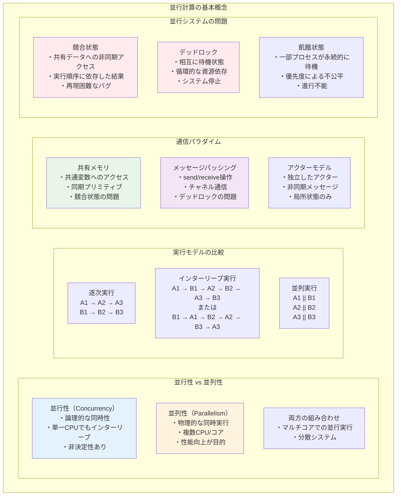
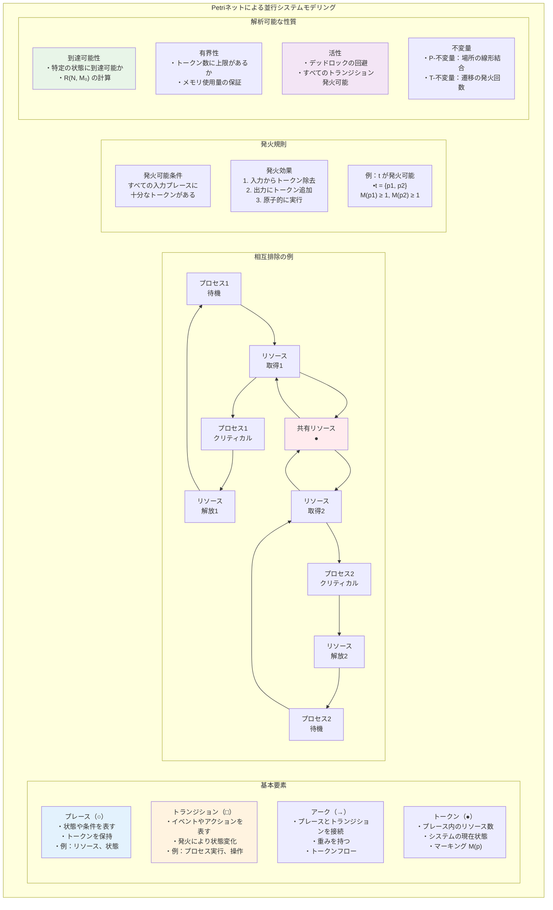
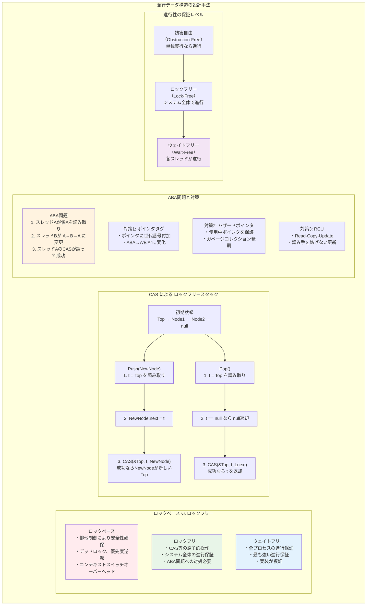

# 第12章 並行計算の理論

## はじめに

並行計算の理論は、複数の計算プロセスが同時に実行される状況を数学的に扱う分野です。マルチコアプロセッサ、分散システム、クラウドコンピューティングの普及により、並行性の理解と制御は現代のコンピュータサイエンスにおいて不可欠となっています。本章では、並行システムのモデル化、解析、検証のための理論的基礎を体系的に学びます。

並行性がもたらす非決定性、デッドロック、競合状態などの問題は、逐次プログラムでは現れない固有の複雑さを持ちます。これらの問題を理解し、解決するための形式的手法は、信頼性の高い並行システムの設計に欠かせません。本章で学ぶ理論は、オペレーティングシステム、データベース、分散アルゴリズムなど、幅広い分野の基礎となります。

## 12.1 並行計算モデル

### 12.1.1 並行性の基本概念



**定義 12.1** **並行システム**は、複数のプロセスが同時に実行される可能性があるシステム。

**並行性 vs 並列性**：
- 並行性（Concurrency）：論理的な同時性、インターリーブ実行を含む
- 並列性（Parallelism）：物理的な同時実行

**インターリーブ意味論**：
並行実行を、可能なすべての実行順序（インターリーブ）の集合として捉える。

### 12.1.2 共有メモリモデル

**定義 12.2** **共有メモリシステム**では、プロセスが共通の変数を通じて通信する。

**原子的操作**：
- Read：x の値を読む
- Write：x に値を書く
- Read-Modify-Write：Test-and-Set、Compare-and-Swap

**メモリ一貫性モデル**：
- 逐次一貫性（Sequential Consistency）
- 弱い一貫性モデル（TSO、PSO、Relaxed）

### 12.1.3 メッセージパッシングモデル

**定義 12.3** **メッセージパッシングシステム**では、プロセスがメッセージ送受信により通信する。

**通信プリミティブ**：
- send(p, m)：プロセス p にメッセージ m を送信
- receive(q)：プロセス q からメッセージを受信

**同期性**：
- 同期通信：送信と受信が同時に起こる
- 非同期通信：送信後、受信まで遅延がある

## 12.2 プロセス代数

### 12.2.1 CCS（Calculus of Communicating Systems）

**定義 12.4** **CCS の構文**：
```
P ::= 0                    (停止)
    | α.P                  (プレフィックス)
    | P + Q                (選択)
    | P | Q                (並行合成)
    | P\L                  (制限)
    | P[f]                 (リラベリング)
    | A                    (プロセス定数)
```

**アクション**：
- a, b, c, ...：入力アクション
- ā, b̄, c̄, ...：出力アクション
- τ：内部アクション

### 12.2.2 操作的意味論

**遷移規則**（構造的操作意味論）：

```
    α.P --α--> P              (Act)

    P --α--> P'
    ---------------           (Sum1)
    P + Q --α--> P'

    P --α--> P'
    ---------------           (Par1)
    P | Q --α--> P' | Q

    P --a--> P', Q --ā--> Q'
    ------------------------  (Com)
    P | Q --τ--> P' | Q'
```

### 12.2.3 双模倣等価性

**定義 12.5** 関係 R が**双模倣**（bisimulation）であるとは：
P R Q ならば、
1. P --α--> P' ⇒ ∃Q', Q --α--> Q' かつ P' R Q'
2. Q --α--> Q' ⇒ ∃P', P --α--> P' かつ P' R Q'

**定義 12.6** P と Q が**双模倣等価**（P ∼ Q）⟺ ある双模倣 R で P R Q

**定理 12.1** 双模倣等価性は合同関係である（すべての文脈で保存される）。

### 12.2.4 その他のプロセス代数

**CSP（Communicating Sequential Processes）**：
- 失敗意味論
- トレース、失敗、発散

**π計算**：
- 名前の移動性
- チャネルを値として送受信可能

## 12.3 Petri ネット

### 12.3.1 基本定義



**定義 12.7** **Petri ネット**は5つ組 N = (P, T, F, W, M₀)：
- P：プレース（場所）の有限集合
- T：トランジション（遷移）の有限集合（P ∩ T = ∅）
- F ⊆ (P × T) ∪ (T × P)：フロー関係
- W: F → ℕ₊：重み関数
- M₀: P → ℕ：初期マーキング

### 12.3.2 実行意味論

**定義 12.8** トランジション t が**発火可能** ⟺
∀p ∈ •t, M(p) ≥ W(p, t)

**発火規則**：t が発火すると、マーキングは以下のように変化：
- ∀p ∈ •t: M'(p) = M(p) - W(p, t)
- ∀p ∈ t•: M'(p) = M(p) + W(t, p)
- その他：M'(p) = M(p)

### 12.3.3 性質解析

**到達可能性**：
初期マーキング M₀ から到達可能なマーキングの集合 R(N, M₀)。

**構造的性質**：
- **有界性**：∀M ∈ R(N, M₀), ∀p ∈ P, M(p) ≤ k
- **安全性**：1-有界性
- **活性**：すべての到達可能マーキングから各トランジションが発火可能

**不変量**：
- **P-不変量**：Y^T · C = 0 を満たすベクトル Y
- **T-不変量**：C · X = 0 を満たすベクトル X

（C は接続行列）

### 12.3.4 解析手法

**可達木**：
到達可能なマーキングを木構造で表現。無限の場合は ω を使用。

**線形代数的手法**：
状態方程式：M = M₀ + C · σ（σ は発火回数ベクトル）

**定理 12.2** M が到達可能ならば状態方程式を満たす（逆は一般に不成立）。

## 12.4 時相論理による並行システムの検証

### 12.4.1 並行システムの性質

**安全性**（Safety）："悪いことは起こらない"
- 相互排除：同時にクリティカルセクションに入らない
- 部分正当性：終了すれば正しい結果

**活性**（Liveness）："良いことがいつか起こる"
- 無飢餓性：要求したプロセスはいつかリソースを得る
- 全域的進行：システム全体が進行する

**公平性**（Fairness）：
- 弱公平性：永続的に可能な動作はいつか実行される
- 強公平性：無限回可能な動作はいつか実行される

### 12.4.2 CTL による検証

**並行システムのモデル化**：
Kripke 構造 M = (S, S₀, R, L)
- S：状態集合
- S₀：初期状態集合
- R：遷移関係
- L：ラベリング関数

**典型的な性質の記述**：
- 相互排除：AG ¬(critical₁ ∧ critical₂)
- 応答性：AG (request → AF grant)
- 無飢餓：AG (request → AF critical)

### 12.4.3 モデル検査アルゴリズム

**状態爆発問題**：
プロセス数に対して状態数が指数的に増加。

**対策**：
- シンボリックモデル検査（BDD を使用）
- 有界モデル検査（SAT ソルバを使用）
- 抽象化技法

## 12.5 分散アルゴリズム

### 12.5.1 分散システムのモデル

**システムモデル**：
- プロセス故障：クラッシュ、ビザンチン
- 通信：同期、非同期
- ネットワーク：完全グラフ、任意トポロジー

**複雑性尺度**：
- メッセージ複雑度
- 時間複雑度（ラウンド数）
- 空間複雑度（局所）

### 12.5.2 基本的な分散アルゴリズム

#### リーダー選出

**LCR アルゴリズム**（リング上）：
```
各プロセス p：
1. 自分の ID を右隣に送信
2. 受信した ID が自分より大きければ転送
3. 自分の ID を受信したらリーダー

メッセージ複雑度：O(n²)
時間複雑度：O(n)
```

**HS アルゴリズム**：
双方向リング、フェーズごとに距離を倍増
メッセージ複雑度：O(n log n)

#### 相互排除

**Lamport のベーカリーアルゴリズム**：
```
プロセス i がクリティカルセクションに入る：
1. choosing[i] = true
2. number[i] = max(number[0], ..., number[n-1]) + 1
3. choosing[i] = false
4. 各 j ≠ i に対して：
   - choosing[j] = false を待つ
   - (number[j] = 0) または
     (number[i], i) < (number[j], j) を待つ
5. クリティカルセクション
6. number[i] = 0
```

### 12.5.3 合意問題

**定義 12.9** **合意問題**の要件：
- **合意**：すべての正常プロセスは同じ値を出力
- **妥当性**：出力値は入力値の一つ
- **停止性**：正常プロセスは有限時間で出力

#### Byzantine 将軍問題

**定理 12.3** n 個のプロセスのうち f 個が Byzantine 故障の場合、
合意が可能 ⟺ n > 3f

**証明の概要**（不可能性、n ≤ 3f）：
3プロセスで1つが故障の場合を考える。対称性により矛盾を導く。□

#### FLP 不可能性定理

**定理 12.4**（Fischer-Lynch-Paterson）
非同期システムでは、1つのプロセス故障でも決定的合意は不可能。

**証明の概要**：
- 2つの決定値の「境界」となる構成が存在
- その構成から1ステップで決定が変わる
- 故障により決定を遅延させ続けることが可能□

### 12.5.4 分散スナップショット

**Chandy-Lamport アルゴリズム**：
一貫性のある大域状態を記録

**アルゴリズム**：
1. 開始プロセスが自状態を記録し、マーカーを送信
2. マーカー受信時：
   - 初回：自状態を記録、マーカーを転送
   - 2回目以降：チャネル状態を記録

**性質**：記録される状態は、実際の計算で起こりうる状態。

## 12.6 並行データ構造

### 12.6.1 ロックベースの手法

**粗粒度ロック**：
データ構造全体に1つのロック。単純だが並行性が低い。

**細粒度ロック**：
各ノードにロック。高い並行性だが、デッドロックの危険。

**ハンドオーバーハンドロック**：
リストやツリーの走査で、次のノードをロックしてから現在のノードを解放。

### 12.6.2 ロックフリーアルゴリズム



**定義 12.10** データ構造が**ロックフリー**⟺
無限のステップ中で、少なくとも1つの操作が完了する。

**CAS（Compare-and-Swap）**：
```
CAS(addr, old, new):
    atomically:
        if *addr == old:
            *addr = new
            return true
        else:
            return false
```

**例：ロックフリースタック**
```
Push(x):
    loop:
        t = Top
        x.next = t
        if CAS(&Top, t, x):
            return
        
Pop():
    loop:
        t = Top
        if t == null:
            return null
        if CAS(&Top, t, t.next):
            return t
```

### 12.6.3 線形化可能性

**定義 12.11** 並行オブジェクトが**線形化可能**⟺
各操作が、呼び出しと応答の間のある時点で瞬間的に効果を持つように見える。

**性質**：
- 合成可能性：線形化可能なオブジェクトの組み合わせも線形化可能
- 局所性：各オブジェクトを独立に推論可能

## 12.7 プロセス計算の高度な話題

### 12.7.1 π計算

**構文**：
```
P ::= 0 | τ.P | x(y).P | x̄⟨y⟩.P | P|Q | (νx)P | !P
```

**名前の移動性**：
チャネル名を値として送受信できる。

**スコープ拡張**：
```
(νx)(x̄⟨z⟩.P | Q) | x(y).R → (νx)(P | Q | R[z/y])
```

### 12.7.2 Ambient 計算

**移動性のモデル化**：
プロセスが階層的な場所（ambient）間を移動。

**基本操作**：
- in n：ambient n に入る
- out n：ambient n から出る
- open n：ambient n を開く

### 12.7.3 確率的プロセス代数

**確率的選択**：
P +_p Q：確率 p で P、確率 1-p で Q を選択

**応用**：
- 性能解析
- 信頼性評価
- ランダム化プロトコルの検証

## 12.8 実時間システム

### 12.8.1 時間オートマトン

**定義 12.12** **時間オートマトン**は以下の組：
- 有限の場所集合
- クロック変数の有限集合
- クロック制約付き遷移

**意味論**：
- 時間経過：すべてのクロックが同じ速度で進む
- 離散遷移：ガード条件を満たすとき遷移、クロックリセット

### 12.8.2 時間付き時相論理

**TCTL（Timed CTL）**：
- EF_{≤d} φ：d 時間単位以内に φ となる経路が存在
- AG_{≤d} φ：すべての経路で d 時間単位まで常に φ

**モデル検査**：
領域グラフによる有限表現。

## 章末問題

### 基礎問題

1. 2つのプロセスが交互に実行される以下のプログラムで、
   最終的な x の値として可能なものをすべて求めよ：
   ```
   共有変数: x = 0
   P1: x = x + 1; x = x + 1
   P2: x = x * 2
   ```

2. CCS で以下のプロセスの双模倣等価性を判定せよ：
   (a) a.b.0 + a.c.0 と a.(b.0 + c.0)
   (b) (a.0 | b.0)\{a} と b.0

3. 哲学者の食事問題を Petri ネットでモデル化し、
   デッドロックが起こることを示せ。

4. n プロセスのベーカリーアルゴリズムが相互排除を満たすことを証明せよ。

### 発展問題

5. 分散システムにおける論理時計について：
   (a) Lamport 時計の定義と性質を述べよ
   (b) ベクトル時計との違いを説明せよ

6. コンセンサス数について：
   (a) 各同期プリミティブのコンセンサス数を求めよ
   (b) 階層定理を説明せよ

7. ロックフリーキューの実装：
   (a) Michael-Scott アルゴリズムを説明せよ
   (b) ABA 問題とその対策を論ぜよ

8. 弱メモリモデルについて：
   (a) TSO と PSO の違いを説明せよ
   (b) メモリバリアの必要性を例を挙げて示せ

### 探究課題

9. ブロックチェーンのコンセンサスアルゴリズムについて調査し、
   Proof of Work、Proof of Stake、PBFT の特徴を比較せよ。

10. トランザクショナルメモリについて調査し、
    ソフトウェア実装とハードウェア実装の得失を論ぜよ。

11. アクターモデルについて調査し、
    共有メモリモデルとの違いと実装例（Erlang、Akka）を説明せよ。

12. 形式的検証ツール（TLA+、SPIN、NuSMV など）について調査し、
    産業界での応用例を示せ。