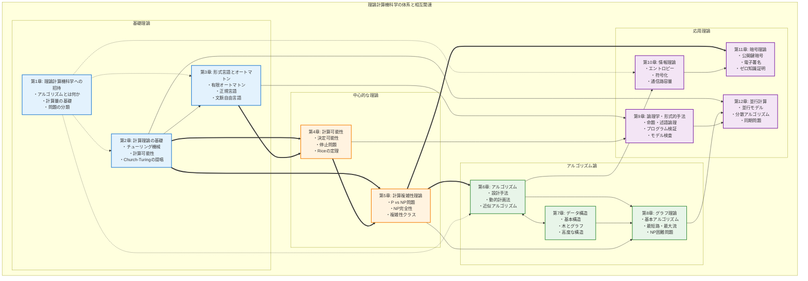

# 理論計算機科学教科書

## 📚 概要

本書は、理論計算機科学の包括的な教科書です。数学的基礎から最先端の研究トピックまで、体系的に学習できるように構成されています。

- **🎯 対象読者**: 計算機科学を学ぶ大学生・大学院生・研究者
- **📖 構成**: 全12章 + 包括的な学習支援教材
- **🔧 特徴**: 140以上の図表、豊富な練習問題、実装例、実世界での応用例

## 🗺️ 全体像



## 📖 章構成

### 🏛️ 基礎理論

<div class="chapter-grid">
<div class="chapter-card">
<span class="emoji">📐</span>
<h3><a href="{{ '/chapter1-complete-with-exercises.html' | relative_url }}">第1章: 数学的基礎</a></h3>
<p>集合論、論理学、証明技法、関係と関数、グラフ理論の基礎</p>
<span class="difficulty difficulty-basic">基礎</span>
<p>推定学習時間: 4-6週間</p>
</div>

<div class="chapter-card">
<span class="emoji">🖥️</span>
<h3><a href="{{ '/chapter2-complete-with-exercises.html' | relative_url }}">第2章: 計算理論の基礎</a></h3>
<p>チューリング機械、計算可能性、Church-Turingの提唱</p>
<span class="difficulty difficulty-basic">基礎</span>
<p>推定学習時間: 3-4週間</p>
</div>

<div class="chapter-card">
<span class="emoji">🔤</span>
<h3><a href="{{ '/chapter3-complete-with-exercises.html' | relative_url }}">第3章: 形式言語とオートマトン理論</a></h3>
<p>有限オートマトン、正規言語、文脈自由言語</p>
<span class="difficulty difficulty-intermediate">中級</span>
<p>推定学習時間: 4-5週間</p>
</div>
</div>

### 🎯 中心的な理論

<div class="chapter-grid">
<div class="chapter-card">
<span class="emoji">🔄</span>
<h3><a href="{{ '/chapter4-computability.html' | relative_url }}">第4章: 計算可能性</a></h3>
<p>決定可能性、停止問題、Riceの定理、還元可能性</p>
<span class="difficulty difficulty-intermediate">中級</span>
<p>推定学習時間: 3-4週間</p>
</div>

<div class="chapter-card">
<span class="emoji">⚡</span>
<h3><a href="{{ '/chapter5-complexity.html' | relative_url }}">第5章: 計算複雑性理論</a></h3>
<p>P vs NP問題、NP完全性、複雑性クラス、多項式階層</p>
<span class="difficulty difficulty-advanced">上級</span>
<p>推定学習時間: 4-6週間</p>
</div>
</div>

### ⚙️ アルゴリズム論

<div class="chapter-grid">
<div class="chapter-card">
<span class="emoji">🔧</span>
<h3><a href="{{ '/chapter6-algorithms.html' | relative_url }}">第6章: アルゴリズムの数学的解析</a></h3>
<p>設計手法、分割統治法、動的計画法、貪欲法、近似アルゴリズム</p>
<span class="difficulty difficulty-intermediate">中級</span>
<p>推定学習時間: 5-7週間</p>
</div>

<div class="chapter-card">
<span class="emoji">🗂️</span>
<h3><a href="{{ '/chapter7-data-structures.html' | relative_url }}">第7章: データ構造の理論</a></h3>
<p>基本構造、平衡木、高度なデータ構造、確率的データ構造</p>
<span class="difficulty difficulty-intermediate">中級</span>
<p>推定学習時間: 4-5週間</p>
</div>

<div class="chapter-card">
<span class="emoji">🕸️</span>
<h3><a href="{{ '/chapter8-graph-theory.html' | relative_url }}">第8章: グラフ理論とネットワーク</a></h3>
<p>基本アルゴリズム、最短路、最大流、マッチング、グラフ彩色</p>
<span class="difficulty difficulty-advanced">上級</span>
<p>推定学習時間: 5-6週間</p>
</div>
</div>

### 🚀 応用理論

<div class="chapter-grid">

<div class="chapter-card">
<span class="emoji">🔐</span>
<h3><a href="{{ '/chapter9-logic-formal-methods.html' | relative_url }}">第9章: 論理学・形式的手法</a></h3>
<p>命題・述語論理、時相論理、プログラム検証、モデル検査</p>
<span class="difficulty difficulty-advanced">上級</span>
<p>推定学習時間: 4-5週間</p>
</div>

<div class="chapter-card">
<span class="emoji">📊</span>
<h3><a href="{{ '/chapter10-information-theory.html' | relative_url }}">第10章: 情報理論</a></h3>
<p>エントロピー、符号化理論、通信路容量、誤り訂正符号</p>
<span class="difficulty difficulty-intermediate">中級</span>
<p>推定学習時間: 3-4週間</p>
</div>

<div class="chapter-card">
<span class="emoji">🔒</span>
<h3><a href="{{ '/chapter11-cryptography.html' | relative_url }}">第11章: 暗号理論の数学的基礎</a></h3>
<p>対称・公開鍵暗号、デジタル署名、ゼロ知識証明</p>
<span class="difficulty difficulty-expert">専門</span>
<p>推定学習時間: 4-5週間</p>
</div>

<div class="chapter-card">
<span class="emoji">🔗</span>
<h3><a href="{{ '/chapter12-concurrent-computation.html' | relative_url }}">第12章: 並行計算の理論</a></h3>
<p>並行計算モデル、プロセス代数、分散アルゴリズム</p>
<span class="difficulty difficulty-expert">専門</span>
<p>推定学習時間: 3-4週間</p>
</div>

</div>

## 🎯 学習パス

### 🔰 初学者向け（6-8ヶ月）
```
第1章 → 第2章 → 第3章 → 第6章(基礎) → 第7章(基礎) → 第8章(基礎)
```

### 📈 標準コース（12-15ヶ月）
```
第1章 → 第2章 → 第3章 → 第4章 → 第5章 → 第6章 → 第7章 → 第8章 → 第9章
```

### 🎓 完全マスター（18-24ヶ月）
```
全章を順番に学習 + 発展的トピック + 最新研究動向の調査
```

### 🔬 研究者向け
```
基礎確認（第1-3章） → 専門分野集中（第4-12章から選択） → 最新論文読解
```

## 🏆 特徴

### 📊 豊富な視覚化
- **140以上のMermaid図表**: 概念の直観的理解を支援
- **アルゴリズムフローチャート**: 実装の詳細な手順
- **複雑性関係図**: 問題クラス間の関係性

### 🎯 実践的学習
- **段階的難易度**: ⭐〜⭐⭐⭐⭐の4段階評価
- **実装例**: Python/擬似コードによる具体例
- **応用事例**: Google、Amazon等の実世界での活用

### 🔄 相互関連性
- **章間リンク**: 概念の発展と関連性を明示
- **前提知識**: 各章で必要な予備知識を明記
- **発展学習**: より高度なトピックへの道筋

## 🚀 使い方

### 📖 読み方
1. 上記の**全体像**で理論の構造を把握
2. **学習パス**から目標に適したコースを選択
3. 各章の[難易度ガイド]({{ '/exercise-difficulty-guide.html' | relative_url }})を確認
4. [進捗チェックリスト]({{ '/learning-progress-checklist.html' | relative_url }})で理解度を評価

### 💻 実習
1. [実装集]({{ '/algorithm-implementations.html' | relative_url }})でコーディング練習
2. [応用例]({{ '/real-world-applications.html' | relative_url }})で理論と実践を結びつけ
3. [練習問題]({{ '/chapter-solutions.html' | relative_url }})で知識を定着

## 📝 ライセンス

Copyright (c) 2025 ITdo Japan, Inc. All rights reserved.

本教科書はMIT Licenseの下で公開されています。学習・教育目的での自由な利用を促進します。

---

**🎓 理論を学び、実践に活かし、未来を創造する**

> "理論なしには実践は盲目であり、実践なしには理論は空虚である" - Immanuel Kant