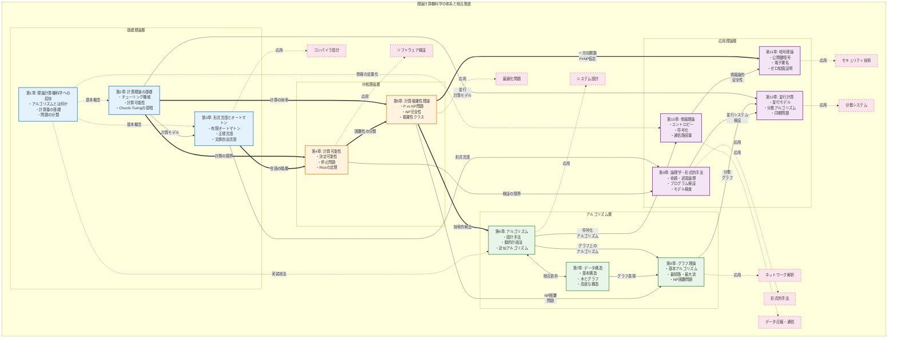

# 理論計算機科学の体系図

## 理論計算機科学の全体像



## 凡例と読み方

### 矢印の意味
- **実線の矢印 (→)**: 直接的な前提知識の関係
- **二重線の矢印 (⇒)**: 強い理論的発展の関係
- **点線の矢印 (⋯>)**: 補助的な関連・応用

### 層の説明

#### 1. 基礎理論層（青色）
- **第1章**: 全体の導入と基本概念
- **第2章**: 計算の数学的基礎
- **第3章**: 言語とオートマトンの理論

#### 2. 中核理論層（橙色）
- **第4章**: 計算の理論的限界
- **第5章**: 計算の効率性と複雑さ

#### 3. アルゴリズム層（緑色）
- **第6章**: 問題解決の具体的手法
- **第7章**: 効率的なデータ管理
- **第8章**: グラフ構造の解析と応用

#### 4. 応用理論層（紫色）
- **第9章**: システムの正当性保証
- **第10章**: 情報の定量的扱い
- **第11章**: セキュリティの理論的基盤
- **第12章**: 並列・分散計算の理論

### 学習パスの例

#### 最短パス（実用重視）
```
第1章 → 第6章 → 第7章 → 第8章
```

#### 理論重視パス
```
第1章 → 第2章 → 第3章 → 第4章 → 第5章
```

#### バランス型パス
```
第1章 → 第2章 → 第3章（基礎のみ）→ 第5章（概要）→ 第6章 → 第7章
```

### 重要な相互関係

1. **P vs NP問題の中心性**
   - 第5章のP vs NP問題は、第11章（暗号理論）の安全性の基盤
   - 第6章の近似アルゴリズムの必要性の理由
   - 第8章のNP困難グラフ問題への対処法

2. **計算可能性から複雑性へ**
   - 第4章（何が計算可能か）から第5章（どれだけ効率的か）への自然な発展
   - 理論的限界の理解が実用的アルゴリズム設計の指針となる

3. **形式言語の広がり**
   - 第3章の形式言語理論は、コンパイラ設計だけでなく
   - 第9章のプログラム仕様記述にも応用される

4. **情報理論の横断性**
   - 第10章の情報理論は、第11章（暗号）の理論的基礎
   - 第6章のアルゴリズム（特に圧縮）の最適性証明にも使用

この体系図により、理論計算機科学の各分野がどのように関連し、発展していくかを一望できます。学習者は自分の興味や目的に応じて、適切な学習経路を選択できます。